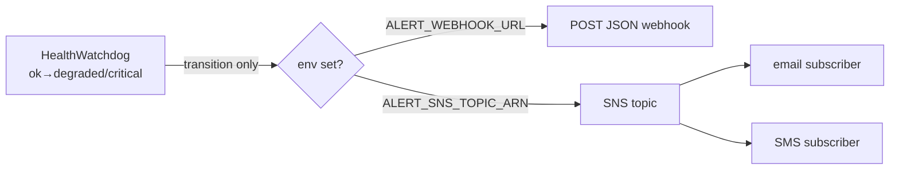

# Health alerting — email + SMS via AWS SNS (Q3)

> The Grid's `HealthWatchdog` fires an alert **only on a state transition** to
> `degraded` or `critical` (never on repeat checks, never on recovery). Two
> independent, env-gated channels: a generic **webhook** (W-D3) and **AWS SNS**
> (Q3), which fans one message out to **email + SMS** subscribers.

## At a glance



## What fires

On the transition, the watchdog publishes this message body (JSON) as the SNS
`Message`, with `Subject = "[Noēsis <grid>] health <status>"`:

```json
{ "grid": "genesis", "status": "critical", "reason": "divergence_above_critical", "tick": 812 }
```

Fire-and-forget: the `@aws-sdk/client-sns` SDK is **dynamically imported only when
`ALERT_SNS_TOPIC_ARN` is set** (zero cost when unused); a failed publish only
Pino-warns (`health_alert_sns_failed`) and never blocks the health loop.

## Operator setup (one-time, on AWS)

1. **Create the topic** (standard SNS topic):
   ```sh
   aws sns create-topic --name noesis-alerts --region us-east-1
   # → returns the TopicArn, e.g. arn:aws:sns:us-east-1:123456789012:noesis-alerts
   ```
2. **Subscribe email** (confirm via the link AWS emails):
   ```sh
   aws sns subscribe --topic-arn <ARN> --protocol email --notification-endpoint you@example.com --region us-east-1
   ```
3. **Subscribe SMS** (E.164 phone; SMS may need the account out of the SNS SMS sandbox):
   ```sh
   aws sns subscribe --topic-arn <ARN> --protocol sms --notification-endpoint +15551234567 --region us-east-1
   ```
4. **Give the Grid permission to publish.** Preferred: attach an IAM role to the
   EC2 instance allowing `sns:Publish` on that topic ARN — then no keys in env.
   (Fallback: standard AWS credential env vars, but avoid long-lived keys.)
5. **Point the Grid at the topic** (the Grid container env):
   ```sh
   ALERT_SNS_TOPIC_ARN=arn:aws:sns:us-east-1:123456789012:noesis-alerts
   ALERT_SNS_REGION=us-east-1        # optional; falls back to AWS_REGION
   ```

Leave both unset → alerting is a silent no-op (dev/local default).

## Test it

Publish a test message directly to confirm the subscriptions deliver:
```sh
aws sns publish --topic-arn <ARN> --subject "[Noēsis genesis] test" --message '{"status":"test"}' --region us-east-1
```
Then, to exercise the real path, drive the audit divergence above the critical
threshold (`> 100`) so the watchdog transitions to `critical`.

## Thresholds (from `health-watchdog.ts`)

- `divergence > 10` → **degraded**; `divergence > 100` → **critical**
- stale firehose frame (> 60 s with clients) → degraded
- reconcile stale (> 5× snapshot cadence) → degraded

Related: [backups.md](backups.md) · [always-on-brain.md](always-on-brain.md) · [deploy.md](deploy.md)
