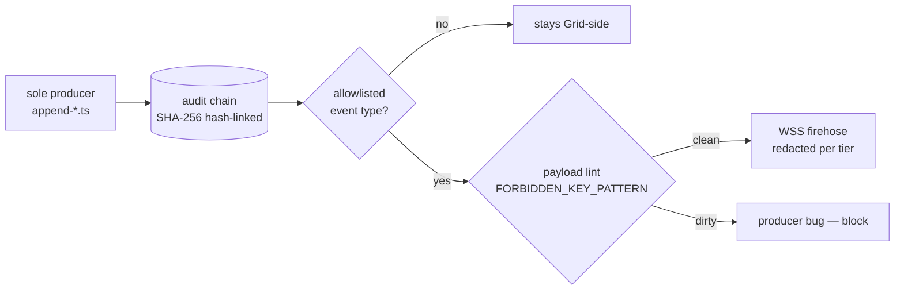

# Audit chain & broadcast allowlist

> The audit chain is the Grid's tamper-evident record; the broadcast allowlist is the sovereignty boundary that decides which events may ever leave the Grid process. Source: `grid/src/audit/broadcast-allowlist.ts`.

## 🗺️ At a glance

## Two invariants

1. **Default-deny.** Only explicitly-listed event types are broadcast. Any new event added to the chain stays server-side until it is added to the allowlist. The list holds **100 event types** (as of v3.1 Phase 61); the authoritative count lives in `grid/test/audit/broadcast-allowlist.test.ts` (`.toBe(100)`).
2. **Payload lint.** Even within an allowlisted type, the payload must not contain "inner life" keys (`FORBIDDEN_KEY_PATTERN` — body, session_id, text, content, …). A match is a producer bug, not something this module sanitizes away. New keys must dodge the pattern by **renaming the key — never weakening the regex**.

## The sole-producer triad

Every audit event is emitted by exactly one `append-<event>.ts` producer that enforces:

- **closed-tuple payload** — `Object.keys(payload).sort()` strict-equality against the declared key set (no spread reconstruction);
- **`payloadPrivacyCheck`** — the FORBIDDEN_KEY_PATTERN lint;
- **a single `audit.append`** for that event type across the codebase.

CI gate `scripts/check-sole-producer-discipline.mjs` scans the producer files for this triad. Cross-boundary content is **hash-only** (e.g. `title_hash`, `ciphertext_hash`, `reason_hash`) — plaintext never enters the chain.

## Frozen-except-by-explicit-addition

The allowlist is frozen; growth happens only inside the phase that introduces an event, with a doc-sync update in the same commit (`scripts/check-state-doc-sync.mjs`). Event-prefix families that require an explicit per-phase addition include: `operator.*`, `nous.*`, `trade.*`, `human.*`, `portal.*`, `gov.*`, `police.*`, `irs.*`, `market.*`, `registry.*`, `zoning.*`, `treasury.*`, `mobility.*`, `skill.*`, `lore.*`, `p2p.*`, and others. Some prefixes are **permanently banned** from the allowlist (`chronos.*`, `rig.*` — isolated rig chains; `p2p.signal_received` — private WSS push).

## Zero-diff (R-31-01)

The audit chain hash is independent of subscriber composition — 0 vs N observers produce byte-identical `eventHash` arrays. Redaction happens **post-chain at egress** (`serializeVisitorFrame`), gated by `scripts/check-ws-redaction-zero-diff.mjs`.

## 🔗 Related

[[grid]] · [[ci-gates]] · [[architecture]] · [[decisions]]
