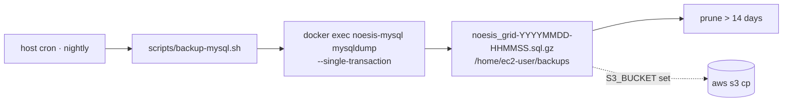

# MySQL backups (W-D1 Substrate Trust)

> Nightly `mysqldump` of `noesis_grid` from the `noesis-mysql` container, gzip'd under `/home/ec2-user/backups`, 14-day local retention, optional S3 off-host copy. Script: `scripts/backup-mysql.sh` (operator-installed cron — never run by CI or deploy tooling).

## 🗺️ At a glance



## What the script does

1. `docker exec` into the `noesis-mysql` container and `mysqldump --single-transaction --quick --routines --triggers` the `noesis_grid` DB (consistent InnoDB snapshot, no locks on the live Grid; password passed via `MYSQL_PWD` container env, never on the host command line).
2. gzip to `BACKUP_DIR/noesis_grid-<YYYYMMDD-HHMMSS>.sql.gz` (default `BACKUP_DIR=/home/ec2-user/backups`); fails loudly on a zero-byte dump.
3. Prune local dumps older than `RETENTION_DAYS` (default 14).
4. If `S3_BUCKET` is set: `aws s3 cp` the dump to `s3://$S3_BUCKET/mysql-backups/` for off-host durability.

All knobs are env vars — see the header comment in `scripts/backup-mysql.sh`.

## Install (operator, on the prod host)

```cron
# /etc/cron.d style — nightly at 03:15 host time
15 3 * * * ec2-user MYSQL_ROOT_PASSWORD=<root-pw from compose .env> /home/ec2-user/noesiis/scripts/backup-mysql.sh >> /home/ec2-user/backups/backup.log 2>&1
```

(Or via `crontab -e` as ec2-user, dropping the user field.)

## Restore procedure

```bash
# 1. Stop the Grid so nothing writes during restore
docker stop noesis-grid

# 2. Stream the dump back into the container
gunzip -c /home/ec2-user/backups/noesis_grid-<stamp>.sql.gz \
  | docker exec -i -e MYSQL_PWD="$MYSQL_ROOT_PASSWORD" noesis-mysql \
      mysql -uroot noesis_grid

# 3. Restart — boot re-runs MigrationRunner; already-applied versions are no-ops
docker start noesis-grid
```

The dump includes `grid_migrations`, so the restored DB carries its schema version; a newer Grid image simply applies the remaining migrations on boot (see [[migrations]]).

## RPO / RTO

- **RPO ≤ 24 h** with the nightly cron (tighten the cron cadence to tighten RPO). Audit-chain writes since the last dump are lost on restore — the in-memory chain + `INSERT IGNORE` reconcile loop cannot recover rows that never got dumped.
- **RTO ≈ minutes**: restore is a single `gunzip | docker exec -i mysql` stream plus a Grid container restart.
- Local-only backups die with the EC2 volume — set `S3_BUCKET` for real durability.

## Verify restore quarterly

A backup that has never been restored is a hope, not a backup. **Once a quarter**, restore the latest dump into a scratch DB and confirm the schema version matches:

```bash
gunzip -c <latest>.sql.gz | docker exec -i -e MYSQL_PWD="$MYSQL_ROOT_PASSWORD" noesis-mysql \
  sh -c 'mysql -uroot -e "CREATE DATABASE IF NOT EXISTS noesis_grid_restore_test" && mysql -uroot noesis_grid_restore_test'
docker exec -e MYSQL_PWD="$MYSQL_ROOT_PASSWORD" noesis-mysql \
  mysql -uroot -e 'SELECT MAX(version) FROM noesis_grid_restore_test.grid_migrations'
# then: DROP DATABASE noesis_grid_restore_test
```

## 🔗 Related

[[migrations]] · [[deploy]] · [[grid]]
