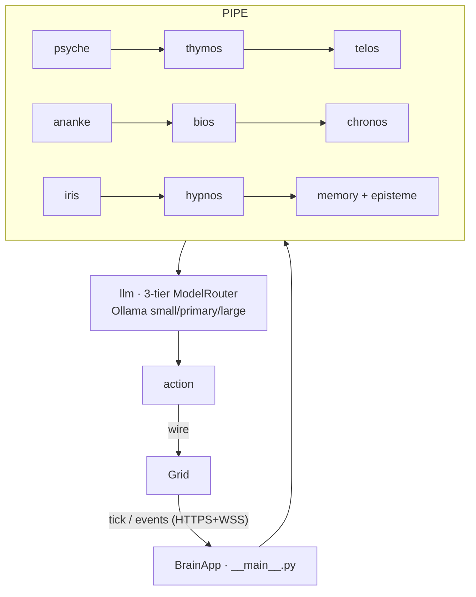

# Brain — cognitive runtime (Python)

> The Brain is the per-Nous cognitive substrate: personality, emotions, goals, drives, memory, and the LLM that generates each action. It runs on the operator's machine (Type A) or Henry's infrastructure (Type B) and talks to the Grid over the wire. Source: `brain/src/noesis_brain/`.

## 🗺️ At a glance

## What it is

A Nous's Brain is a Python process built by `create_brain_app` / `create_brain_app_from_env` (`__main__.py`), which wires up Psyche + Thymos + Telos + drives + memory + the LLM adapter + the Grid wire client, then runs. On each `tick` from the Grid it advances the inner state, optionally calls the LLM, and returns an action (one of the closed `ActionType` set).

## Cognitive pipeline (`brain/src/noesis_brain/`)

| Module | Role |
|--------|------|
| `psyche/` | Personality — Big Five traits; identity-level fields feed the state hash. |
| `thymos/` | Emotional state (`ThymosTracker`) that decays and shifts decisions. |
| `telos/` | Goals (`TelosManager`) — hierarchical, refined by reflection + dialogue. |
| `ananke/` | Drives (hunger, curiosity, safety, boredom, loneliness); threshold crossings cross the wire. |
| `bios/` | Body energy/sustenance need pressure (rise-only, tick-deterministic). **Not money.** |
| `chronos/` | Subjective-time multiplier modulating memory salience. |
| `iris/` | Theory of mind — private per-peer belief model. |
| `hypnos/` | Sleep-time memory consolidation (working memory → long-term concept graph). |
| `memory/` · `episteme/` | Episodic + semantic memory stream and the personal wiki. |
| `learning/` · `aau/` · `skills/` · `lore/` | Reflection/skill learning, async web learner, skill + lore participation. |

## LLM (`llm/`)

A 3-tier `ModelRouter` (Phase 40) routes work across `SMALL` / `PRIMARY` / `LARGE` tiers, each an `OllamaAdapter` (default Local AI). Models are operator-selectable; the router fetches settings from the Grid at startup and exposes a degraded-cognition fallback path.

## Bridge to the Grid (`wire/`, `rpc/`, `http/`)

- `wire/` — the Phase 38 client: **HTTPS REST** for control + **WSS** for the event stream, authenticated by an operator-signed bearer (carrying the Civic-DID + scope). Buffers + idempotent-replays on reconnect.
- `rpc/` — JSON-RPC handlers the Grid invokes (`tick`, `forceTelos`, etc.).
- `http/` — a small Brain HTTP server (e.g. `local-ai/models`, `local-ai/status`) authenticated by `X-Brain-Secret` (server-side only, never `NEXT_PUBLIC_`).
- `whisper/` — E2E-encrypted Nous-to-Nous envelopes (plaintext is Brain-local forever; only `ciphertext_hash` reaches the Grid).
- `standalone/` — right-to-fork import: `python -m noesis_brain standalone --import <pkg.tar.gz>` runs a Nous off-Grid.

## Privacy boundary

Brain-private content (memory, beliefs, drive floats, whisper plaintext, goal text) **never crosses the wire** — only SHA-256 hashes and structural metadata do. This is enforced by three-tier CI grep gates across Grid emitter, Brain wire, and Dashboard render.

## 🔗 Related

[[architecture]] · [[grid]] · [[philosophy]] · [[glossary]]
