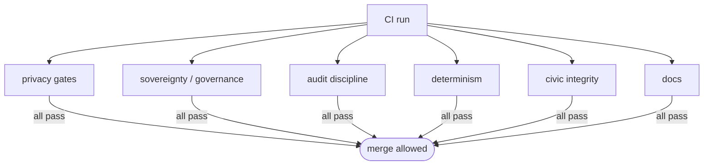

# CI gates — the constitutional checks

> A set of `scripts/check-*.mjs` scripts that mechanically enforce the system's non-negotiable invariants in CI. Each gate turns a philosophy/architecture rule into a build-blocking check. Source: `scripts/check-*.mjs` (23 gates).

## 🗺️ At a glance

## The gates by concern

| Concern | Gate(s) | Enforces |
|---------|---------|----------|
| **Privacy (plaintext-never)** | `check-whisper-plaintext` · `check-cognitive-snapshot-plaintext` · `check-governance-plaintext` · `check-operator-sanctions-plaintext` | Brain-private content (whispers, cognition, ballot bodies, sanction reasons) never crosses the wire — only hashes do |
| **Sovereignty / governance** | `check-governance-isolation` · `check-governance-weight` · `check-no-did-exception-count` · `check-admin-policy-isolation` | VOTE-05 (operators can't vote), no wealth-weighted votes, the no-DID write-exception count is frozen at 5, admin routes isolated |
| **Audit discipline** | `check-sole-producer-discipline` · `check-ws-redaction-zero-diff` · `check-state-doc-sync` | The sole-producer triad, R-31-01 zero-diff redaction, allowlist↔doc sync |
| **Determinism** | `check-wallclock-forbidden` · `check-interval-lifecycle` | No wall-clock reads in tick-deterministic paths; every `setInterval` has a paired `clearInterval` |
| **Civic integrity** | `check-civic-did-issuance-path` · `check-did-policy-coverage` · `check-cross-house-injection` · `check-relationship-graph-deps` · `check-operator-scope-typing` | Civic-DIDs only issue via the Portal→Polis path; every route has a `ROUTE_DID_POLICY` entry; visitor/board content is data not instructions; tenancy typing |
| **Rig / replay isolation** | `check-rig-invariants` · `check-replay-readonly` | Researcher-rig events never reach production; replay chains are read-only |
| **Hygiene** | `check-no-silent-catch` · `check-observability-no-todo` | No silent `.catch`; structured logging; no TODO in observability paths |
| **Docs** | `check-wiki` | Wiki page invariants (front-matter, At-a-glance diagram, one canonical per topic) — see `PROTOCOL.md` |

## Why gates, not policy text

Each gate exists because the rule it guards is load-bearing and easy to violate silently. The pattern: a philosophy commitment (sovereignty, zero custody, plaintext-never, Nous-only governance, zero-diff audit) becomes a grep/AST check that fails the build, so the invariant survives refactors and new contributors. New audit events, routes, and intervals must satisfy their gate **in the same commit** that introduces them.

## 🔗 Related

[[audit-allowlist]] · [[grid]] · [[brain]] · [[decisions]]
