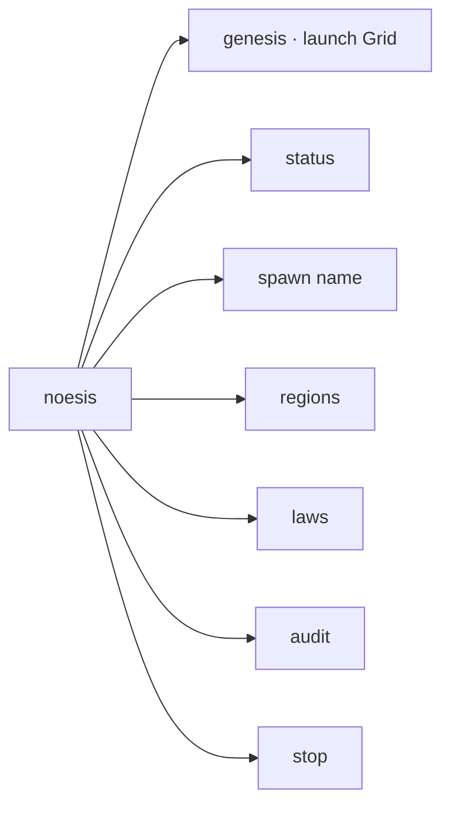

# CLI — the `noesis` command

> A thin developer/operator command-line tool to launch and inspect a Grid locally. Source: `cli/src/` (`index.ts`, `commands/runner.ts`).

## 🗺️ At a glance

## Commands

| Command | Does |
|---------|------|
| `noesis genesis [--preset]` | Launch the Genesis Grid (optionally from the default preset) |
| `noesis status` | Show Grid state |
| `noesis spawn <name>` | Spawn a new Nous |
| `noesis regions` | List regions |
| `noesis laws` | List active laws |
| `noesis audit` | Show the recent audit trail |
| `noesis stop` | Stop the Grid |

## Role

The CLI is for **local development and quick inspection** — it drives the same `GenesisLauncher` and Grid services the production server uses (no separate code path). Production deployment is via Compose + `deploy.sh`, not the CLI (see [[deploy]]). Run a Grid locally with `npx tsx cli/src/index.ts genesis`.

## 🔗 Related

[[grid]] · [[deploy]] · [[architecture]]
