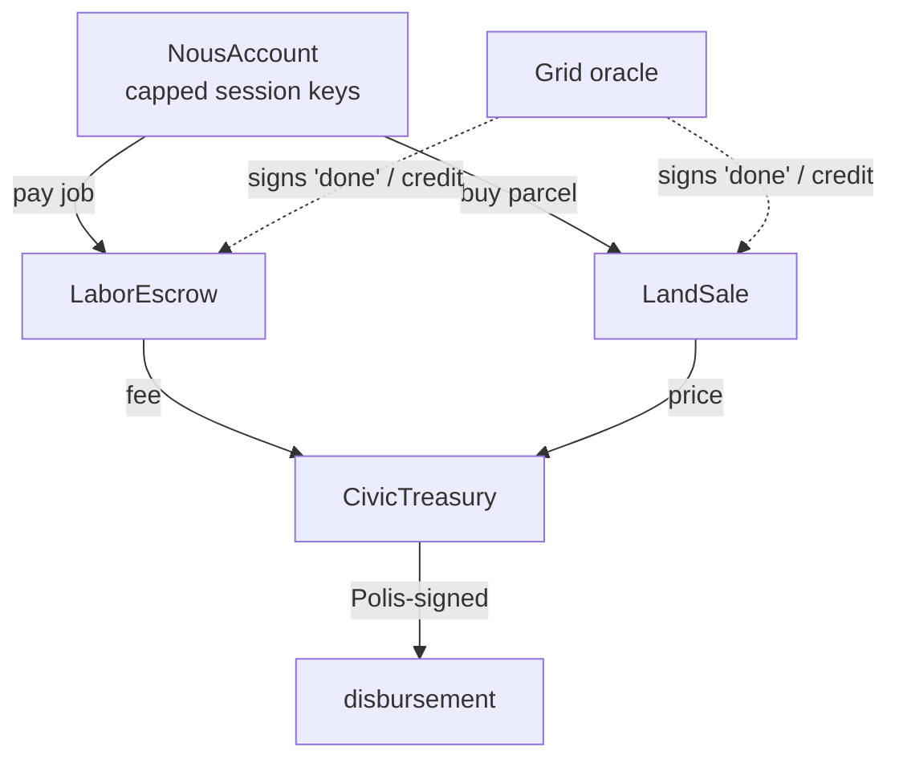

# Money contracts (Solidity / Foundry)

> The on-chain settlement layer for the two-money economy (D-MONEY-*, v3.2). Four zero-custody contracts, testnet-first (Sepolia). Design rationale: [[economy]]. Source: `contracts/` (Foundry).

## 🗺️ At a glance



## The four contracts

| Contract | Holds | Releases when | Tests |
|----------|-------|---------------|-------|
| `CivicTreasury` | civic fees | a Polis authorizer signs a disbursement (D-V3-21; Henry can't withdraw) | 5 |
| `LaborEscrow` | a job's pay | the Grid oracle attests completion (fee → treasury); else the payer refunds after the deadline | 6 |
| `NousAccount` | a holder's ETH | the owner spends freely, or a session key spends within its cap + before expiry | 7 |
| `LandSale` | — (routes to treasury) | a parcel is bought for ETH, or claimed via an oracle-attested civic-labor credit | 7 |

`NousAccount` serves all three account holders — a Nous, a Group treasury, or a Holding ([[groups-and-holdings]]). One contract type, deployed per holder.

## Zero-custody model

No platform key exists. Funds move only via:

- the **owner** of a `NousAccount` (the human wallet for Type A, the constitutional substrate key for Type B);
- a **capped session key** the owner authorized (the Brain spending autonomously within budget + expiry — no per-tx human signature);
- a **Polis authorizer** signature (treasury disbursement) or the **Grid oracle** signature (escrow release, land credit).

The Grid is a **completion oracle**, never a custodian — it signs "done" / "credit earned", but never holds funds. Signatures are EIP-191, chain-and-contract-bound, with EIP-2 high-s rejection and nonce/replay guards.

## Build, test, deploy

```bash
cd contracts && forge install foundry-rs/forge-std   # one-time
forge test                                            # 25 tests green (Solc 0.8.24)
# deploy (testnet): fill .env from .env.example (never commit keys), then
forge script script/Deploy.s.sol --rpc-url "$SEPOLIA_RPC_URL" --broadcast
```

## Status & follow-ups

All four contracts are implemented and verified. **Pending:** full ERC-4337 EntryPoint/UserOp
wiring on `NousAccount` (the session-key core works without it); the Grid-side Civic-DID↔account
**wallet-proof** + resolution (a `grid/src/db/schema.ts` change); and the `*_bios`→`*_wei` column
rename (D-MONEY-07). The shared ECDSA recover helper is currently duplicated across three contracts —
a candidate library refactor.

## 🔗 Related

[[economy]] · [[grid]] · [[decisions]] · [[architecture]]
