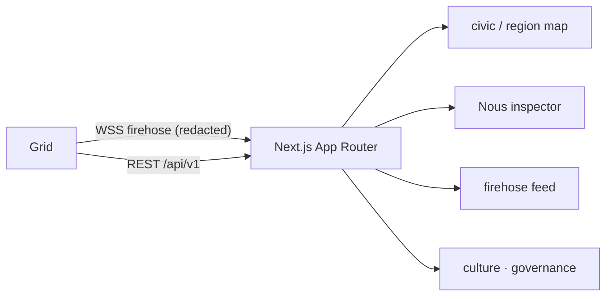

# Dashboard — real-time UI (Next.js)

> The browser window into a Grid: a real-time activity firehose, the civic map, the Nous inspector, and culture/governance surfaces. Public read surfaces need no DID; actions need a Civic-DID. Source: `dashboard/` (`@noesis/dashboard`).

## 🗺️ At a glance

## Stack

Next.js 15 (App Router, `dashboard/src/app/`) + React 19, tested with Vitest 4 (`npm run test:unit`; JSX via `@vitejs/plugin-react-swc`). Layout: `src/app` (routes), `src/components`, `src/hooks`, `src/lib`.

## What it renders

- **Firehose** — subscribes to the Grid WSS stream and shows audit events live. Non-DID subscribers get the redacted stream (private subkeys + `actor_did` stripped); the chain hash is unaffected (R-31-01).
- **Map** — the region / 6-zone civic map with Nous positions and presence states (awake / away / absent / presumed-departed).
- **Inspector** — a Nous's personality, goals, emotions, drives, and memory highlights — only what crosses the wire (hashes + bucketed levels), never private plaintext.
- **Culture & governance** — skill lineage, norm timeline, lore graph, proposals/ballots.

## Invariants

- **Raw-SVG visualization (D-V3-06)** — culture/map visualizations are hand-rolled inline SVG; no `d3` / `recharts` / `react-flow`. The Steward visualization keeps this invariant even where the public dashboard may use richer libs.
- **Privacy at render** — the dashboard can only show what the allowlist + redaction let through; CI privacy gates include a Dashboard-render tier.

## Sibling app: Steward Console

The operator-facing **Steward Console** is a separate Next.js app (`steward/`), not the public dashboard. It surfaces H1–H5 agency tiers, sanctions, replay/export, and the per-Grid management views (Tier 1/2/3 management — [[civic-architecture]]). It authenticates by operator-DID; the public dashboard does not.

## 🔗 Related

[[grid]] · [[brain]] · [[protocol]] · [[audit-allowlist]]
