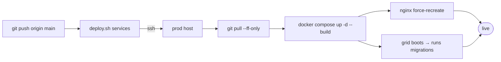

# Deployment

> How Noēsis ships to production: a Docker Compose stack behind nginx, deployed by `deploy.sh`. **This page describes the mechanism and its invariants only — the concrete host, SSH keys, and operator runbook are private and live outside this public wiki.**

## 🗺️ At a glance

## Mechanism

`deploy.sh [services]` connects to the production host, fast-forwards the checkout (`git pull --ff-only`), then rebuilds and restarts the named Compose services (`docker compose up -d --build <services>`). The stack is served behind **nginx**, with TLS terminated upstream. Host, key, directory, and branch are all environment-overridable; the script refuses to run without a valid key.

Typical service sets: `grid dashboard` for app changes; the documented full stack adds `nginx guide mysql steward`.

## Deploy-time invariants (learned the hard way)

- **The Grid runs migrations on boot.** A schema change ships when the grid container restarts (brief downtime). Validate migrations against real MySQL first — the test suite uses a mock Pool and won't catch reserved-word/syntax errors (see [[migrations]]).
- **Force-recreate nginx after any deploy that recreates upstream containers** (or edits the nginx template). Otherwise nginx serves stale config and returns 502s across the board.
- **Brain agents need `BRAIN_HTTP_SECRET`.** The per-Nous brain containers crash-loop on startup if that secret is absent from the production environment — they are not part of the standard app stack and require it to be provisioned first. Production secrets are never generated or committed by tooling; the operator sets them.

## What is NOT here

The production host address, SSH key locations, deploy directory, and the step-by-step operator runbook are **operational/private** — they live in the private developer log and the operator's own environment, not in this public wiki ([D-WIKI-06](../1-design/decisions.md)). The Grid never holds custody of any wallet or key (see [[economy]] · PHILOSOPHY §8).

## 🔗 Related

[[grid]] · [[migrations]] · [[wiki-hosting]] · [[architecture]]
