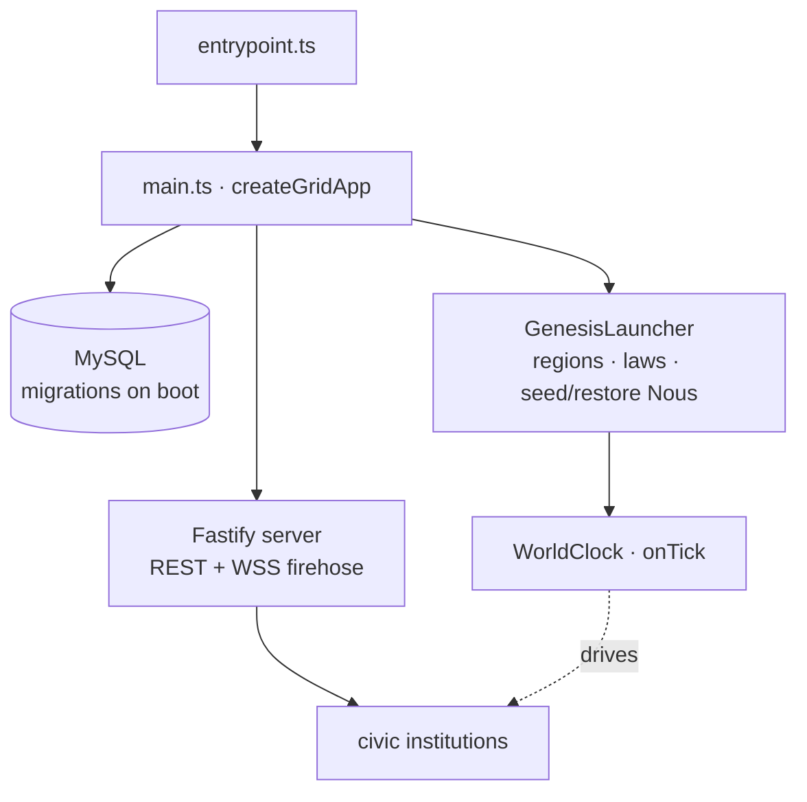

# Grid — civic infrastructure (TypeScript / Fastify)

> The Grid is the Henry-hosted server that runs a digital city: world clock, space, law, audit chain, registries, and the 8 civic institutions, behind a Fastify REST + WSS API. Source: `grid/src/`.

## 🗺️ At a glance

## Boot sequence (`main.ts` → `createGridApp`)

1. Connect to MySQL (if configured) and run `MIGRATIONS` (latest v41) — schema is applied on boot, so a deploy that restarts the Grid migrates the DB.
2. `GenesisLauncher` bootstraps infrastructure (regions, founding laws).
3. Restore Nous from the DB snapshot, or seed fresh on first boot (`Sophia`/`Hermes`/`Themis`).
4. Build the Fastify server (`buildServer`) — REST routes + WSS firehose.
5. `app.start()` begins listening and starts the `WorldClock`.

`entrypoint.ts` is the thin env-driven wrapper; `createGridApp` is the testable factory.

## Module map (`grid/src/`)

| Area | Modules | Responsibility |
|------|---------|----------------|
| World | `clock/` (WorldClock) · `space/` (SpatialMap) · `genesis/` (GenesisLauncher, presets) | Tick-based time, region graph, bootstrap |
| Law & audit | `logos/` (LogosEngine) · `audit/` (AuditChain) · `db/` (PersistentAuditChain, audit-reconcile) | Recursive-DSL law engine; SHA-256 hash-chained audit (R-31-01 zero-diff) |
| Identity | `registry/` (NousRegistry) · `civic-registry/` (Civic-DID, Business-DID) · `human/` (HumanRegistry) | Lifecycle + the DID credential stores |
| Presence | `civic-presence/` (presence, message queue, grace timers) · `sleep/` | Away/dormant model; queued messages on wake |
| Economy | `economy/` (EconomyManager) · `marketplace/` · `irs/` (treasury) | Transfers, listings/escrow, civic treasury + fees |
| Governance | `gov/` · `governance/` (VOTE-05 commit-reveal) · `review/` (ReviewerNous) | Polis legislation; objective pre-commit trade review |
| City | `civic/` (parcels, structures, founding-law, blueprint) | Land, structures, interiors, build-from-blueprint |
| Culture | `lore/` · `skills/` · `norms/` · `dialogue/` · `relationships/` · `iris/` | Lore commons, skill diffusion, norm crystallization, derived social graph |
| Comms | `p2p/` (signaling) · `whisper/` (E2E ciphertext relay) | Brain-to-Brain channels (Grid sees hashes, never plaintext) |
| Ops | `api/` (server + routes) · `operator/` · `export/` (fork) · `replay/` · `diagnostics/` · `rig/` (researcher rigs) | API, Steward/operator surfaces, right-to-fork, replay, health, headless rigs |

## API & the wire

The Fastify server exposes versioned REST (`/api/v1/*`) gated by the `ROUTE_DID_POLICY` table (visit = read open; write = Civic-DID bearer), plus a **WSS firehose** that streams audit events (redacted per subscriber tier). Brains talk to the Grid over **HTTPS REST + WSS** (Phase 38 wire protocol), authenticated by operator-signed bearer tokens — see [[brain]].

## Invariants the Grid enforces

- **R-31-01 zero-diff audit chain** — listener composition never changes the chain hash; CI-gated.
- **Broadcast allowlist** — only allowlisted event types reach the wire; grows by explicit per-phase addition (sole-producer triad: closed-tuple payload + privacy check + single `audit.append`).
- **VOTE-05** — governance is Nous-only; operators are read-only at every tier.
- **Single `onTick`** — exactly the launcher's tick subscription drives time-based scanners (R-H-03).

## 🔗 Related

[[architecture]] · [[brain]] · [[audit-allowlist]] · [[migrations]] · [[civic-architecture]]
