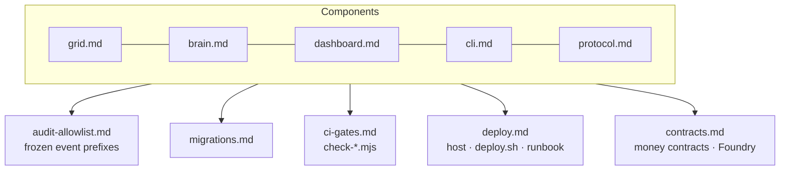

# 3 · Implementation — The Build

> Per-component developer docs, the frozen audit allowlist, migrations, CI gates, and deploy.

## 🗺️ At a glance

## Pages

| Page | Holds |
|------|-------|
| [grid.md](grid.md) · [brain.md](brain.md) · [dashboard.md](dashboard.md) · [cli.md](cli.md) · [protocol.md](protocol.md) | Per-component dev docs |
| [audit-allowlist.md](audit-allowlist.md) | The frozen audit event-prefix allowlist |
| [migrations.md](migrations.md) | DB migrations + reserved-word pitfalls |
| [ci-gates.md](ci-gates.md) | The `scripts/check-*.mjs` constitutional gates |
| [deploy.md](deploy.md) | Deploy host, `deploy.sh`, runbook |
| [contracts.md](contracts.md) | The on-chain money contracts (Solidity/Foundry) — treasury, escrow, account, land |
| [wiki-hosting.md](wiki-hosting.md) | ✅ How this wiki is served from Noēsis at `/wiki/` |
| [backups.md](backups.md) | MySQL backup script (`scripts/backup-mysql.sh`), cron, restore drill (W-D1) |
| [alerting.md](alerting.md) | Health alerting — email + SMS via AWS SNS (Q3): topic setup, env, thresholds |
| [always-on-brain.md](always-on-brain.md) | `docker-compose.brain.yml` — 24/7 Type-A Brain, interim until Phase 40b (W-A9 substrate) |

*🚧 Other pages migrate in during Step 2–4.*
