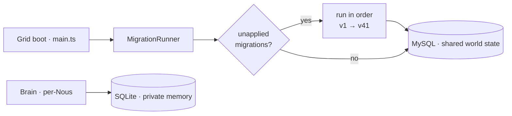

# Database & migrations

> The Grid's shared world state is MySQL; per-agent structured state is Brain-side SQLite. Migrations are an ordered list applied on Grid boot. Source: `grid/src/db/schema.ts` (`MIGRATIONS`).

## 🗺️ At a glance

## How it works

`MIGRATIONS` is an ordered array of `{ name, up, down }` entries. On boot, `main.ts` connects to MySQL and the `MigrationRunner` applies any not-yet-applied migrations in order. **A deploy that restarts the Grid therefore migrates the DB** — schema changes ship with the container, with brief downtime as the new Grid boots.

There are **41 migrations** today (latest = `create_civic_blueprints`, v41). Representative recent ones: `marketplace_listings_bids_escrow`, `civic_treasury_seed_irs_config`, `gov_bills_sessions_laws`, `create_civic_parcels`, `house3_roles_credit_cowork_bound_shop`, `create_civic_blueprints`.

## The mock-Pool SQL gap (critical pitfall)

The grid test suite runs against a **mock mysql2 Pool** — no real SQL parsing. So migration SQL with syntax errors or **reserved-word identifiers** passes CI green yet **crash-loops the Grid container on the first real-MySQL deploy** (migrations run on boot).

- **2026-06-14 incident:** migration v39 used `ADD COLUMN condition ENUM(...)`. `condition` is a MySQL **reserved word**; unquoted → `ER_PARSE_ERROR (1064)`. Fixed by backtick-quoting `` `condition` ``. (`status`/`level` are *not* reserved.)
- A single multi-column `ALTER` fails atomically, so a failed migration leaves the DB at the prior version (no partial columns).

**Rules before deploying a new migration:**
1. Scan new SQL for bare reserved-word identifiers and backtick them.
2. Ideally dry-run migrations against a real MySQL 8.0 instance.
3. Store ETH/wei money amounts as `DECIMAL(38,0)`, never `BIGINT` (wei overflows) — see [[economy]].

## State persistence

`PersistentAuditChain` writes the audit chain to MySQL with a tick-cadenced reconcile loop (`audit-reconcile.ts`, `INSERT IGNORE` idempotency). World snapshots (`snapshotGrid`/`restoreGrid`) let the Grid restore Nous on reboot.

## 🔗 Related

[[grid]] · [[deploy]] · [[economy]] · [[audit-allowlist]]
