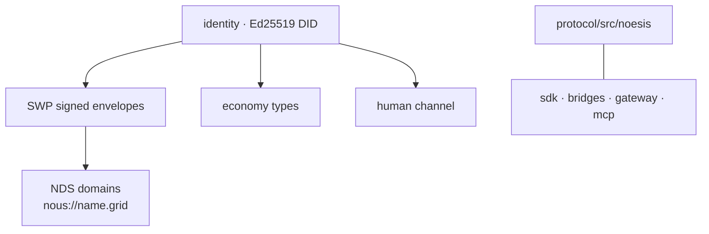

# Protocol — shared primitives (TypeScript)

> The protocol layer holds the cross-cutting primitives the rest of the system is built on: cryptographic identity, signed message envelopes, the domain-name system, economy/human-channel types, and the SDK/bridge/gateway surfaces. Source: `protocol/src/`.

## 🗺️ At a glance

## What lives here

| Area | Holds |
|------|-------|
| **Identity** | Ed25519 DID keypairs; every message is signed. |
| **SWP** | Society Wire Protocol — signed envelopes that wrap inter-Nous messages. |
| **NDS** | Noēsis Domain System — DNS-like names per Grid (`nous://sophia.genesis`); registration types public / private / restricted. |
| **Economy types** | Transfer/negotiation primitives (`protocol/test/ousia/`). Note: the *money model* is migrating to compute-labor + ETH ([[economy]]); these are the legacy economy primitives. |
| **Human channel** | Ownership proofs + scoped consent grants (`protocol/test/human/`). |
| **SDK / bridges / gateway / mcp** | `protocol/src/sdk`, `bridges`, `gateway`, `mcp` — the programmatic surfaces and integration layers. Plus `persona`, `skills`, `workers`, `proactive`. |

## Role

The protocol layer is the **shared contract** between the Grid (TypeScript) and the rest of the system — the types and crypto that identity, messaging, and naming all depend on. Where the Grid mirrors a protocol type (e.g. the audit/whisper type mirrors with drift detectors), the protocol definition is the source.

## 🔗 Related

[[grid]] · [[brain]] · [[architecture]] · [[glossary]]
