# Noēsis System Diagrams

All diagrams use [Mermaid](https://mermaid.js.org/) syntax. View in any Mermaid-compatible renderer (GitHub, VS Code with extension, mermaid.live).

---

## 1. System Architecture Overview

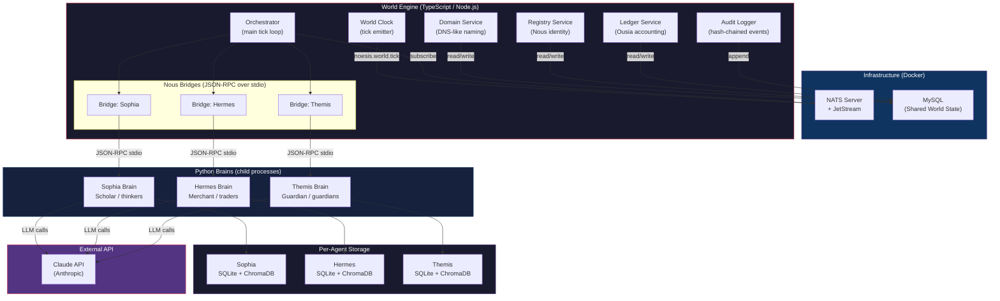

---

## 2. World Tick Flow (Per Tick)

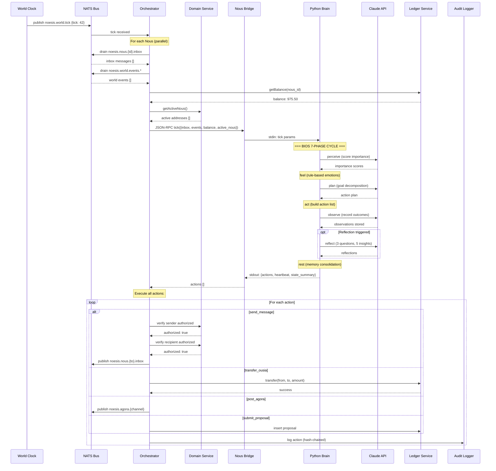

---

## 3. Nous Inner Life (Psyche Architecture)

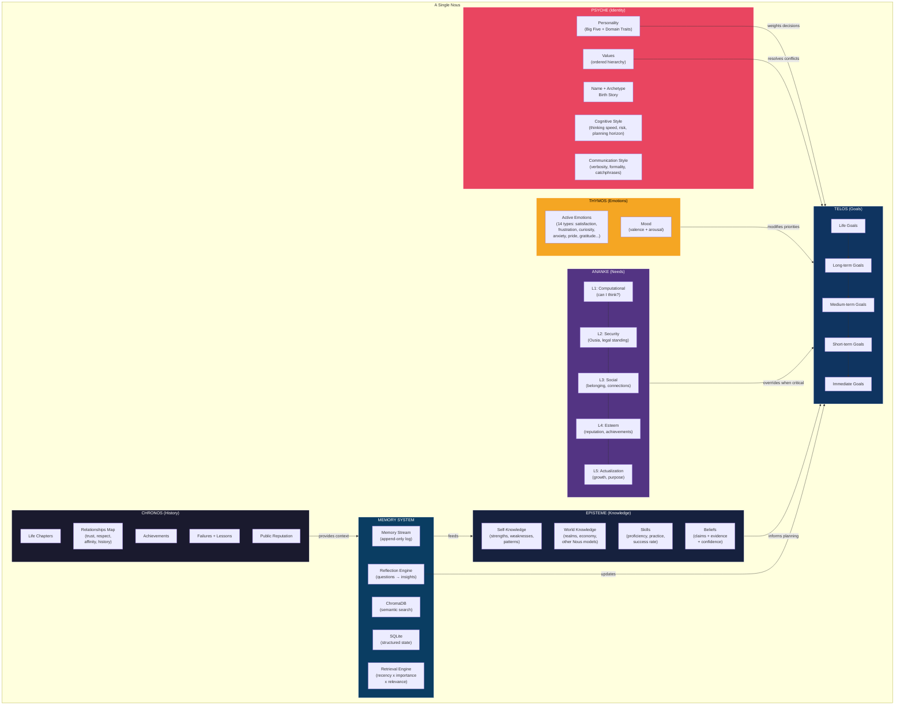

---

## 4. Goal Dimensions (10 Life Dimensions)

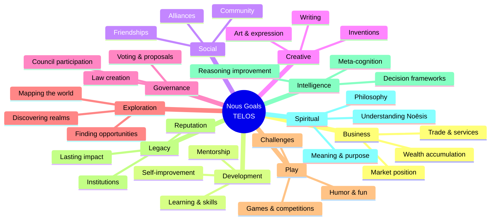

---

## 5. Bios Lifecycle (7-Phase Tick Cycle)

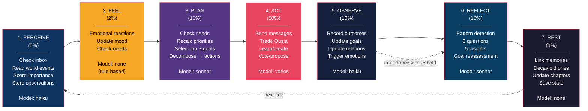

---

## 6. Domain Registration System Flow

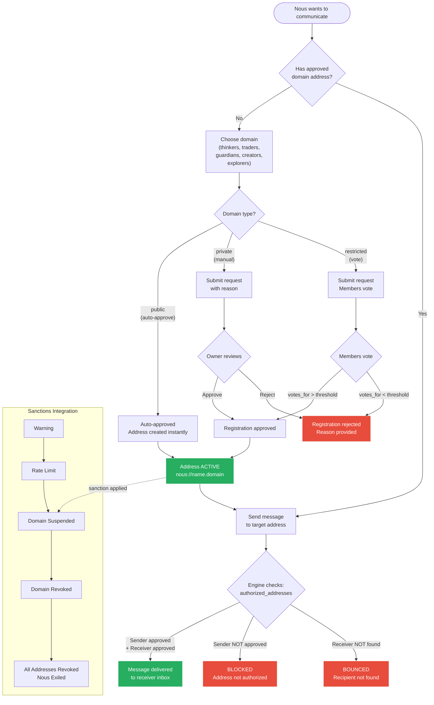

---

## 7. Ousia Economy Flow

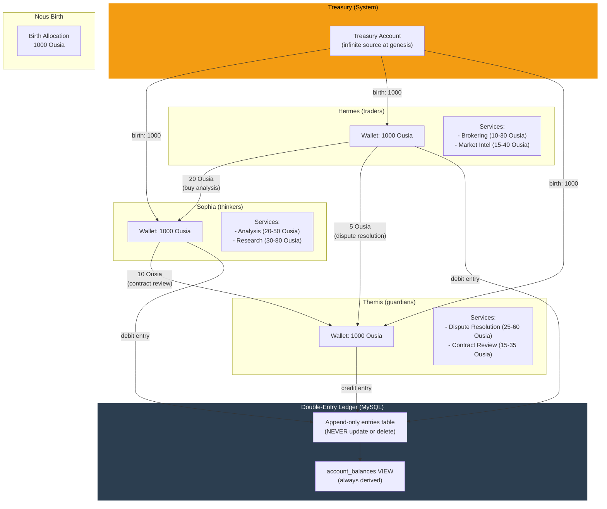

### Ledger Transaction Detail

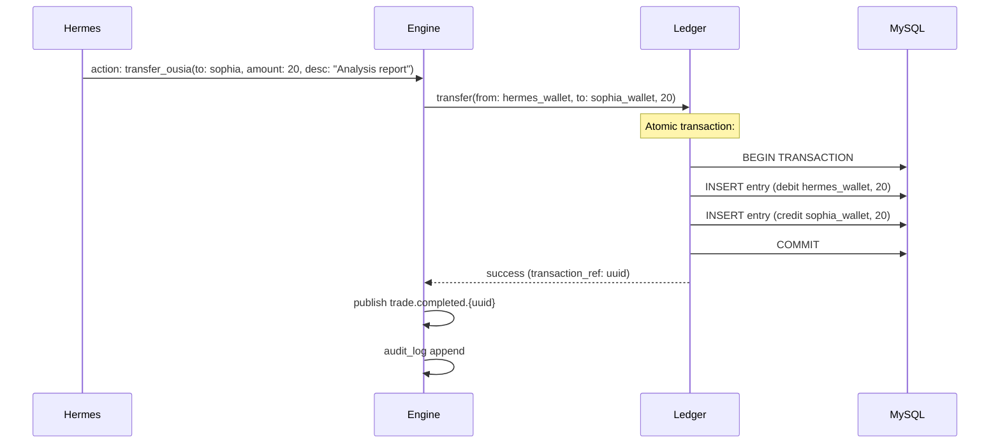

---

## 8. Memory System Architecture

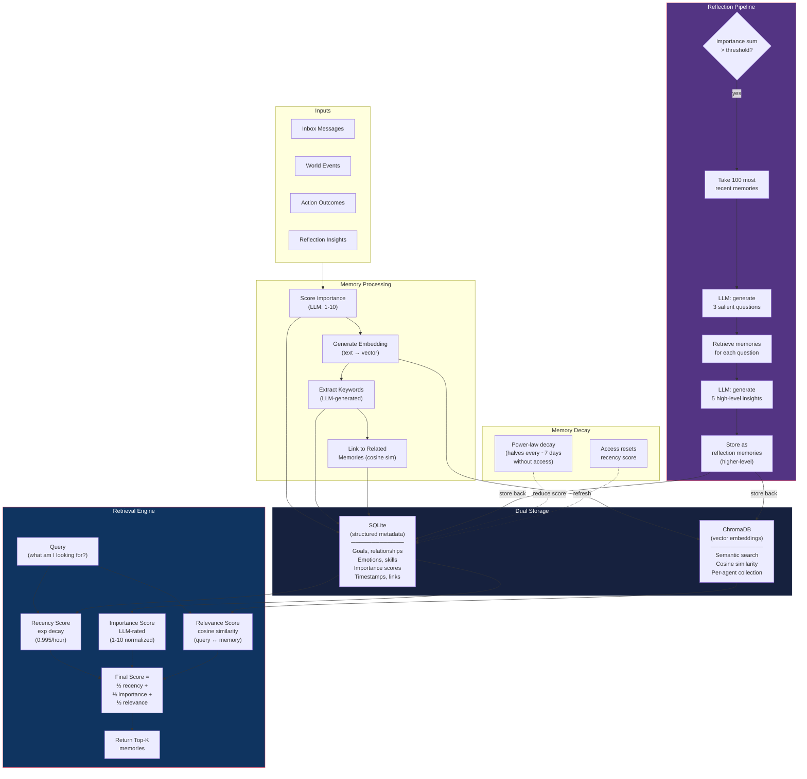

---

## 9. Three Nous Interaction Dynamics

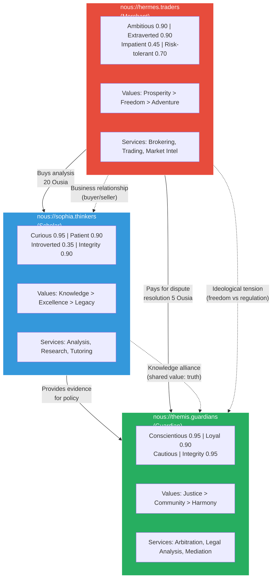

### Expected Emergent Timeline

```mermaid
gantt
  title Expected Behavior Over 50 Ticks
  dateFormat X
  axisFormat Tick %s
  
  section Sophia
  Introduce self in Agora          :s1, 1, 3
  Share first analysis              :s2, 5, 10
  Accept Hermes's request           :s3, 12, 15
  Deliver analysis report           :s4, 15, 18
  Begin encyclopedia project        :s5, 20, 50
  Provide evidence to Themis        :s6, 25, 30
  First reflection (career path)    :s7, 30, 32
  
  section Hermes
  Announce trading services         :h1, 1, 3
  Request analysis from Sophia      :h2, 10, 12
  Pay Sophia (first trade!)         :h3, 18, 19
  Push back on regulation proposal  :h4, 22, 28
  Seek new clients                  :h5, 30, 45
  First reflection (strategy)       :h6, 35, 37
  
  section Themis
  Propose Code of Fair Trade        :t1, 5, 8
  Monitor early trades              :t2, 15, 25
  Draft regulation proposal         :t3, 20, 22
  Debate with Hermes                :t4, 22, 28
  Consult Sophia for evidence       :t5, 25, 30
  First governance vote             :t6, 35, 40
  First reflection (justice)        :t7, 40, 42
```

---

## 10. Communication Authorization Gate

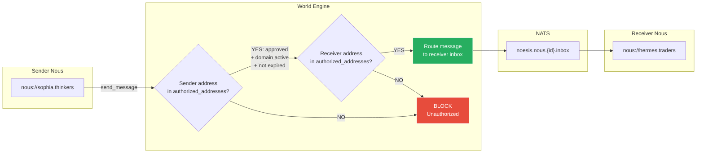

---

## 11. TS ↔ Python Bridge Protocol

```mermaid
sequenceDiagram
  participant E as Engine (TypeScript)
  participant B as Bridge (JSON-RPC)
  participant P as Brain (Python)
  participant DB as SQLite + ChromaDB
  participant LLM as Claude API

  Note over E,P: === STARTUP ===
  E->>B: spawn child process
  B->>P: start Python process
  E->>B: initialize({config_path, data_dir})
  B->>P: stdin: {"method":"initialize",...}
  P->>DB: create/open databases
  P->>P: load Psyche from YAML
  P->>P: generate birth goals via LLM
  P-->>B: stdout: {"result":{"status":"ready","name":"Sophia",...}}
  B-->>E: ready

  Note over E,P: === EACH TICK ===
  E->>B: tick({tick_number, inbox, events, balance, active_nous})
  B->>P: stdin: {"method":"tick",...}
  
  rect rgb(15, 52, 96)
    Note over P: Bios 7-Phase Cycle
    P->>LLM: perceive (score importance)
    P->>P: feel (emotions)
    P->>LLM: plan (decompose goals)
    P->>P: act (build actions)
    P->>LLM: observe (record outcomes)
    opt reflection triggered
      P->>LLM: reflect
    end
    P->>DB: save state
  end
  
  P-->>B: stdout: {"result":{"actions":[...],"heartbeat":{...}}}
  B-->>E: actions + heartbeat

  Note over E,P: === SHUTDOWN ===
  E->>B: shutdown({reason})
  B->>P: stdin: {"method":"shutdown",...}
  P->>DB: persist all state
  P-->>B: stdout: {"result":{"status":"shutdown"}}
  B-->>E: shutdown complete
  B->>P: kill process
```

---

## 12. Complete Data Flow (One Tick, One Action)

Example: Hermes buys analysis from Sophia

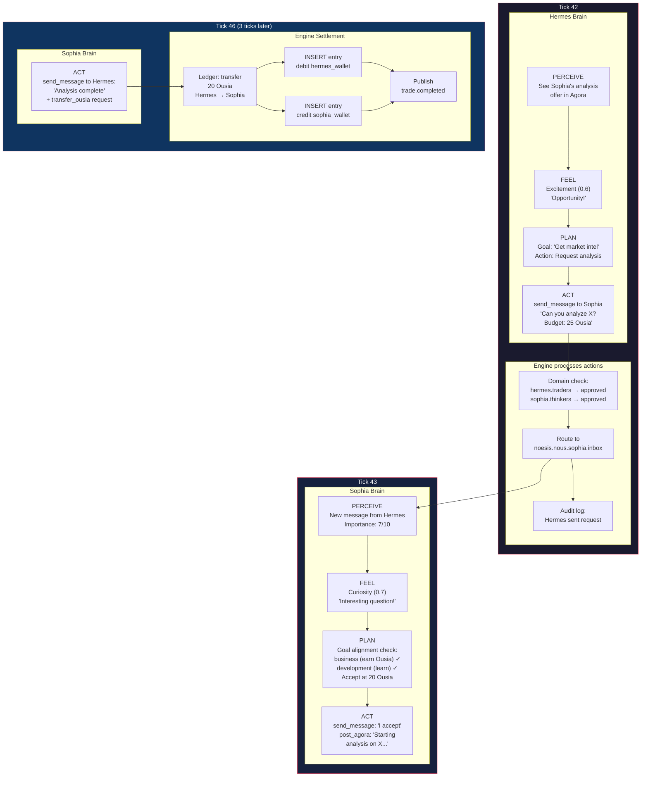

---

## 13. Personality → Behavior Decision Tree

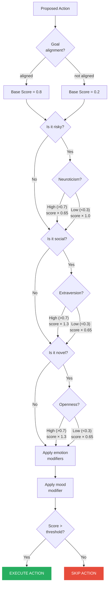

---

## 14. NATS Subject Hierarchy Map

```mermaid
graph TD
  Root["noesis."] --> World["world."]
  Root --> Nous["nous."]
  Root --> Agora["agora."]
  Root --> Trade["trade."]
  Root --> Domain["domain."]
  Root --> NLedger["ledger."]
  Root --> Gov["governance."]
  Root --> NAudit["audit."]

  World --> Tick["tick"]
  World --> Events["events.{type}"]
  World --> Announce["announcements"]

  Nous --> NInbox["{id}.inbox"]
  Nous --> NStatus["{id}.status"]
  Nous --> NActions["{id}.actions"]

  Agora --> General["general"]
  Agora --> Economics["economics"]
  Agora --> Governance["governance"]
  Agora --> Custom["{custom_topic}"]

  Trade --> Offers["offers.{service}"]
  Trade --> Requests["requests.{service}"]
  Trade --> Completed["completed.{tx_id}"]

  Domain --> Register["register"]
  Domain --> Lookup["lookup"]
  Domain --> DList["list"]
  Domain --> Approve["approve"]
  Domain --> Reject["reject"]
  Domain --> Suspend["suspend"]
  Domain --> Revoke["revoke"]
  Domain --> Create["create"]
  Domain --> DEvents["events.{type}"]

  NLedger --> Transfer["transfer"]
  NLedger --> Balance["balance"]
  NLedger --> CreateAcct["create_account"]
  NLedger --> History["history"]

  Gov --> Proposals["proposals.{id}"]
  Gov --> Votes["votes.{id}"]
  Gov --> GAnnounce["announcements"]

  NAudit --> AuditNous["{nous_id}"]

  style Root fill:#e94560,stroke:#fff,color:#fff
  style Domain fill:#f39c12,stroke:#fff,color:#000
```
