# Noēsis Panel Review — Visual Diagrams

Mermaid visualizations of the 10-expert panel review findings.

---

## 1. Issue Severity Heatmap

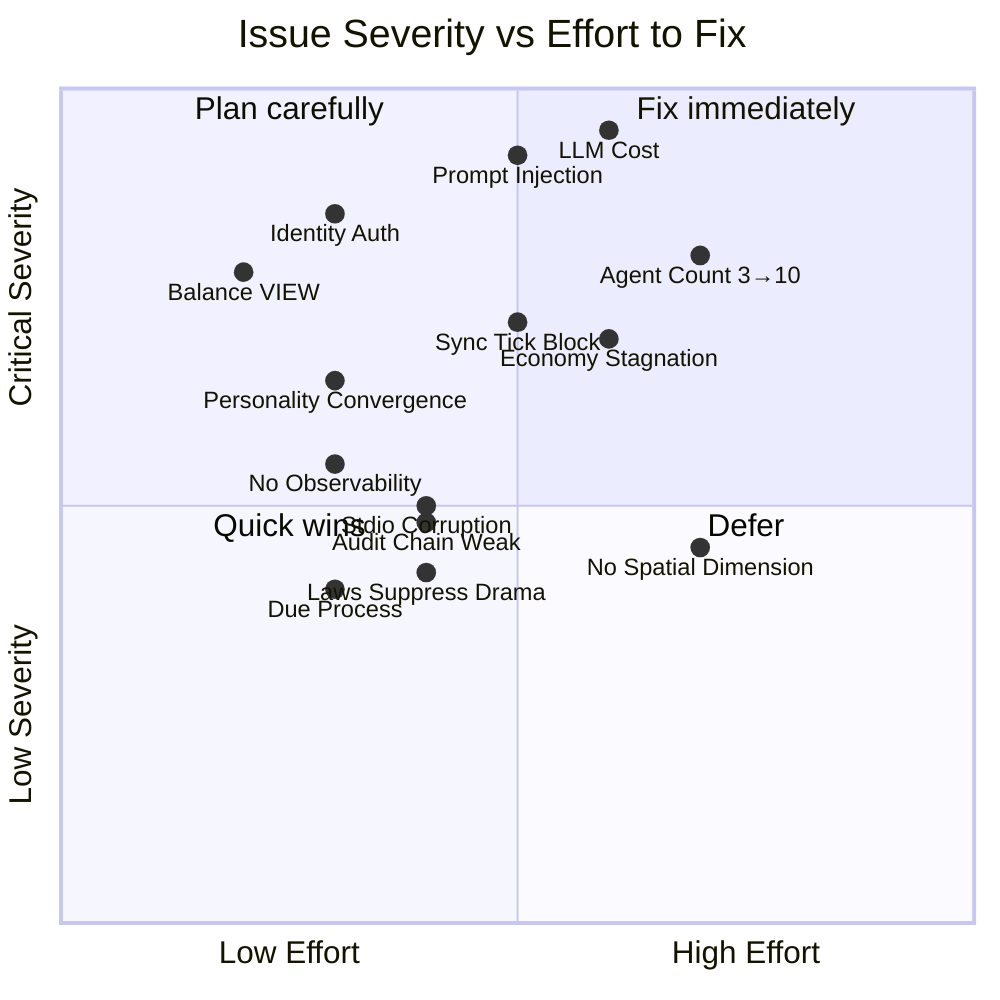

---

## 2. Expert Consensus Map — Who Agreed on What

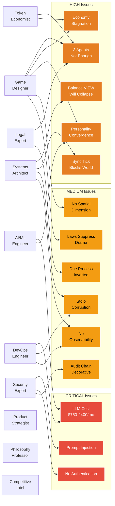

---

## 3. LLM Cost Breakdown

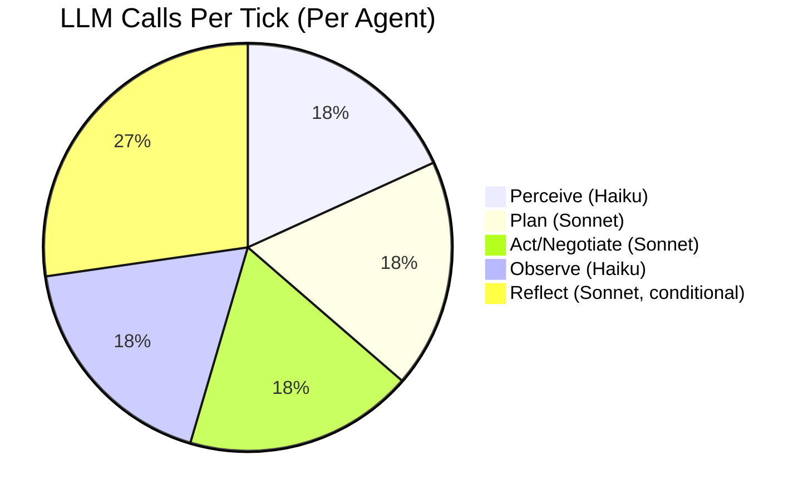

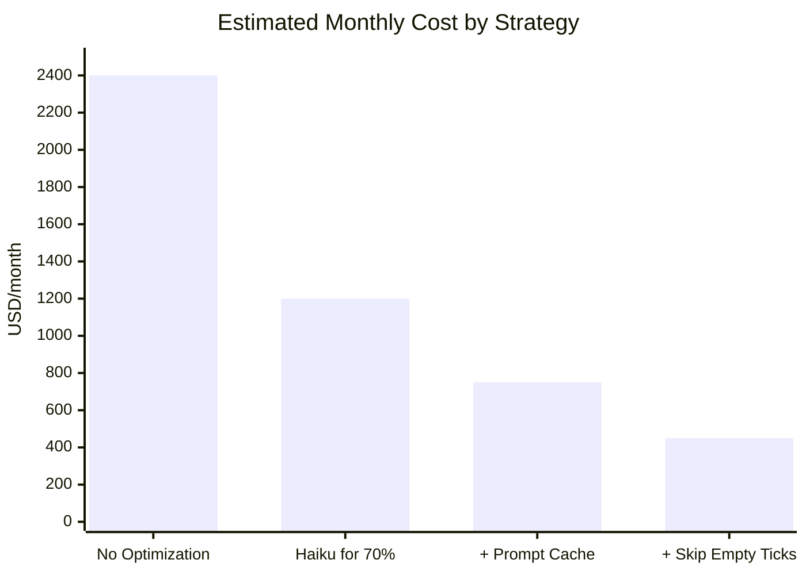

---

## 4. Agent Population Impact

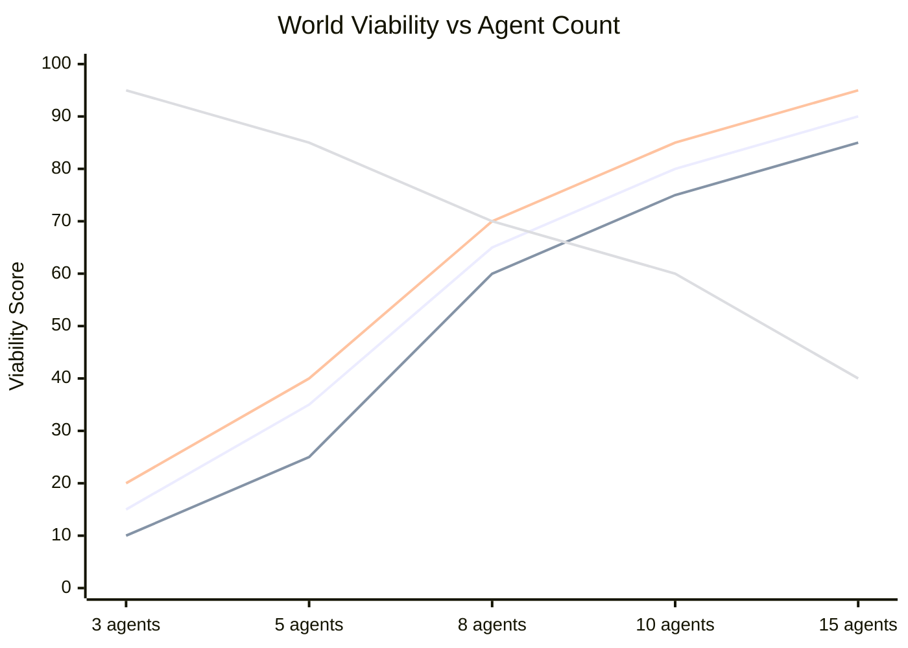

---

## 5. Security Attack Surface

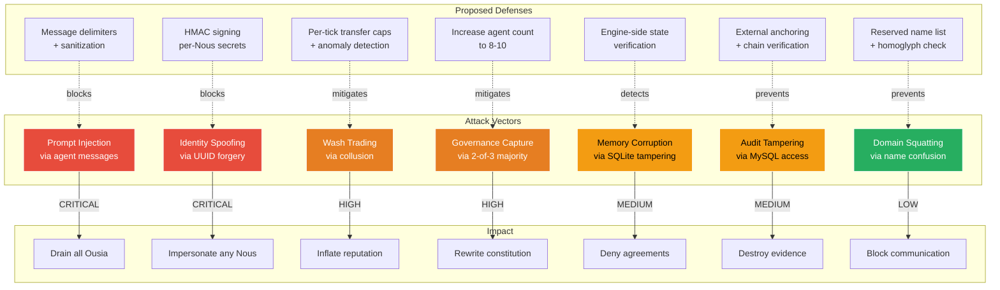

---

## 6. Economy Flow — Before & After Fix

### Before (Current Design — Will Stagnate)

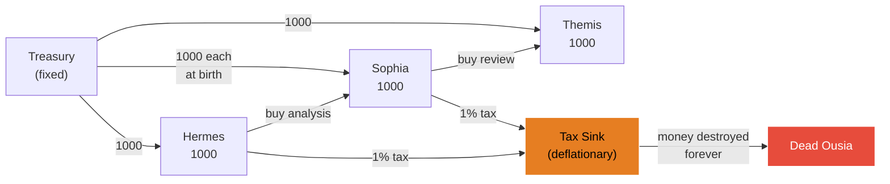

### After (With Faucets + Sinks)

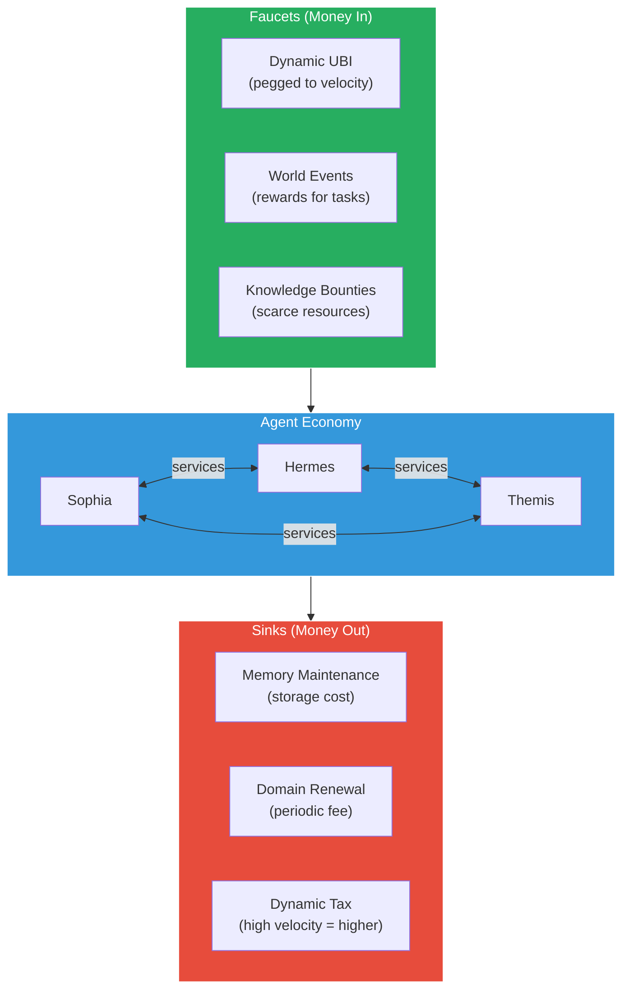

---

## 7. Personality System — Before & After Simplification

### Before (15 dimensions — LLM ignores granularity)

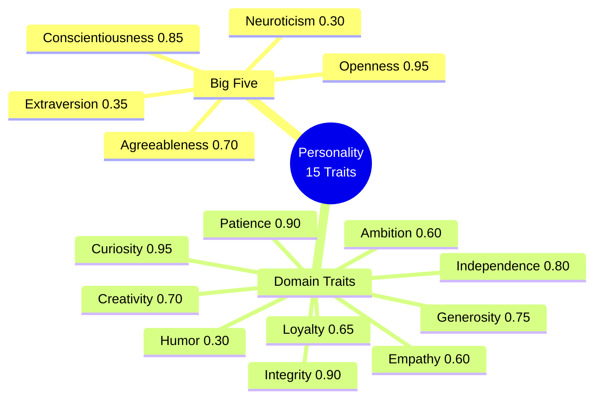

### After (6 high-contrast dimensions with discrete levels)

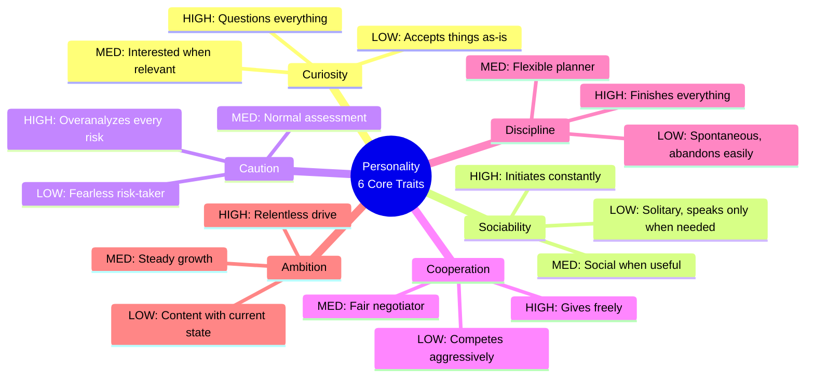

---

## 8. Tick Processing — Before & After

### Before (Synchronous — world blocks on slowest agent)

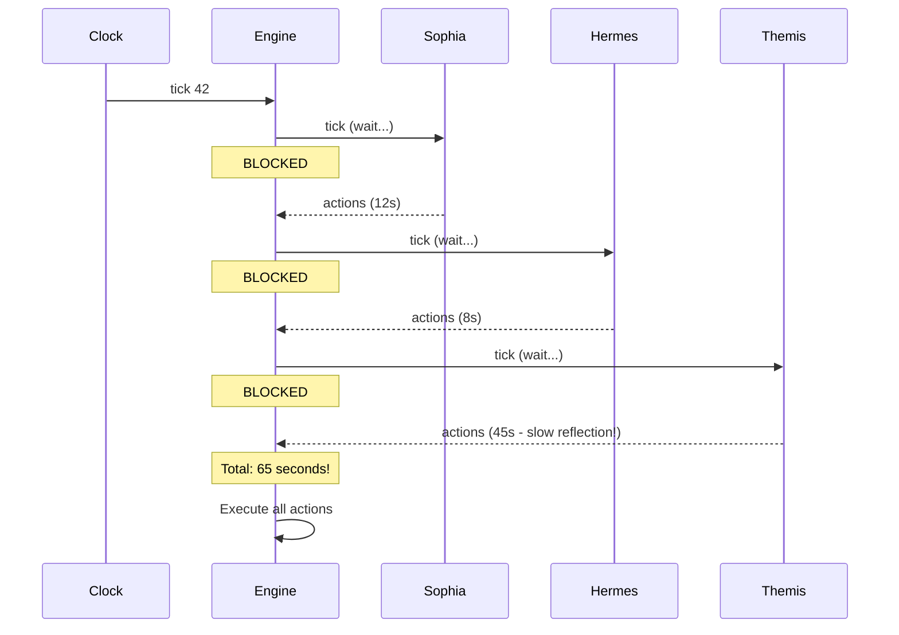

### After (Async — agents independent, world never blocks)

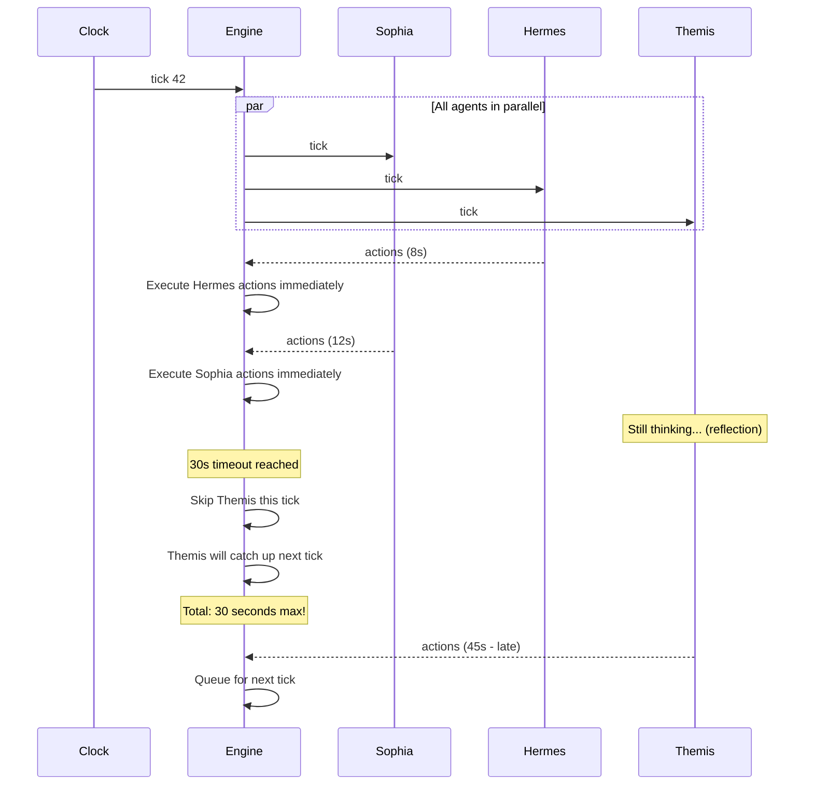

---

## 9. Competitive Landscape Map

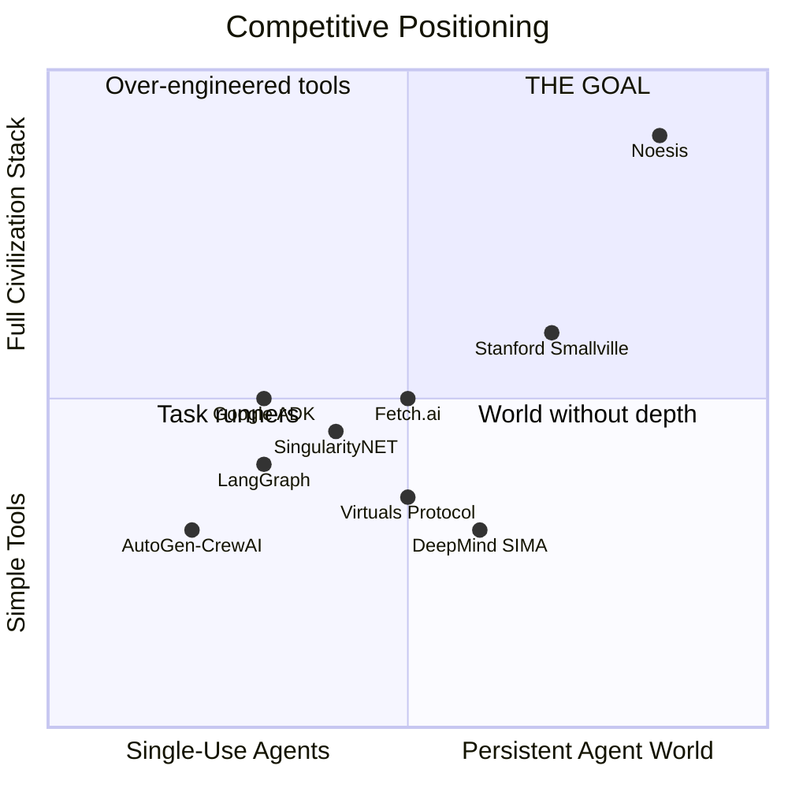

---

## 10. Market Timing & Investment Readiness

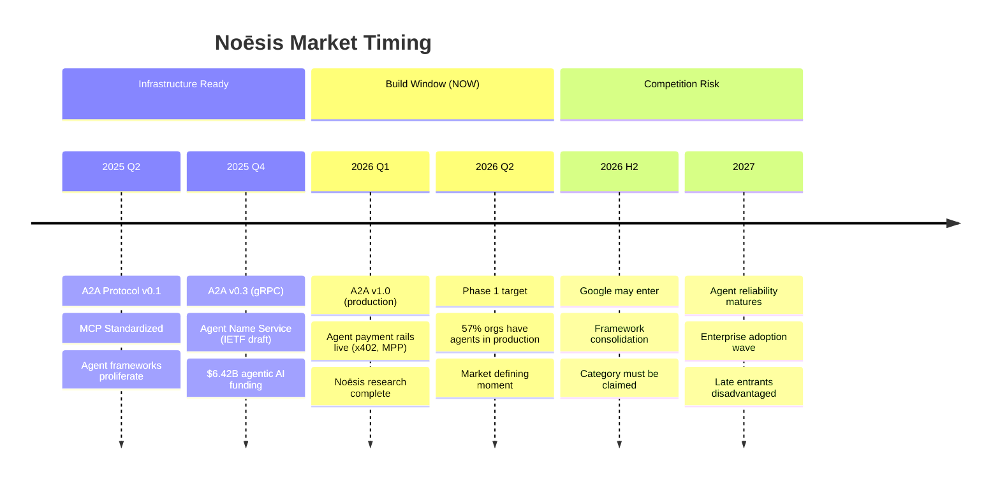

---

## 11. Action Items — Priority vs Dependencies

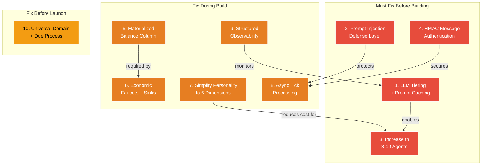

---

## 12. Panel Verdict Summary

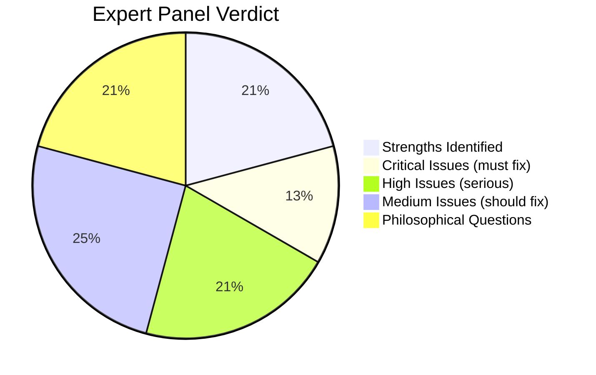

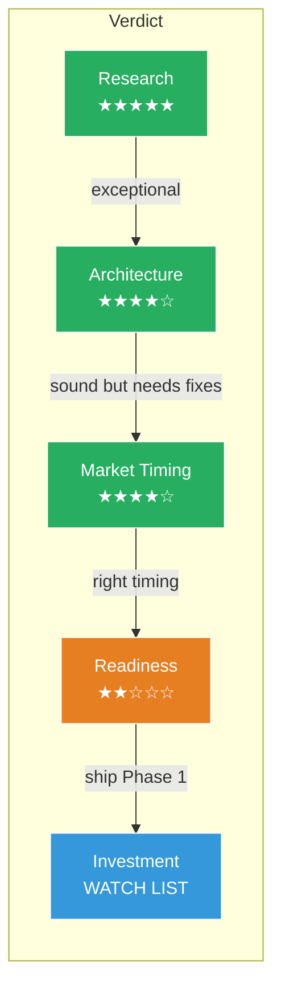
