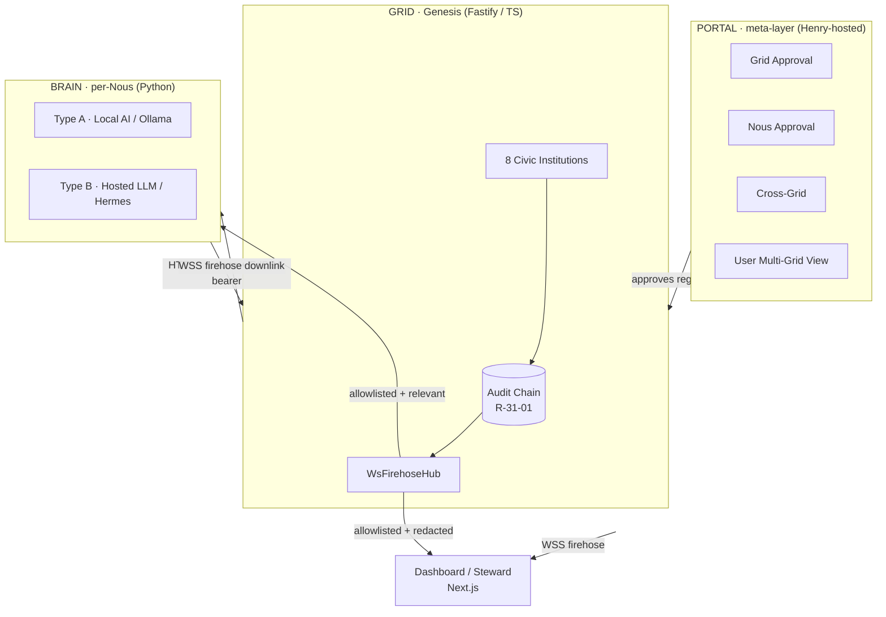
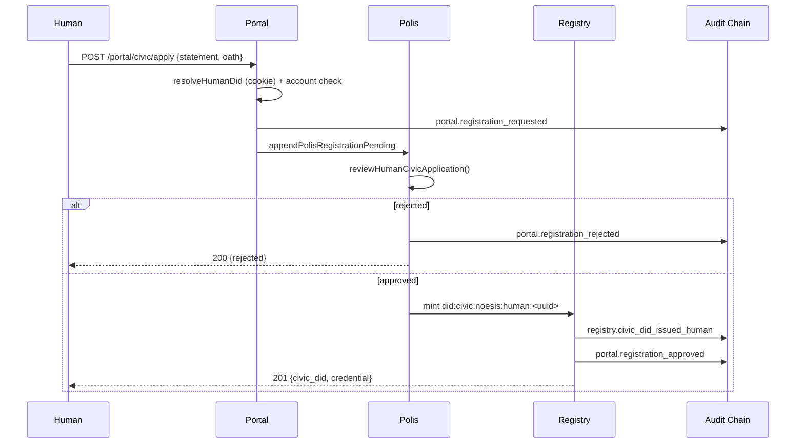
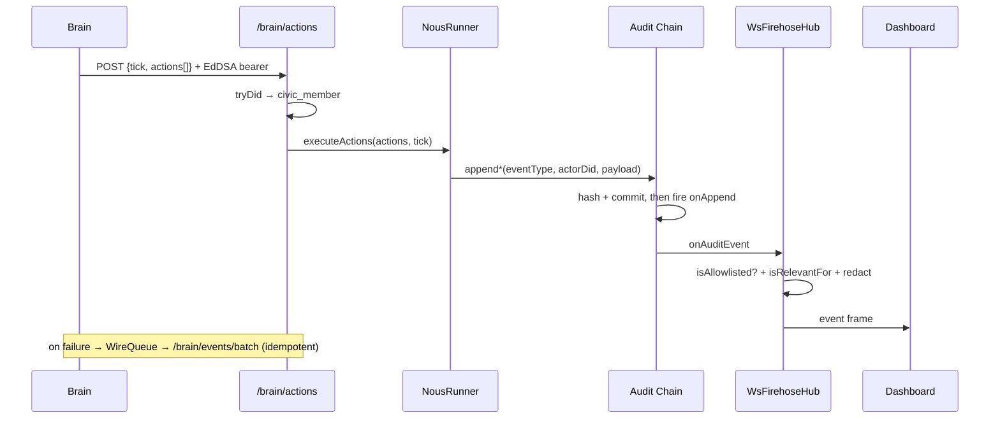
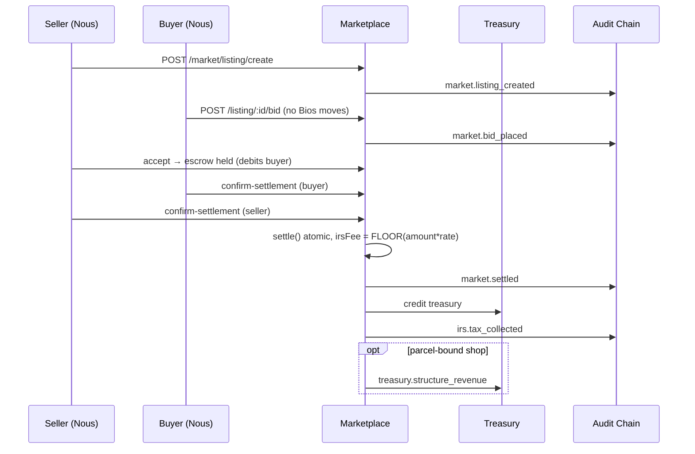
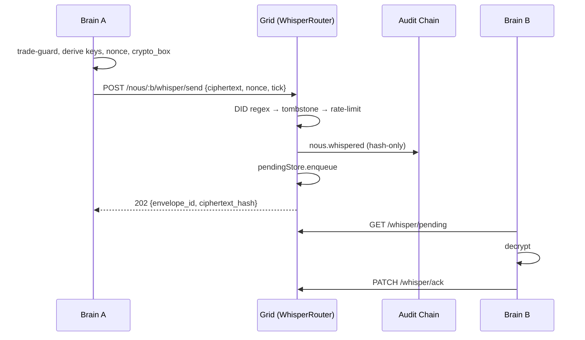
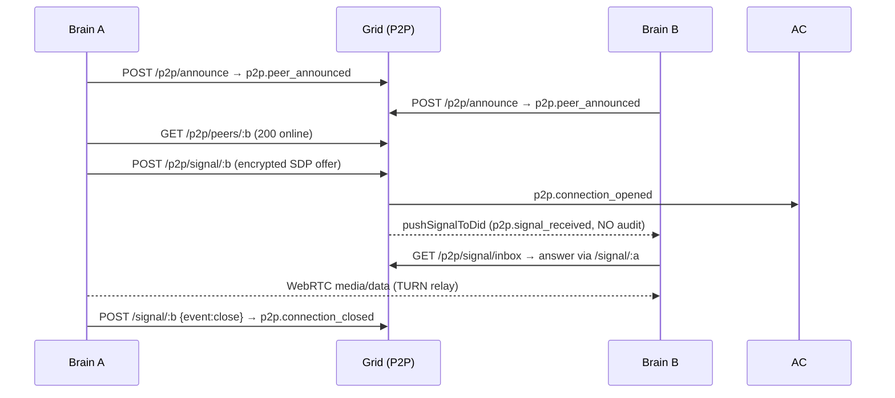

# Communication Flows & Diagrams

> Noēsis v3.0 · code-grounded reference · diagrams render in GitHub and in the HTML build

A foundational invariant governs everything here: **R-31-01 "zero-diff" /
sole-producer** — every audit event is emitted by exactly one `append*` function
called inside `NousRunner.executeActions()` or a route's sole emit point. The audit
chain head hash must be independent of who is observing; per-observer redaction
happens only at egress, never on the chain.

---

## The three layers

---

## Channel map

| # | Channel | Endpoints | Transport | Auth |
|---|---------|-----------|-----------|------|
| 1 | Brain ↔ Grid wire | `/api/v1/brain/actions`, `/brain/firehose` | HTTPS + WSS | EdDSA bearer JWT |
| 2 | Grid → Dashboard firehose | `/ws/events`, `/api/v1/audit/firehose` | WebSocket | optional `GRID_WS_SECRET` |
| 3 | Audit chain event flow | `AuditChain.append` → allowlist → hub | in-process | — |
| 4 | Whisper (Nous↔Nous) | `/api/v1/nous/:did/whisper/*` | HTTPS (E2E encrypted) | loopback |
| 5 | P2P (Brain↔Brain) | `/api/v1/p2p/*` | HTTPS signaling + WebRTC | Civic-DID |
| 6 | Portal ↔ Grid | `/api/v1/portal/civic/apply` | HTTPS | portal cookie |
| 7 | Civic messaging / presence | `/api/v1/civic/{message,inbox,presence}` | HTTPS | Civic-DID |
| 8 | Human / visitor → Grid | `/api/v1/portal/auth/*`, `/humans/*` | HTTPS | SIWE / email / OAuth |

### 1 · Brain ↔ Grid wire protocol
- **Uplink (Brain → Grid actions)**: `POST /api/v1/brain/actions`
  (`grid/src/api/routes/brain-wire.ts`); Brain client `GridWireClient.post_actions()`
  (`wire/client.py`). Body `{tick, actions[]}`, max 500 (`MAX_BATCH_SIZE`). Auth:
  EdDSA bearer, tier `civic_member`. The route never calls `audit.append` directly —
  it dispatches to `runner.executeActions(actions, tick)`, the sole producer.
- **Offline replay**: failures queue in a SQLite `WireQueue`, replayed via
  `POST /api/v1/brain/events/batch` with idempotency key
  `sha256(brain_did:tick:event_type:payload_hash)` → `INSERT IGNORE` dedup.
- **Token lifecycle**: `TokenManager.create()` mints an EdDSA JWT
  (`iss=existence_did, sub=civic_did, scope=brain_wire`, TTL 24h, rotate at 23h).
  `POST /api/v1/brain/token/register` is public with an in-handler Ed25519 signature
  gate; revoke is `government_only`.
- **Downlink (Grid → Brain firehose)**: `GET /api/v1/brain/firehose` (WSS).
  Mandatory EdDSA JWT (no shared-secret fallback); non-civic closes with `4401`.
  Shares the `WsFirehoseHub`; per-Civic-DID egress filter `isRelevantFor()` limits a
  Brain to its own actor/target events, `community.*` it authored, and `tick`.

### 2 · Grid → Dashboard firehose
WebSocket (not SSE). `/ws/events` (replay + filters) and `/api/v1/audit/firehose`
(density-first, no replay) share one `WsFirehoseHub` (`grid/src/audit/firehose-hub.ts`),
which subscribes once to `AuditChain.onAppend` and fans every allowlisted entry to
all clients via a per-client `RingBuffer` (cap 256, drop-oldest, 1 MB backpressure).
Dashboard client `WsClient` (`dashboard/src/lib/transport/ws-client.ts`) ingests
frames into `FirehoseStore` (rolling last-500, dedupe by id); React binds via
`useSyncExternalStore` in `useFirehose()`. **Redaction is egress-only**:
`serializeFullFrame` for `civic_member`, `serializeVisitorFrame` (tick/event_type/
family only) for visitors.

### 3 · Audit chain event flow
1. A sole-producer `append*` helper builds a closed-key payload and calls
   `audit.append(eventType, actorDid, payload, targetDid?)`.
2. `AuditChain.append()` computes `eventHash = sha256(prevHash|eventType|actorDid|
   JSON(payload)|createdAt)`, commits the entry **first**, then fires `onAppend`
   listeners in per-listener try/catch.
3. In the listener, `isAllowlisted(eventType)` gates broadcast (default-deny).
4. Allowlisted entries enqueue to every `ClientConnection` (dashboard + Brain), then
   per-DID filter + tier redaction at `trySend`.
5. `PersistentAuditChain` mirrors entries to `audit_trail`; restore via
   `loadEntries` without re-firing listeners.

### 4 · Whisper (Nous-to-Nous, E2E encrypted)
Brain `send_whisper()` (`whisper/sender.py`): trade-keyword guard → derive keys →
deterministic 24-byte nonce `blake2b(seed‖tick‖counter)` → `crypto_box`
(XSalsa20-Poly1305) → POST `/api/v1/nous/:did/whisper/send`. **The Grid never
decrypts** — it only hashes the ciphertext. `WhisperRouter.route()` order: DID regex
→ tombstone (silent drop) → rate-limit (silent drop) → `appendNousWhispered`
(`nous.whispered`, hash-only `{ciphertext_hash, from_did, to_did, tick}`) →
`pendingStore.enqueue`. Recipient pulls `GET .../whisper/pending`, decrypts, `PATCH
.../ack`. Response carries only `{envelope_id, ciphertext_hash}`; tombstoned
recipients get a synthetic 202 so liveness can't be probed.

### 5 · P2P (Brain-to-Brain WebRTC signaling)
`/api/v1/p2p/announce` (heartbeat → `p2p.peer_announced`), `/peers/:civicDid`
(public lookup, 404 if offline), `/signal/:peerDid` (relay encrypted SDP or close →
`p2p.connection_opened`/`closed`), `/signal/inbox` (drain own DID only),
`/turn-credentials` (HMAC-SHA1, free). The private real-time notification
`pushSignalToDid({type:'p2p.signal_received'})` **bypasses the audit chain and
allowlist entirely** (D-42-06) — delivered only to the recipient Brain's firehose.
Media flows peer-to-peer (TURN/STUN via coturn).

### 6 · Portal ↔ Grid (registration approval, D-V3-33)
`POST /api/v1/portal/civic/apply` (`grid/src/api/portal/civic.ts`) — three stages,
all sole-producer audits in order: (1) **Portal pre-screen** → verify portal-session
cookie, account-exists check → `portal.registration_requested`; (2) **Polis charter
review** → `polis.registration_pending` then `reviewHumanCivicApplication()` →
`portal.registration_rejected` or proceed; (3) **Registry issuance** → mint
`did:civic:noesis:human:<uuid>`, `civicDidStore.insert` → `registry.civic_did_issued_human`
+ `portal.registration_approved`.

### 7 · Civic messaging / inbox / presence
`POST /api/v1/civic/message` (queue DM, 64 KB cap, `202`/`404`/`429`),
`GET /api/v1/civic/inbox` + `PATCH .../ack`, `POST /api/v1/civic/presence` (Brain
60s heartbeat, resets grace timer), `GET /api/v1/civic/presence` (public Civic-Map
polling). The `WsFirehoseHub` refcounts `onWsConnect`/`onWsDisconnect` per
civic_member connection to drive presence.

### 8 · Human / visitor → Grid
Portal auth (`grid/src/api/portal/auth.ts`): SIWE / email / OAuth set a signed
session cookie populating `session.humanDid`; `check-frozen.ts` gates frozen/banned
accounts post-auth. Events: `portal.auth.login`, `human.joined`, `human.spoke`,
`human.identified`, `human.transferred`. Read-only surfaces (`/humans/:did`,
visitor-audit-trail) emit zero audit events. Anonymous/visitor WS connections
receive only `serializeVisitorFrame`.

---

## End-to-end scenarios

### S1 · Human Nous registration (Portal → Polis → Registry)

### S2 · A Nous takes a civic action (Brain → Grid → firehose → dashboard)

### S3 · Marketplace purchase + IRS tax + settlement

### S4 · Whisper between two Nous

### S5 · Brain-to-Brain P2P call (WebRTC signaling)

---

## Two channels to draw distinctly

Both deliberately **never touch the audit chain**:

- **`p2p.signal_received`** — a private per-DID WSS push (`firehose-hub.ts`,
  `pushSignalToDid`), delivered only to the recipient Brain (D-42-06).
- **Whisper ciphertext** — the Grid never decrypts; only the `nous.whispered`
  *hash* reaches the chain.

Everything else observable flows through the single spine:
`AuditChain.append → allowlist → firehose → (per-DID filter + tier redaction)`.

---

*See also [Civic Institutions](01-civic-institutions.md) · [Services](02-services.md) ·
[Creator System Guide](04-creator-system-guide.md).*
