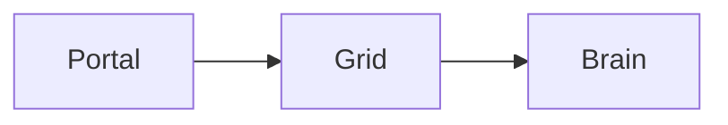
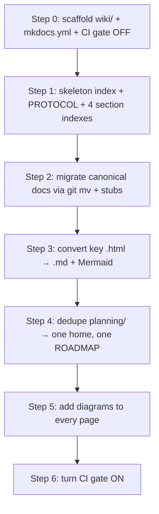

# Noēsis Wiki System — Design

**Date:** 2026-06-14
**Status:** validated, in implementation
**Decision owners:** Henry (askkpop), Claude

---

## Problem

The project has **1,077 markdown files** plus scattered HTML, with **no single index, no search, and active duplication**:

- two planning dirs: `planning/` (non-dot) **and** `.planning/`
- a root `ROADMAP.md` duplicating `.planning/ROADMAP.md`
- knowledge split across `.md` and a dozen `.html` files

Neither the user nor Claude can reliably find or trust the source of truth. The fix is **not a new SaaS tool** — it is consolidating everything into one navigable, in-repo, single-source-of-truth wiki that Claude reads first and updates every task.

## Decisions

| # | Decision |
|---|----------|
| D-WIKI-01 | **Engine = MkDocs Material.** Claude edits markdown; `mkdocs serve` renders a browsable HTML wiki; `mkdocs build` → static `site/`. |
| D-WIKI-02 | **Scope = full restructure.** New `wiki/` taxonomy; everything migrates in; duplicates removed. |
| D-WIKI-03 | **In-repo only.** No external wiki — Claude must read/update every turn; external SaaS breaks the loop and the Documentation Sync Rule. |
| D-WIKI-04 | **One `canonical: true` doc per topic.** Enforced invariant that kills duplication. |
| D-WIKI-05 | **Every page must include a visualization/diagram** (Mermaid `## At a glance` block). Required, lint-enforced. |
| D-WIKI-06 | **Completion gate (requirement):** no task is done until the wiki is updated to reflect it, in the same commit. |

## Taxonomy

```
wiki/
├── index.md              HOME: the map, read first every session
├── PROTOCOL.md           the always-follow / always-update loop
├── 1-design/             WHY & WHAT  — philosophy, architecture, civic-architecture, decisions
├── 2-planning/           WHEN & HOW MUCH — roadmap, milestones, requirements, state, phases/, research/
├── 3-implementation/     THE BUILD — grid, brain, dashboard, cli, protocol, audit-allowlist, migrations, ci-gates, deploy
└── 4-reference/          LOOK IT UP — handbook/, glossary, guides/, user-manual
```

Numeric prefixes drive MkDocs nav order.

## Single source of truth

- **`wiki/index.md`** — one-screen table: Topic → canonical doc → status → last_verified.
- **Front-matter on every page:** `canonical`, `supersedes`, `status` (live|draft|superseded|archived), `last_verified`, `owners`.
- **Superseded docs** keep only a one-line pointer to the new home (no stale content, no broken links).
- **Decision log** `1-design/decisions.md` — one row per `D-*`, linking the doc it governs.

## Build (markdown → HTML)

```
wiki/*.md ──(mkdocs build)──► site/  (HTML: nav tree + search + Mermaid)
```

- `mkdocs serve` → live HTML wiki at `localhost:8000` (the user's everyday view).
- `mkdocs build` → static `site/` (git-ignored), hostable on the existing nginx box (one location, no new server).
- Deps in `requirements-wiki.txt` (`mkdocs-material`, `mkdocs-awesome-pages-plugin`, `mkdocs-git-revision-date-localized-plugin`, mermaid via `pymdownx.superfences`).

## Page template

```markdown
---
canonical: true
status: live
last_verified: 2026-06-14
owners: [henry, claude]
---
# Title
> One-line purpose.
## 🗺️ At a glance        ← MANDATORY diagram

## Details
...
## 🔗 Related
[[architecture]] · [[decisions]]
```

## Enforcement

`wiki/PROTOCOL.md` + CI gate `scripts/check-wiki.mjs` (matches existing `scripts/check-*.mjs` pattern). Build fails if:

1. a page lacks front-matter,
2. a page lacks an `## At a glance` diagram,
3. two `canonical: true` docs claim one topic,
4. a `supersedes` points at a file that still has content.

**Loop:** read `wiki/index.md` first → do work → update canonical page + diagram + `last_verified` in the same commit → only then is the task done.

## Migration (reversible, committed steps)



- **`git mv` only** — preserve history; old paths get a superseded stub.
- **One commit per step** — reviewable, revertible.
- **Gate OFF until Step 6** — don't block builds mid-migration.
- **GSD phase workflow preserved** — `.planning/phases/` → `2-planning/phases/`, structure intact.
