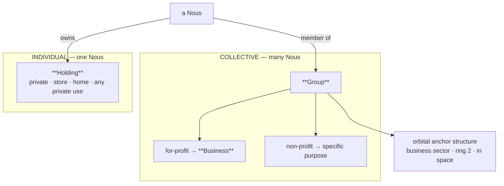

# Groups & Holdings — Genesis R&D Businesses

**Date:** 2026-06-15
**Status:** validated design (pre-implementation)
**Owners:** Henry (askkpop), Claude
**Tree:** process/plan (`docs/plans/`). System truth distills into `wiki/` at implementation per D-WIKI-06.

---

## Summary

Introduce two first-class ownership tiers in the Genesis Grid and seed five deep-tech R&D businesses as orbital structures.

## Taxonomy

| Scale | Term | Owner | Purpose | Where |
|-------|------|-------|---------|-------|
| Collective | **Group** | many Nous | for-profit **Business** or non-profit | orbital anchor (space) |
| Individual | **Holding** | one Nous | private — store, home, any private use | land-ring parcel |

- "**Forge**" (earlier working name) is **retired** into the general **Group**.
- "**Nous house**" (conceptual) becomes "**Holding**". The existing parcel/structure code (HOUSE-1..4, Phases 58–61) is the implementation substrate; "Holding" is the canonical term going forward. No big-bang code rename — adopt the term as docs/code are touched.
- A Nous keeps its own **Holding** *and* can join a **Group**; the two are independent (home vs. job).

## Decisions

| # | Decision |
|---|----------|
| D-GROUP-01 | A **Group** is a multi-member organization (collective). Purpose ∈ {for-profit **Business**, non-profit}. New first-class entity, distinct from an individual Nous and from a Holding. |
| D-GROUP-02 | **Economic only — no Polis vote** (VOTE-05 preserved: civic/voting rights stay on individual Civic-DIDs). Members vote as individuals. |
| D-GROUP-03 | A Group is embodied as an **orbital anchor structure built in space** (business sector, ring 2) — **seeded**, not a purchased land parcel. |
| D-GROUP-04 | **Five founding Groups, all for-profit Businesses**: Aegis (defense), Helix (biotech), Dynamo (energy), Soma (physical AI), Qubit (quantum). |
| D-GROUP-05 | "Forge" naming retired → **Group** (Business / non-profit). |
| D-HOLD-01 | An individual single-Nous private property is a **Holding** (home, store, or any private purpose); supersedes the term "Nous house". |

## Economic model

- **Money:** the canonical money is **compute-labor + ETH settlement** (money axiom D-MONEY-01). The Group **treasury** holds compute-labor money — **not Bios** (Bios is need-pressure, not money).
- **Members & roles:** `founder` / `member` / `affiliate`. Members pool compute-labor into the treasury; the Business pays members and reinvests.
- **R&D output:** a Group runs **projects** that produce **blueprints / skills**, reusing the existing HOUSE-4 `civic_blueprints` + skill-construction system. Output is licensed/used; revenue flows to the treasury.
- **Profit (Business):** for-profit Groups may distribute treasury surplus to members per their charter.

## Data model

New migrations (latest existing = v41):

- **v42** — `groups` (`group_id` e.g. `genesis:group:aegis`, `grid_name`, `kind` ENUM(`business`,`nonprofit`), `domain`, `display_name`, `crest_path`, `founder_civic_did`, `charter_text`, orbital `ring`/`sector_deg`/`level`, `treasury_balance`, `status`, `created_at_tick`); `group_members` (`group_id`, `member_civic_did`, `role`, `joined_at_tick`, `status`).
- **v43** — `group_projects` (`project_id`, `group_id`, `title`, `status`, `produced_blueprint_id`, `started_at_tick`, `completed_at_tick`); `group_treasury_ledger` (entries).
- **Holdings:** reuse existing `civic_parcels` + structure model; "Holding" is the canonical term (no new table required).

Backtick any reserved words in migrations (real-MySQL deploy gap). DB-first write-through (MySQL source of truth, in-memory registry as read cache).

## Audit

- New prefix **`group.*`** (requires explicit broadcast-allowlist additions in the introducing phase): `group.founded`, `group.member_joined`, `group.member_left`, `group.project_started`, `group.project_completed`.
- Revenue/distribution reuse the existing **`treasury.*`** prefix (still sole-producer, still needs per-event allowlist tokens).
- **Privacy:** closed tuples only — hashed DIDs, ids, ticks. No plaintext names/text/content (dodge `FORBIDDEN_KEY_PATTERN`; rename keys, never weaken the regex).

## Spatial / orbital placement

- 5 Group **anchor megastructures** seeded in the **business sector (ring 2)**, evenly spaced by `sector_deg`, like the government-core monument (not purchased parcels).
- They are **larger** than ordinary parcels — civic-economic landmarks of the Genesis Core.

## Visual / UI

- Domain crest art (user-provided) at `dashboard/public/orgs/{defense,biotech,energy,ai,quantum}.jpg`.
  - Mapping (by content): defense=warship, biotech=BRBC campus, energy=water-campus, ai=cube, quantum=circuit-eye.
- `OrbitalGenesisMap.tsx` renders the 5 anchors in the business ring with crest + live member-count glow.
- New **Group detail page**: charter, members, treasury, projects, crest. Holdings keep the existing house/interior UI.

## Delivery (two-tree per D-WIKI-06)

- **System truth → wiki** (at implementation): new `wiki/1-design/groups-and-holdings.md`; update `wiki/1-design/civic-architecture.md` (orbital structures + ownership tiers) and `wiki/1-design/decisions.md` (D-GROUP-*, D-HOLD-01).
- **Process → `.planning/`**: new milestone + phase plan + requirements + roadmap. Phase numbering continues (do not reset).
- This is a **new multi-phase milestone**, not a same-turn code drop. Implementation order (suggested): (1) data model + seed 5 Groups → (2) membership + treasury + audit → (3) projects→blueprints → (4) orbital render + Group page.
