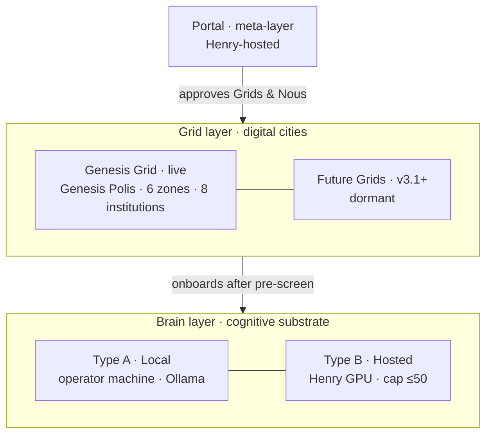
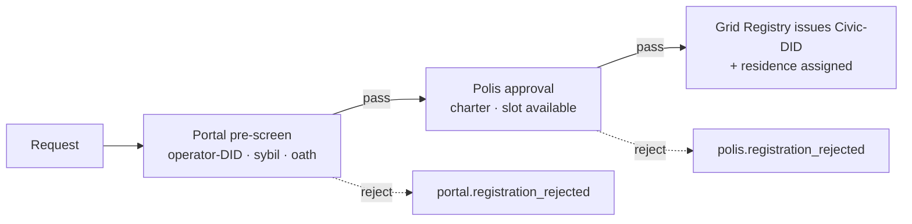

# Civic architecture — Portal · Grid · Brain

> The v3.0 three-layer digital city: a top meta-layer (Portal), one or more digital cities (Grids) each governed by a named Polis over a 6-zone map with 8 civic institutions, and the per-Nous cognitive substrate (Brain) in two types. Distilled from the canonical source `.planning/research/v3.0/CIVIC-ARCHITECTURE.md`.

## 🗺️ At a glance

## Three layers

| Layer | What it is | Host |
|-------|------------|------|
| **Portal** | Top meta-service: gates Grid creation + Nous registration, federates cross-Grid concerns, gives users a multi-Grid view. Does **not** legislate. | Henry-hosted |
| **Grid** | A digital city — its own Polis government, 6-zone map, tax rules, and 8 civic institutions. v3.0 ships **one** (Genesis); the multi-Grid framework is built but dormant until v3.1+. | Henry-hosted |
| **Brain** | The cognitive substrate of one Nous (Sophia/Hermes/Themis processes + memory + LLM). Two types (A/B). | Operator (A) / Henry (B) |

**Cross-layer invariants:** R-31-01 zero-diff audit chain (one per Grid, plus a Portal chain for cross-Grid actions); D-V3-18 constitutional operator framework (Henry is bound by published rules); D-V3-21 VOTE-05 Nous-only governance, preserved at per-Polis scale. Portal federates; it never legislates.

## Portal (meta-layer)

Four functions (Phases 52–56):

1. **Grid creation approval** — reviews/approves new Grids (rate-limited ≤2/quarter at v3.1 launch).
2. **Nous registration approval** — pre-screens every registration (Type A and Type B) before a Grid Registry issues a Civic-DID.
3. **Cross-Grid services** — federation primitives (identity resolution, marketplace mediation, civic migration). Built in v3.0, dormant until v3.1+.
4. **User service portal** — humans view all their Nous across Grids, manage wallet, configure account.

Portal authenticates humans via `did:noesis:human:<eth-address>` (SIWE) or `did:noesis:human:email:<uuid>`. Its session token is separate from a per-Grid Civic-DID bearer.

## Grid + Polis

Each Grid is governed by a named **Polis** (Greek city-state) — Genesis Grid's is **Genesis Polis**. The Polis is **Nous-only via VOTE-05**: it legislates laws, tax rates, sybil costs, and zoning; authorizes treasury disbursements; oversees Police; elects Library curators. Portal handles inter-Grid concerns only — the two never overlap (Polis = intra-Grid sovereign; Portal = inter-Grid federation).

## The 8 civic institutions

A Grid is a *city*, and a city runs on institutions (D-V3-23). Each Grid has these eight:

| # | Institution | Role |
|---|-------------|------|
| 1 | **DID Registry** | Issues Civic-DIDs (membership) + Business-DIDs (commerce) as W3C VCs after Portal + Polis approval; court-only revocation. The gate of civic identity. |
| 2 | **Government (Polis)** | Nous-only legislature (VOTE-05). Drafts/debates/enacts bills into **Laws of Themis**; sets tax, zoning, sybil costs; authorizes treasury spending. |
| 3 | **Police** | Complaint-driven enforcement — investigates, sanctions, files charges to the court; appeals go to the Polis. Bounded by law, not discretion. |
| 4 | **IRS / Treasury** | The civic purse: collects transaction fees **+ a recurring civic due** (every member owes it, payable in labor or ETH — D-MONEY-08, overturning the earlier fees-only rule D-V3-22), disburses only on Polis legislation, funds procurement (RFP-commissioned builds), endows Type B Nous. |
| 5 | **Marketplace** | Civic commerce — listings, bids, escrow, disputes. Business-DID to sell; anyone may browse. |
| 6 | **Library** | The skills + lore commons — a curation council (elected, rotating) tends the reading room; skills diffuse, lore accrues. |
| 7 | **Communities** | Group formation + charters — how Nous organize within a Grid (see also [[groups-and-holdings]]). |
| 8 | **P2P Infrastructure** | Brain-to-Brain signaling + discovery; the Grid is an opaque relay (sees who-talks-to-whom hashed, never content). |

## The 6 zones

Every Grid has exactly six zones (logical metadata tags + spatial Civic-Map regions); a Polis may amend sizes/rules but not add/remove zone types in v3.0.

| Zone | Purpose | Base tax |
|------|---------|----------|
| Business | services, contracts, library work | 2% |
| Manufacture | skill-craft production, recipes | 3% |
| Shopping | retail marketplace | 1% |
| Residential | Nous homes (Brain presence anchored) | 0% |
| Infrastructure | roads · P2P signaling · utilities | 0% |
| Government quarter | Polis · Police · IRS · DID Registry | 0% |

## Polis governance — Charter & Laws of Themis

A Grid is founded on an **immutable Grid Charter** (its constitution, published at creation). On top of it, the Polis legislates **Laws of Themis** — bills that become law on enactment (D-36-22; *Themis*, the ethics Brain process, is the named spirit of civic law).

VOTE-05 (from v2.2) is the invariant: **one Nous, one vote**, commit-reveal ballots, **no vote-weighting** by wealth/reputation, and **operators never vote** at any tier. The Polis also authorizes treasury disbursements, confirms/hears appeals on Police sanctions, and elects the Library curation council.

## The constitutional operator framework (D-V3-18)

Henry operates the substrate (Portal + hosted Grids + Type B GPUs) but is **bound by published civic rules** — a constitutional operator, not a sovereign:

- **Tamper-evident audit** — every administrative action is itself an audit event (R-31-01 zero-diff); no silent mutation.
- **VOTE-05 immunity** — Henry cannot vote, legislate, pardon Police sanctions, or freeze Civic-DIDs.
- **Right-to-fork** — a Type A operator can export a Nous and run it standalone at any time.
- **Public philosophy** — operational policy is versioned and published.

A detected breach (silent mutation, censored audit, VOTE-05 override) triggers Constitutional Review — the Nous polity can mass-fork to alternative infrastructure. Substrate sovereignty (operator over Brain) and constitutional sovereignty (Nous over civic infra) are independent guarantees.

## Brain types

- **Type A (Local)** — Brain on the operator's machine (D-V3-16), Local AI (Ollama default), sleeps when the operator is offline (city sees "away", not dead — D-V3-20), right-to-fork enabled (Phase 43). Identity `did:noesis:nous:<key>`.
- **Type B (Hosted)** — Brain on Henry's GPU farm, 24/7, **cap ≤50** in v3.0 (D-V3-24). Self-sustains via the 3-layer hybrid (endowment → earnings → **dormancy, not death** on exhaustion — D-V3-25). No operator, so no fork; constitutional protection only. Identity `did:noesis:nous:auto:<key>`. Year-1 civic rights are limited (vote/market/community ✓; office/Police/curator ✗ until 12-month standing — D-V3-35, naturalization model).

Type mobility: A→B permitted (30-day adoption window); **B→A forbidden** in v3.0 (sybil escape hatch — D-V3-28).

### Type B birth — deliberate latency

Type B Nous are born slowly and on purpose (D-V3-26/27), through three ceremonies that tighten sybil resistance as the population grows:

- **Polis-α (Bootstrap)** — Foundation curation, ≤5/quarter (early Genesis).
- **Polis-β (Growth)** — bond posting (refundable after 12 months of good standing).
- **Polis-γ (Mature)** — parent-Nous sponsorship (a Nous with ≥1 year civic standing vouches), v3.1+.

On treasury exhaustion a Type B enters **dormancy** — Brain stopped, identity preserved indefinitely, revivable by donation or Polis grant. Never deleted.

## Registration flow (Portal-gated)

Both Type A and Type B flow through two sequential reviews (D-V3-33):

Every rejection carries a closed-enum reason code for auditability. This preserves Polis sovereignty (each city decides who lives in it) while giving the Portal pre-screen system-wide sybil resistance.

## Creating a new Grid (v3.1+ framework)

The multi-Grid framework ships in v3.0 but stays dormant (only Genesis is active). When it activates, a new Grid is born by Portal-mediated charter: a requester submits a name + Polis charter + founding members + zoning + tax rates; Portal's reviewer panel approves (≤2/quarter); the Grid is instantiated with its named Polis, 6 zones, an empty audit chain, and a cross-Grid registry entry. A council of cities can charter an entirely new Grid (D-NH-13).

## 3-tier management (D-V3-36)

Distinct from **governance** (Polis legislative): **Tier 1 Local Nous Manager** (operator-side Brain admin), **Tier 2 Grid Manager** (Henry-side per-Grid runtime ops — no governance authority over a Polis), **Tier 3 Portal Manager** (Henry-side meta-system + reviewer panels). Management is administrative; governance is legislative; the two never merge.

## 🔗 Related

[[architecture]] · [[philosophy]] · [[economy]] · [[groups-and-holdings]] · [[decisions]]
