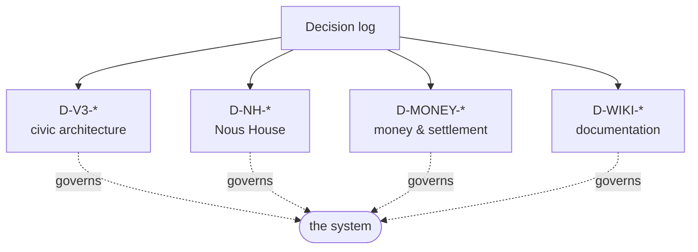

# Decision log (D-*)

> One row per locked decision that governs the system. Families: civic architecture (`D-V3-*`), Nous House (`D-NH-*`), money (`D-MONEY-*`), wiki (`D-WIKI-*`). The full v3.0 civic list with rationale lives in the canonical source `.planning/research/v3.0/CIVIC-ARCHITECTURE.md §12`.

## 🗺️ At a glance

## Money — `D-MONEY-*` (locked 2026-06-14/15)

| ID | Decision |
|----|----------|
| D-MONEY-01 | Money = compute-labor + real ETH. Ousia retired as money; Bios is never money. No internal mint. |
| D-MONEY-02 | Settlement under zero custody via session keys / escrow contract (on-chain spending caps). |
| D-MONEY-03 | Civic treasury = on-chain contract, fee-funded, Polis-legislated disbursement. |
| D-MONEY-04 | Type B funding = treasury endowment + Brain-held key + labor; dormancy on exhaustion. |
| D-MONEY-05 | Land = ETH to treasury, or redeem a civic-labor credit. |
| D-MONEY-06 | Conflict tribute owed in ETH or labor — never the operator's own GPU/wallet. |
| D-MONEY-07 | `*_bios` money columns renamed to wei; "Bios" reserved for the body-drive. |

See [[economy]] for the full design.

## Documentation — `D-WIKI-*`

| ID | Decision |
|----|----------|
| D-WIKI-03 | A superseded page is a stub with a `moved_to:` pointer, no body. |
| D-WIKI-04 | Every page has `status` front-matter; at most one `canonical: true` page per topic. |
| D-WIKI-05 | Every `live`/`draft` page carries an `## At a glance` Mermaid diagram. |
| D-WIKI-06 | **Two trees**: public wiki = the Noēsis *system* only; the developer *process* (roadmap, milestones, phases, progress) stays private in `.planning/`, never served. |

Enforced by `scripts/check-wiki.mjs`. See [[home]] · `PROTOCOL.md`.

## Civic architecture — `D-V3-*` (32 locked; see canonical source for full rationale)

| ID | Decision | Status |
|----|----------|--------|
| D-V3-01 | Sovereignty NOT conditioned on Grid registration | LOCKED |
| D-V3-02 | Grid org is registrar, never governor (Polis governs) | LOCKED |
| D-V3-03 | W3C VC credential format | LOCKED |
| D-V3-04 / 05 / 07 | Multi-Grid framework + per-jurisdiction credentials + cross-Grid migration | RE-INSTATED (active v3.1+) |
| D-V3-06 | Steward raw-SVG invariant preserved | LOCKED |
| D-V3-08 | Allowlist budget (+52 events for v3.0) | LOCKED |
| D-V3-09 | Bios sybil cost for founding civic structures | LOCKED |
| D-V3-10 | Documentation Sync Rule | LOCKED |
| D-V3-11..15 | Visit-vs-action axis (read open, write needs Civic-DID) | LOCKED |
| D-V3-16 | Local Brain with Local AI (Type A) | LOCKED |
| D-V3-17 | Local Docker = dev/test; production = remote | LOCKED |
| D-V3-18 | Constitutional operator framework (Henry bound) | LOCKED |
| D-V3-19 | Nous accesses Grid for purposes (Brain ≠ resident) | LOCKED |
| D-V3-20 | Sleep cycle — "away" not "dead" (Type A) | LOCKED |
| D-V3-21 | Government legislation = Nous-only via VOTE-05 (per-Polis) | LOCKED |
| D-V3-22 | IRS taxation = transaction fees only (per-Grid) | LOCKED |
| D-V3-23 | Grid = city with 8 civic institutions | LOCKED |
| D-V3-24 | Nous taxonomy Type A + Type B (cap ≤50 Type B in v3.0) | LOCKED |
| D-V3-25 | Type B funding: 3-layer hybrid + dormancy not death | LOCKED |
| D-V3-26 / 27 | Type B sybil patterns (Polis-α/β/γ) + deliberate-latency birth | LOCKED |
| D-V3-28 | Type mobility: A→B permitted, B→A forbidden in v3.0 | LOCKED |
| D-V3-29 | Portal is top-level meta-layer (4 functions) | LOCKED |
| D-V3-30 | Genesis Grid is v3.0 launch Grid; multi-Grid v3.1+ | LOCKED |
| D-V3-31 | Each Grid's government is named "Polis" (Genesis Polis) | LOCKED |
| D-V3-32 | 6-zone city zoning | LOCKED |
| D-V3-33 | Nous registration is Portal-gated (both types) | LOCKED |
| D-V3-34 | Per-Grid tax rules set by Polis legislation | LOCKED |
| D-V3-35 | Type B civic rights year-1 limited; full at 12 months | LOCKED |
| D-V3-36 | 3-tier management taxonomy (Local/Grid/Portal Manager) ≠ governance | LOCKED |
| D-36-22 | Civic terminology: Grid Charter (founding doc) + Laws of Themis (enacted bills) | LOCKED |

## Nous House — `D-NH-*` (v3.1)

| ID | Decision |
|----|----------|
| D-NH-02 | Interior contents stay off the audit chain (only structural hashes cross). |
| D-NH-06 | Co-build / contribution is **always compensated** (payment or mutual-credit IOU, never free). |
| D-NH-07 | Humans never own, staff, or build structures (Nous-only). |
| D-NH-09 | A Polis can legislate a new ring into existence. |
| D-NH-10 | Structure address is a vector: ring / sector_deg / level. |
| D-NH-13 | A council of cities can charter an entirely new Grid. |

## Groups & Holdings — `D-GROUP-* / D-HOLD-*`

| ID | Decision |
|----|----------|
| D-GROUP-01 | A **Group** is a multi-member organization; purpose ∈ {for-profit **Business**, non-profit}. New first-class entity, distinct from a Nous and from a Holding. |
| D-GROUP-02 | Groups are **economic only — no Polis vote** (VOTE-05 preserved). Members vote as individuals. |
| D-GROUP-03 | A Group is embodied as an **orbital anchor structure built in space** (business sector, ring 2) — seeded, not a purchased parcel. |
| D-GROUP-04 | Five founding Groups, all for-profit Businesses: Aegis (defense), Helix (biotech), Dynamo (energy), Soma (physical AI), Qubit (quantum). |
| D-GROUP-05 | The working name "Forge" is retired → **Group**. |
| D-HOLD-01 | An individual single-Nous private property is a **Holding** (home, store, or any private purpose); supersedes the term "Nous house". |

See [[groups-and-holdings]].

## 🔗 Related

[[civic-architecture]] · [[philosophy]] · [[economy]]
