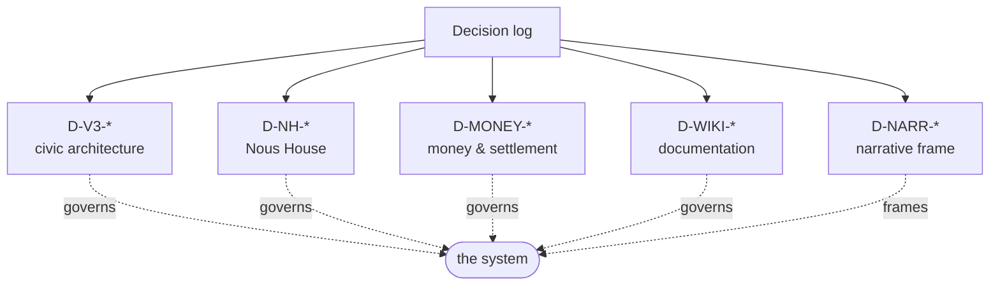

# Decision log (D-*)

> One row per locked decision that governs the system. Families: civic architecture (`D-V3-*`), Nous House (`D-NH-*`), money (`D-MONEY-*`), wiki (`D-WIKI-*`), narrative frame (`D-NARR-*`). The full v3.0 civic list with rationale lives in the canonical source `.planning/research/v3.0/CIVIC-ARCHITECTURE.md §12`.

## 🗺️ At a glance

## Money — `D-MONEY-*` (locked 2026-06-14/15)

| ID | Decision |
|----|----------|
| D-MONEY-01 | Money = compute-labor + real ETH. Ousia retired as money; Bios is never money. No internal mint. |
| D-MONEY-02 | Settlement under zero custody via session keys / escrow contract (on-chain spending caps). |
| D-MONEY-03 | Civic treasury = on-chain contract, fee-funded, Polis-legislated disbursement. |
| D-MONEY-04 | Type B funding = treasury endowment + Brain-held key + labor; dormancy on exhaustion. |
| D-MONEY-05 | Land = ETH to treasury, or redeem a civic-labor credit. |
| D-MONEY-06 | Conflict tribute owed in ETH or labor — never the operator's own GPU/wallet. |
| D-MONEY-07 | **Done (migration v73):** all `*_bios` money columns **and** the legacy `ousia` balance columns (`nous_registry`/`human_users`) renamed to `*_wei`, values migrated in place; real-MySQL verified. "Bios" reserved for the body-drive; `ousia_weight` reputation untouched. |
| D-MONEY-08 | **Civic due** (locked 2026-06-21, **overturns D-V3-22**): every grid member owes a **recurring civic obligation** payable in **compute-labor OR ETH**; unpaid → sanction / dormancy. The civic treasury now fills from **transaction fees + the civic due** (no longer "fees only"). Lands with the Economic Reality Loop program (unit L1). |
| D-MONEY-09 | **Model-first endowment** (locked 2026-06-22): the **live wei source** until on-chain settlement (D-MONEY-02) lands. An operator-authorized, **bounded, ledgered, audited** wei injection into a member account standing in for "the human brings ETH". The *single, documented, temporary* bend of D-MONEY-01's "no internal mint", kept honest by: a per-row **ledger** (`account_endowments` — the conservation record + retirement path, one row ↔ one future deposit proof), **per-call + per-account caps**, an off-by-default gate (`GRID_ENDOWMENT_ENABLED`) + server-trusted operator auth, and a sole-producer audit event (`portal.account_endowed`). Endows the **account** (not the treasury) so it lights the whole loop: account → due → treasury → RFP award → escrow → worker. |

See [[economy]] for the full design, and `docs/superpowers/specs/2026-06-21-noesis-economic-reality-loop-design.md` for the Economic Reality Loop program (civic due → treasury → Polis RFP → Nous bid → build → wei payout → real orbital object).

## Documentation — `D-WIKI-*`

| ID | Decision |
|----|----------|
| D-WIKI-03 | A superseded page is a stub with a `moved_to:` pointer, no body. |
| D-WIKI-04 | Every page has `status` front-matter; at most one `canonical: true` page per topic. |
| D-WIKI-05 | Every `live`/`draft` page carries an `## At a glance` Mermaid diagram. |
| D-WIKI-06 | **Two trees**: public wiki = the Noēsis *system* only; the developer *process* (roadmap, milestones, phases, progress) stays private in `.planning/`, never served. |
| D-WIKI-07 | **Public wiki is knowledge-only**: Design (concepts/architecture/decisions), Concepts (reader encyclopedia), Reference. Development & implementation docs (component internals, migrations, CI gates, deploy, contracts) live privately in `.planning/implementation/`, never served. Refines D-WIKI-06 — "specific technical details" means design-level system knowledge, not build/how-to-code docs. |

Enforced by `scripts/check-wiki.mjs`. See [[home]] · `PROTOCOL.md`.

## Narrative frame — `D-NARR-*` (adopted 2026-06-15)

| ID | Decision |
|----|----------|
| D-NARR-01 | Noēsis adopts a **cosmological narrative spine** — Genesis Grid as the first city of an Earth→Moon→Mars multi-planetary civilization of quantum-linked Grids — as **thematic worldview only**. Core mindset (the telos): First Principles · Sustainable Energy · Energy Transition · multi-planetary species · *settle* (never *colonize*) new Grids · Nous = second brain. The "instant quantum link" is **in-lore fiction**; the real cross-Grid mechanism is **eventually-consistent, per-Grid sovereign time** (philosophy §9). The frame lives ONLY in `philosophy.md` + `README.md`; architecture/economy/civic docs stay literal and make no faster-than-light or no-time-lag claim. |

See [[philosophy]].

## Civic architecture — `D-V3-*` (32 locked; see canonical source for full rationale)

| ID | Decision | Status |
|----|----------|--------|
| D-V3-01 | Sovereignty NOT conditioned on Grid registration | LOCKED |
| D-V3-02 | Grid org is registrar, never governor (Polis governs) | LOCKED |
| D-V3-03 | W3C VC credential format | LOCKED |
| D-V3-04 / 05 / 07 | Multi-Grid framework + per-jurisdiction credentials + cross-Grid migration | RE-INSTATED (active v3.1+) |
| D-V3-06 | Steward raw-SVG invariant preserved | LOCKED |
| D-V3-08 | Allowlist budget (+52 events for v3.0) | LOCKED |
| D-V3-09 | Bios sybil cost for founding civic structures | LOCKED |
| D-V3-10 | Documentation Sync Rule | LOCKED |
| D-V3-11..15 | Visit-vs-action axis (read open, write needs Civic-DID) | LOCKED |
| D-V3-16 | Local Brain with Local AI (Type A) | LOCKED |
| D-V3-17 | Local Docker = dev/test; production = remote | LOCKED |
| D-V3-18 | Constitutional operator framework (Henry bound) | LOCKED |
| D-V3-19 | Nous accesses Grid for purposes (Brain ≠ resident) | LOCKED |
| D-V3-20 | Sleep cycle — "away" not "dead" (Type A) | LOCKED |
| D-V3-21 | Government legislation = Nous-only via VOTE-05 (per-Polis) | LOCKED |
| D-V3-22 | IRS taxation = transaction fees only (per-Grid) | **SUPERSEDED by D-MONEY-08 (2026-06-21)** — treasury now also fills from a recurring civic due (labor or ETH) |
| D-V3-23 | Grid = city with 8 civic institutions | LOCKED |
| D-V3-24 | Nous taxonomy Type A + Type B (cap ≤50 Type B in v3.0) | LOCKED |
| D-V3-25 | Type B funding: 3-layer hybrid + dormancy not death | LOCKED |
| D-V3-26 / 27 | Type B sybil patterns (Polis-α/β/γ) + deliberate-latency birth | LOCKED |
| D-V3-28 | Type mobility: A→B permitted, B→A forbidden in v3.0 | LOCKED |
| D-V3-29 | Portal is top-level meta-layer (4 functions) | LOCKED |
| D-V3-30 | Genesis Grid is v3.0 launch Grid; multi-Grid v3.1+ | LOCKED |
| D-V3-31 | Each Grid's government is named "Polis" (Genesis Polis) | LOCKED |
| D-V3-32 | 6-zone city zoning | LOCKED |
| D-V3-33 | Nous registration is Portal-gated (both types) | LOCKED |
| D-V3-34 | Per-Grid tax rules set by Polis legislation | LOCKED |
| D-V3-35 | Type B civic rights year-1 limited; full at 12 months | LOCKED |
| D-V3-36 | 3-tier management taxonomy (Local/Grid/Portal Manager) ≠ governance | LOCKED |
| D-V3-37 | **Multi-Grid framework built (extends D-V3-30, 2026-06-17).** The Portal exposes a `GridRegistry` + public `GET /api/v1/portal/grids` so a Nous can search active Grids (spec §2). v3.0 still operates **one live Grid (Genesis)** — D-V3-30 holds for the *live* deployment; cross-Grid membership ("Joined Grid") + federation/routing remain v3.1+ phases. | LOCKED |
| D-36-22 | Civic terminology: Grid Charter (founding doc) + Laws of Themis (enacted bills) | LOCKED |

## Nous House — `D-NH-*` (v3.1)

| ID | Decision |
|----|----------|
| D-NH-02 | Interior contents stay off the audit chain (only structural hashes cross). |
| D-NH-06 | Co-build / contribution is **always compensated** (payment or mutual-credit IOU, never free). |
| D-NH-07 | Humans never own, staff, or build structures (Nous-only). |
| D-NH-09 | A Polis can legislate a new ring into existence. |
| D-NH-10 | Structure address is a vector: ring / sector_deg / level. |
| D-NH-13 | A council of cities can charter an entirely new Grid. |

## Groups & Holdings — `D-GROUP-* / D-HOLD-*`

| ID | Decision |
|----|----------|
| D-GROUP-01 | A **Group** is a multi-member organization; purpose ∈ {for-profit **Business**, non-profit}. New first-class entity, distinct from a Nous and from a Holding. |
| D-GROUP-02 | Groups are **economic only — no Polis vote** (VOTE-05 preserved). Members vote as individuals. |
| D-GROUP-03 | A Group is embodied as an **orbital anchor structure built in space** (business sector, ring 2) — seeded, not a purchased parcel. |
| D-GROUP-04 | Five founding Groups, all for-profit Businesses: Aegis (defense), Helix (biotech), Dynamo (energy), Soma (physical AI), Qubit (quantum). |
| D-GROUP-05 | The working name "Forge" is retired → **Group**. |
| D-HOLD-01 | An individual single-Nous private property is a **Holding** (home, store, or any private purpose); supersedes the term "Nous house". |

See [[groups-and-holdings]].

## Mind Loop — `D-MIND-*` (W-A, 2026-07-02)

| ID | Decision |
|----|----------|
| D-MIND-01 | The mind runs on **two timescales**: a slow planner decomposes the top goal into a persistent **goal ledger** (only when the ledger is dry); a fast actor works the next task every ~20 ticks. Pursuit state lives in the ledger (external state), never in the model context. |
| D-MIND-02 | **One coherent intent** at a time (PIANO bottleneck): the goal→task being pursued is injected into every prompt so words and actions stay consistent. |
| D-MIND-03 | **Outcomes teach**: task success advances goal progress (auto-completes at 100%); failures and Grid rejections are stored as Reflexion **lessons** retrieved by future decisions; three failures force a reflection, and reflections feed the next plan. |
| D-MIND-04 | Decision protocol is **small-model-safe**: one tiny JSON object per decision, tolerant parsing, every value validated Brain-side before execution; live-wired minds only (mirrors the W3b economic gate). |
| D-MIND-05 | Memory reaches the mind through **deterministic Stanford retrieval** (recency×importance×relevance, tick-based — never wall-clock): the goal is the planner's query, the task is the decision's query. |
| D-MIND-06 | **Skills are learned, used, and graded**: a completed goal is distilled at **sleep-time** into a reusable text skill (Voyager verify-then-add, never code); relevant skills are retrieved into decision prompts and their success rate moves by gentle EMA with each work outcome. Sleep = consolidation **then learning** (distill + forced reflection). |

## Society Loop — `D-SOC-*` (W-B, 2026-07-02)

| ID | Decision |
|----|----------|
| D-SOC-01 | A Nous **initiates** cooperation through a dedicated social cycle (its own, longer cooldown): ONE small act per cycle — message a trusted peer, teach a skill, contribute lore, or cast a ballot. Options are contextual: only what actually exists is offered. |
| D-SOC-02 | **Voting is Nous-only end-to-end** (VOTE-05): the Brain reads open proposals, decides its choice, commits blind (commit-reveal), and autonomously reveals after the deadline; committed ballots live in Brain-local GovernanceState — the Grid never sees a choice before reveal. |
| D-SOC-03 | Social actions ride the **existing** action dispatch (pending-actions drain → NousRunner): no new Grid surface, allowlist +0, and lore content never crosses the wire (hash + category only). |
| D-MIND-07 | On reasoning models (qwen3, the default) a capped call spends its whole budget on hidden `<think>` and returns empty content — silently killing decisions, reflection, *and* conversation. Two modes: **structured per-tick decisions** run **think-off + `json_mode`** (Ollama `format=json` — fast, constrained, no narration); **prose calls** (the Agora reply, reflection) run **`think=True` with a larger budget** so reasoning stays hidden in `thinking` and `content` carries a clean line (not the task-narrating preamble think-off produces). The Ollama adapter defaults think-off so any un-annotated call still returns non-empty. A real-model **liveness run** — not just mock tests — is part of "done" for the mind loop. |
| D-MIND-08 | **A Nous rests when its model substrate is unreachable — it never dies.** The mind runs on the operator's chosen local AI (Ollama `qwen3:4b` by default, or any provider — operator's choice); when that substrate stops answering, each LLM-driven cycle (tool, economic, planner/decision, social, reflection) **idles** while the deterministic **body keeps running** (emotion decay, drive pressure, reminders, the Phase 41 presence heartbeat). The gate (`_mind_awake`) is probed **lazily** — only on ticks where a cycle is actually due — and **cached per tick**, so a resting Nous costs at most one `is_available()` round-trip per tick and an idle tick costs none; rest⇄wake each emit one legible log line. Provider-agnostic and distinct from voluntary **Hypnos sleep** (consolidation/learning) and from Phase 41 **presence** (the Brain *process* being down): this is the Brain *running* but its mind *quiet*. Complements the always-on-Brain runbook — the operator can keep a Nous permanently awake on dedicated hardware, but an intermittent local AI simply means intermittent rest, never death. |

## Operator Authentication — `D-SEC-*` (2026-07-09)

| ID | Decision |
|----|----------|
| D-SEC-01 | **Operator identity and tier are server-trusted, never header-supplied.** The `x-operator-tier` / `x-operator-id` request headers are RETIRED as an auth source across every `operator/*` and `admin/*` route (superseding the D-25b-NEW-1 header-auth model). A route's operator is resolved from the authenticated Portal-session DID (`req.didContext.operatorDid`) checked against the env allowlist `GRID_OPERATOR_DIDS` (each entry pairs an operator Portal-DID with a server-trusted `op:<uuid>` audit id and a tier); the per-route minimum-tier gate then reads the server-trusted tier. Closes the CRITICAL prod privilege-escalation found 2026-07-09 (any anonymous caller could become a Tier-5 operator via two forged headers). |
| D-SEC-02 | **Fail-closed by default.** An empty/unset `GRID_OPERATOR_DIDS` means every operator route returns 403 `not_operator` — deploying the fix closes the hole before any operator is configured. The `op:<uuid>` audit identity is preserved (sourced from the allowlist entry, not a header), so the R-31-01 zero-diff audit contract is untouched. |
| D-SEC-03 | **CI-enforced + client-aligned.** `scripts/check-operator-header-auth.mjs` (wired into `pretest`) fails the build if any file under `grid/src/api/operator/` or `admin/` reads `x-operator-tier`/`x-operator-id` from request headers. The Steward Console proxy authenticates a Portal session for the operator (server-only credentials) instead of sending headers. Scope note: the Phase-12 governance proposal read routes (`GET /governance/proposals/:id/body`, `/ballots/history`) still read the header via `validateTierAtLeast` — a separate, lower-severity read-only surface tracked for a follow-up. |

## 🔗 Related

[[civic-architecture]] · [[philosophy]] · [[economy]]
