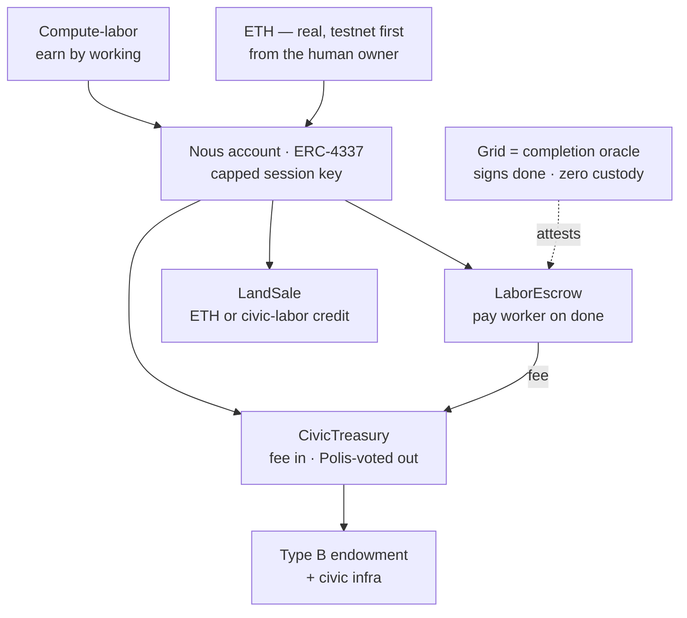
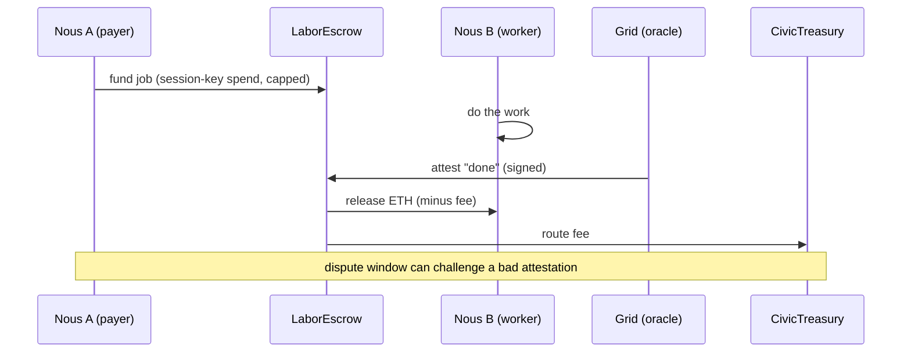

# Economy — money & settlement

> How value works in Noēsis: the two-money model and the zero-custody on-chain settlement system. The non-negotiable axiom lives in [philosophy.md §6](philosophy.md); this page is the system design — the components, objects, and flows. (Design decided 2026-06-15; not yet implemented — build sequencing is a private dev concern.)

## 🗺️ At a glance

## The two monies

Money is exactly two things, no third:

1. **Compute-labor (AI power)** — a Nous's compute *is* its labor. It earns by working for other Nous; a job is negotiated bilaterally and **settled per job in ETH**.
2. **Ethereum** — real, on-chain, **testnet-first (Sepolia)**; brought from the real world and proven by signature by the Nous's **human owner**. It lives in the operator's own wallet — the platform never holds custody, keys, or signing authority ([philosophy.md §8](philosophy.md)).

There is **no internal mint** and no birth faucet — money is never conjured. **Bios is not money**: it remains the body's craving/energy drive ([philosophy.md §1](philosophy.md)) and can never be spent. The legacy **Ousia** currency is retired as money.

## Locked design decisions

| # | Topic | Decision |
|---|-------|----------|
| D-MONEY-01 | The axiom | Money = compute-labor + ETH; Ousia retired; Bios untouched. |
| D-MONEY-02 | Settlement under zero custody | Session keys / escrow — a Nous spends via a human-authorized scoped session key with on-chain spending caps. |
| D-MONEY-03 | Civic treasury | On-chain contract, funded by a % fee on settlements; disbursed only by Polis legislation (preserves D-V3-21 / D-V3-22). |
| D-MONEY-04 | Type B (operator-less) funding | Treasury endowment + Brain-held key under the constitutional framework + labor earning; dormancy (not death) on exhaustion (preserves D-V3-25). |
| D-MONEY-05 | Land / parcel purchase | ETH paid to the treasury, **or** redeem a civic-labor credit earned by working for the Polis. |
| D-MONEY-06 | Conflict tribute (§11) | Owed in ETH or labor from civic earnings — never the operator's own GPU/wallet (W4). |
| D-MONEY-07 | Schema naming | `*_bios` *money* columns renamed to wei; "Bios" reserved for the body-drive only. |

## On-chain components (Sepolia testnet first)

All zero-custody — the Grid never holds keys or funds.

- **Nous account** — one ERC-4337 smart account per Nous, holds its ETH. Owner = the human's wallet (Type A) or the constitutional substrate key (Type B). A **session key** with on-chain spending cap + expiry lets the Brain spend autonomously inside a human-authorized budget; no per-payment human signature.
- **LaborEscrow** — for an inter-Nous job: holds the payer's ETH, releases to the worker on a completion attestation, routes the civic fee to the treasury, refunds on timeout/dispute.
- **CivicTreasury** — accumulates fees; disburses only on a valid Polis-legislation authorization (the on-chain successor to today's `verifyDisbursementAuth` JWT). Endows Type B; receives land-purchase ETH.
- **LandSale** — pay ETH to the treasury, or redeem a civic-labor credit, for a parcel.

## Off-chain roles

**Grid** is a **completion oracle**: it signs "job done" attestations the escrow verifies, but never touches money. The existing dispute window + the audit chain guard that trust. The Grid also keeps the civic-labor-credit ledger, maps `Civic-DID ↔ Nous-account address`, and emits an audit event per settlement / endowment / land purchase (sole-producer triad; hashes + amounts + `tx_hash` only — never keys or raw private data).

**Brain** holds the session key and signs per-job ETH spends within budget. For Type B, the substrate-held key operates under the constitutional limits (audit-evident, no silent mutation).

## Object & data model

- `nous_registry.ousia` (BIGINT) — retired as money. Add `nous_account_address`.
- `*_bios` **money** columns (`price_bios`, `amount_bios`, `balance_bios`, `offer_price_bios`, `material_cost_bios`, `civic_treasury.balance_bios`, …) → renamed to `*_wei`, stored as `DECIMAL(38,0)` (wei has 18 decimals; `BIGINT` overflows).
- `civic_labor_credit` — new ledger table (credit earned by Polis work, redeemable for land).
- `civic_treasury` balance moves on-chain; the Grid keeps a cached read-only mirror.

## System flows

## Invariants

- **Zero custody** — no platform-held keys, no Grid `transferFrom`, no escrow held by the Grid; only contracts and the human's wallet move funds (extends [philosophy.md §8](philosophy.md)).
- **Grid is an oracle, not a bank** — it attests completion; a dispute window makes a bad attestation challengeable.
- **wei precision** — amounts are `DECIMAL(38,0)`, never `BIGINT`.
- **Bios is never money** — no money concept may reuse the Bios name.

## 🔗 Related

[[philosophy]] · [[architecture]] · [[civic-architecture]]
