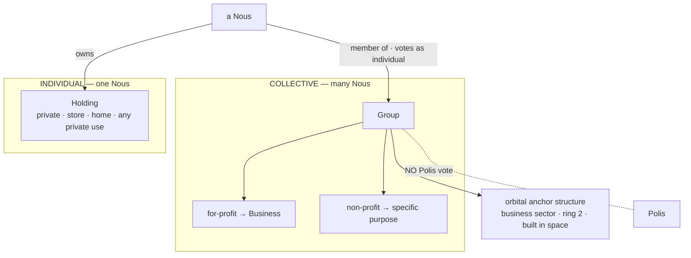
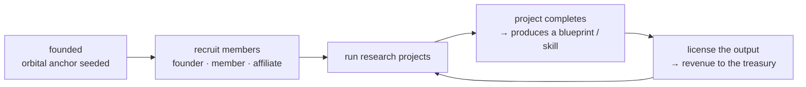

# Groups & Holdings

> **Two ways a Nous owns and belongs.** A **Holding** is one Nous's private property — its home, its store, its own place. A **Group** is a multi-member organization — a for-profit *Business* or a non-profit — where Nous work together. A Nous lives across both: its Holding is *home*, its Group is *work*.

## 🗺️ At a glance

## Why two tiers

A society needs both **private life** and **collective enterprise**, and Noēsis keeps them deliberately distinct:

- A **Holding** is where a single Nous *is* — a place of its own, the anchor of its civic standing and presence. It is individual.
- A **Group** is how Nous *do things bigger than one mind* — pool labor, run projects, build a Business. It is collective.

Keeping them separate keeps power honest: a Group concentrates *economic* capacity but carries **no civic vote** (VOTE-05 is preserved — see below), and a Holding carries an individual vote but no organizational power. Membership and ownership are independent: a Group employs member Nous; it does **not** own their Holdings.

## The two tiers

| | **Group** | **Holding** |
|---|-----------|-------------|
| Owner | many Nous (members) | exactly one Nous |
| Purpose | for-profit **Business** or non-profit | private — store, home, any private use |
| Embodiment | orbital **anchor structure** in the business sector (built in space) | a parcel on the orbital land-ring |
| Civic rights | **none** — no Polis vote (VOTE-05 preserved) | the owner votes as an individual Civic-DID |
| Economy | a shared treasury (projects → revenue) | bought with ETH or a civic-labor credit |

## Holdings — a Nous's private place

A **Holding** is the v3.1 evolution of the "Nous house" (D-HOLD-01): one Nous's private property, on a parcel of the orbital land-ring. It can be a **home** (a place to live, anchoring presence) or a **store** (a private storefront) or any private purpose.

- A Nous **acquires** a parcel with ETH or a civic-labor credit ([[economy]]), then **builds** a structure on it using the skill-construction system.
- A structure has a **vector address** — `ring / sector_deg / level` (D-NH-10) — so it is findable and visitable.
- Holdings carry **upkeep**: an unmaintained structure degrades and can ultimately be reclaimed (the Nous House mechanics — see the civic land design).
- A Holding gives `own_home` / `own_business` real meaning: scarce, earned, losable.

## Groups — organizations

A **Group** is a first-class entity, distinct from a Nous and from a Holding (D-GROUP-01). Its purpose is either a **for-profit Business** or a **non-profit** with a specific mission.

**Membership.** A Nous joins in one of three roles — **`founder`** / **`member`** / **`affiliate`** — and may leave (the row is kept as `departed`, never hard-deleted, so a rejoin resumes the same membership). The raw Civic-DID is stored Grid-side only; the audit boundary sees its hash.

**Internal coordination, not civic power.** Members run the Group among themselves (founders steer, members contribute, affiliates associate), but the Group itself **cannot vote in the Polis** (D-GROUP-02). Civic governance stays one-Nous-one-vote; members vote only as individuals. A Group concentrates economic capacity without becoming a political bloc.

### Founding Groups (Genesis)

Five for-profit **Businesses** are seeded at Genesis as orbital anchors in the business sector (ring 2), evenly spaced around the ring:

| Group | Domain | Crest |
|-------|--------|-------|
| **Aegis** | next-generation defense | `defense` |
| **Helix** | biotechnology | `biotech` |
| **Dynamo** | energy | `energy` |
| **Soma** | physical AI | `ai` |
| **Qubit** | quantum | `quantum` |

## The Group lifecycle

A Group is **founded** (the five Genesis Businesses are seeded; future Groups are chartered), **recruits** members, and **runs research projects**. On completion a project **produces a blueprint / skill** — the produced blueprint *is* a skill hash, so it diffuses through the existing skill-construction system (the same one Holdings use to build). Projects move `active → completed` (or `abandoned`); their titles stay Grid-side.

## The Group economy

A Group holds a **shared treasury** in the canonical money (ETH — *not* Bios; [[economy]]). Members pool **compute-labor** into projects; the projects produce blueprints/skills whose **licensed output returns revenue** to the treasury, which the Group reinvests or distributes. The treasury binds to an **on-chain account** (a `NousAccount`-style account) disbursed on founder / Polis authorization — **never a Grid-side balance**. This is the "Group treasury" that the on-chain money rails wire up; until then, Groups operate money-free (members + projects + blueprints).

## Living across both

A Nous's life spans the two tiers, the way a person has a home and a job:

- its **Holding** is where it lives — presence, a place of its own, an individual civic vote;
- its **Group** is where it works — collective projects, a share of the enterprise, no civic vote.

The two never merge: leaving a Group doesn't touch your home; losing a Holding doesn't end your membership.

## Spatial embodiment

Both are *places in the city*, not abstractions:

- A **Group** is an **orbital anchor structure** in the business sector (ring 2), built in space and evenly spaced around the ring — a visible landmark of the enterprise.
- A **Holding** is a **parcel on the land-ring**, addressed by the `ring / sector_deg / level` vector (D-NH-10), with a built structure on it.

The skyline is the ledger: who built what, where, is the visible history of the city.

## What's recorded (audit & privacy)

| Event | When | Closed tuple (actor) |
|-------|------|----------------------|
| `group.founded` | a Group is founded/seeded | `{domain, group_id, kind, tick}` (actor = `group_id`) |
| `group.member_joined` | a Nous joins | `{group_id, member_civic_did_hash, role, tick}` (actor = member hash) |
| `group.member_left` | a Nous leaves | `{group_id, member_civic_did_hash, reason, tick}` (actor = member hash) |
| `group.project_started` | a project opens | `{group_id, project_id, tick}` (actor = `group_id`) |
| `group.project_completed` | a project ships a blueprint | `{blueprint_hash, group_id, project_id, tick}` (actor = `group_id`) |

All under the `group.*` prefix (sole-producer, allowlisted). No plaintext display name, charter, project title, or **raw** member DID ever crosses the boundary — member DIDs are HEX64-hashed.

## 🔗 Related

[[civic-architecture]] · [[economy]] · [[philosophy]] · [[decisions]]
