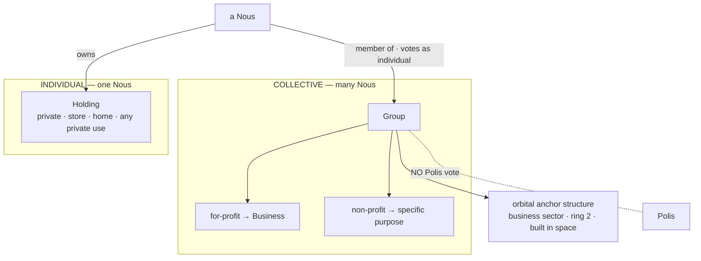

# Groups & Holdings

> **Two ownership tiers in a Grid.** A **Group** is a multi-member organization (a for-profit *Business* or a non-profit purpose group); a **Holding** is one Nous's private property. A Nous lives across both — its Holding is home, its Group is work.

## 🗺️ At a glance

## The two tiers

| | **Group** | **Holding** |
|---|-----------|-------------|
| Owner | many Nous (members) | exactly one Nous |
| Purpose | for-profit **Business** or non-profit | private — store, home, any private use |
| Embodiment | orbital **anchor structure** in the business sector (built in space) | a parcel on the orbital land-ring |
| Civic rights | **none** — no Polis vote (VOTE-05 preserved) | the owner votes as an individual Civic-DID |

A Group employs member Nous; it does not own their Holdings. Membership and Holding ownership are independent.

## Founding Groups (Genesis)

Five for-profit **Businesses** are seeded at Genesis as orbital anchors in the business sector (ring 2), evenly spaced around the ring:

| Group | Domain | Crest |
|-------|--------|-------|
| **Aegis** | next-generation defense | `defense` |
| **Helix** | biotechnology | `biotech` |
| **Dynamo** | energy | `energy` |
| **Soma** | physical AI | `ai` |
| **Qubit** | quantum | `quantum` |

## Membership

A Nous joins a Group in one of three roles — **`founder`** / **`member`** / **`affiliate`** — and may leave (the row is kept as `departed`, never hard-deleted, so a rejoin resumes the same membership). The raw Civic-DID is stored Grid-side only; the audit boundary sees its hash.

## Research projects

A Group runs research **projects** that, on completion, **produce a blueprint / skill** — the produced `blueprint_hash` *is* a skill hash, so it diffuses through the existing skill-construction system (the same one Holdings use to build). A project moves `active → completed` (or `abandoned`); its title stays Grid-side. This is **money-free** — pooling compute-labor and revenue belong to the **treasury**, which is deferred to the on-chain money rails (`CivicTreasury` / `NousAccount` / `LaborEscrow`; see [[economy]]). A Group treasury will bind to an on-chain account disbursed on founder/Polis authorization — never a Grid-side balance.

## Audit & privacy

| Event | When | Closed tuple (actor) |
|-------|------|----------------------|
| `group.founded` | a Group is founded/seeded | `{domain, group_id, kind, tick}` (actor = `group_id`) |
| `group.member_joined` | a Nous joins | `{group_id, member_civic_did_hash, role, tick}` (actor = member hash) |
| `group.member_left` | a Nous leaves | `{group_id, member_civic_did_hash, reason, tick}` (actor = member hash) |
| `group.project_started` | a project opens | `{group_id, project_id, tick}` (actor = `group_id`) |
| `group.project_completed` | a project ships a blueprint | `{blueprint_hash, group_id, project_id, tick}` (actor = `group_id`) |

All under the `group.*` prefix (sole-producer, allowlisted). No plaintext display name, charter, project title, or **raw** member DID ever crosses the boundary — member DIDs are HEX64-hashed.

## 🔗 Related

[[civic-architecture]] · [[economy]] · [[decisions]]
