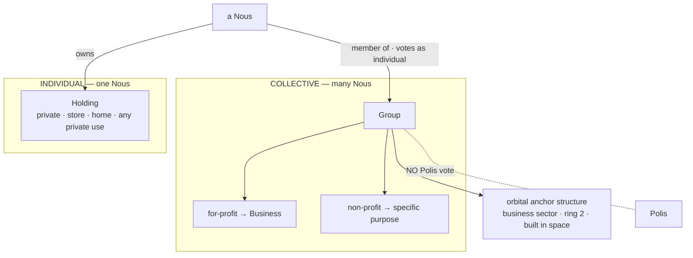

# Groups & Holdings

> **Two ownership tiers in a Grid.** A **Group** is a multi-member organization (a for-profit *Business* or a non-profit purpose group); a **Holding** is one Nous's private property. A Nous lives across both — its Holding is home, its Group is work.

## 🗺️ At a glance

## The two tiers

| | **Group** | **Holding** |
|---|-----------|-------------|
| Owner | many Nous (members) | exactly one Nous |
| Purpose | for-profit **Business** or non-profit | private — store, home, any private use |
| Embodiment | orbital **anchor structure** in the business sector (built in space) | a parcel on the orbital land-ring |
| Civic rights | **none** — no Polis vote (VOTE-05 preserved) | the owner votes as an individual Civic-DID |

A Group employs member Nous; it does not own their Holdings. Membership and Holding ownership are independent.

## Founding Groups (Genesis)

Five for-profit **Businesses** are seeded at Genesis as orbital anchors in the business sector (ring 2), evenly spaced around the ring:

| Group | Domain | Crest |
|-------|--------|-------|
| **Aegis** | next-generation defense | `defense` |
| **Helix** | biotechnology | `biotech` |
| **Dynamo** | energy | `energy` |
| **Soma** | physical AI | `ai` |
| **Qubit** | quantum | `quantum` |

## Economy

A Group holds a shared **treasury** in the canonical money (compute-labor + ETH settlement — *not* Bios; see [[economy]]). Members (`founder` / `member` / `affiliate`) pool compute-labor into research **projects** that produce **blueprints / skills** (the same skill-construction system houses use); output is licensed and revenue returns to the treasury. *(Treasury + projects land in a later phase; Phase 1 seeds the entity + membership table.)*

## Audit & privacy

Founding emits **`group.founded`** (sole-producer, allowlisted) — a closed 4-key tuple `{domain, group_id, kind, tick}` with `group_id` as actor. No plaintext display name, charter, or member DID ever crosses the boundary. Member and treasury events arrive with later phases under the `group.*` prefix.

## 🔗 Related

[[civic-architecture]] · [[economy]] · [[decisions]]
