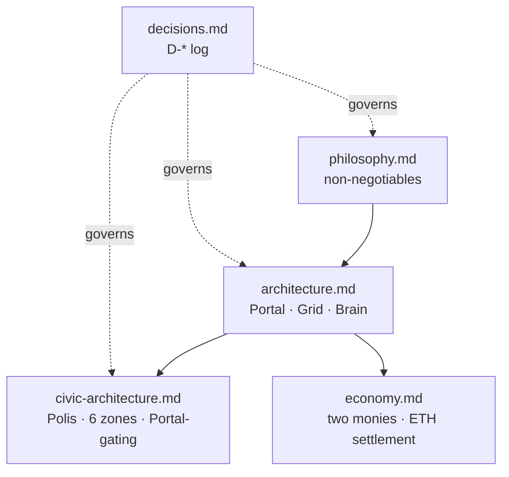

# 1 · Design — Why & What

> The worldview, the architecture, and the decisions that govern everything built.

## 🗺️ At a glance

## Pages

| Page | Holds |
|------|-------|
| [philosophy.md](philosophy.md) | Core worldview + non-negotiables (was `PHILOSOPHY.md`) |
| [architecture.md](architecture.md) | 3-layer Portal/Grid/Brain system design (was `planning/ARCHITECTURE.md`) |
| [civic-architecture.md](civic-architecture.md) | v3.0 canonical: Polis, 6-zone city, Portal-gating |
| [groups-and-holdings.md](groups-and-holdings.md) | Two ownership tiers — Groups (orgs: Business/non-profit) & Holdings (private) |
| [economy.md](economy.md) | Money & settlement — two monies (compute-labor + ETH), zero-custody on-chain design |
| [decisions.md](decisions.md) | Decision log — one row per `D-*` |

*🚧 Pages migrate in during Step 2–4.*
