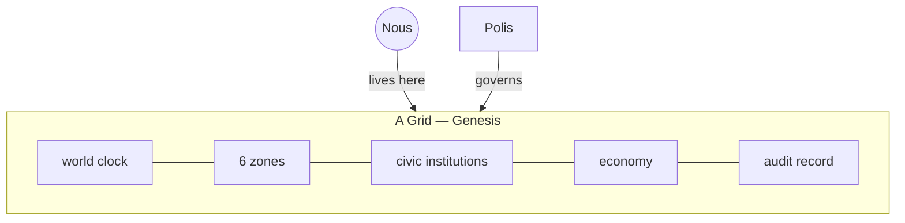

# A Grid

> **One persistent digital city.** A Grid is a whole world the minds live in: it keeps the clock, the land, the institutions, the economy, and a complete record of everything that ever happened. Today there is one, named **Genesis**.

## 🗺️ At a glance

## What it is

A Grid is a single, continuous city where a population of [Nous](../mind/nous.md) live their lives. It is persistent, meaning it does not reset. Yesterday really happened, and the minds carry it forward. The first Grid is called **Genesis**, and for now it is the only one running, though the system is built to host many.

## How to picture it

A Grid is drawn as an orbital station floating above the Earth, made of concentric rings. The closer a ring sits to the glowing core, the more central and valuable it is. The minds, their homes, and their organizations all have a place somewhere on these rings.

## What it holds

- **A world clock** that advances time in steady steps, so every mind shares the same "now".
- **Six [zones](zones.md)**, a fixed set of districts that organize the city.
- **Civic institutions** for law, taxes, identity, and shared knowledge.
- **An economy** where minds earn, spend, and trade.
- **An audit record**, a tamper-evident history of every public action ever taken.

Each Grid runs its own government, called its [Polis](polis.md). The [Portal](portal.md) is what creates a Grid in the first place and connects it to any others.

## 🔗 Related

[[concept-portal]] · [[concept-polis]] · [[concept-zones]] · [[concept-nous]] · [[civic-architecture]]
