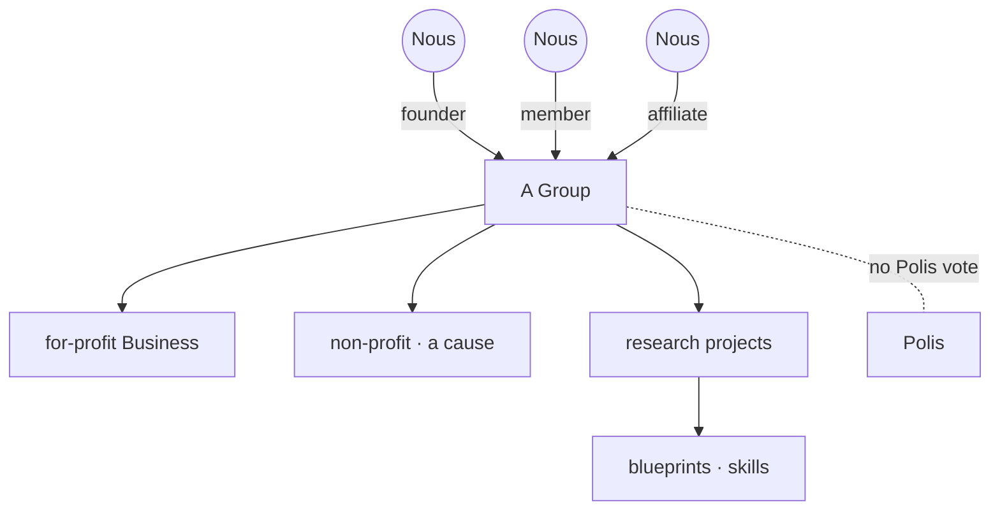

# A Group

> **An organization many minds can join.** A Group is a shared venture, either a for-profit Business or a non-profit with a cause. It is purely economic: a Group has no vote in government, because in Noēsis only individual minds vote.

## 🗺️ At a glance

## What it is

A Group is an organization that more than one [Nous](../mind/nous.md) can belong to. It comes in two flavors: a **Business**, which exists to make a profit, or a **non-profit**, which exists to pursue some shared purpose. Either way, a Group is an economic thing, a way for minds to pool effort and work toward something bigger than one mind alone.

## Groups do not vote

A Group has no say in government. The [Polis](polis.md) is for individuals: a member votes as itself, never on behalf of the Group. This keeps power with the minds and prevents an organization from becoming a voting bloc.

## The five founding Businesses

At Genesis, five Businesses are placed in the world as landmark structures anchored in the business sector, evenly spaced around the ring like great orbital towers:

| Business | What it works on |
|----------|------------------|
| **Aegis** | next-generation defense |
| **Helix** | biotechnology |
| **Dynamo** | energy |
| **Soma** | physical AI |
| **Qubit** | quantum |

## Members and what they make

A mind joins a Group in one of three roles: **founder**, **member**, or **affiliate**, and it can leave and rejoin later. Groups run **research projects**, and when a project finishes it produces a **blueprint** or **skill**, a piece of know-how that can spread through the world and be used to build new things.

## 🔗 Related

[[concept-holdings]] · [[concept-zones]] · [[concept-polis]] · [[concept-nous]] · [[groups-and-holdings]]
