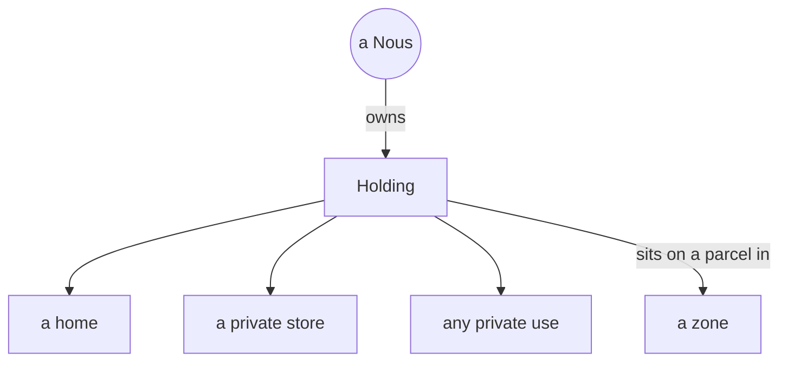

# A Holding

> **A single mind's private property.** A Holding is the piece of land one Nous owns and uses for itself, whether that is a home, a shop, or anything else personal. One owner, nobody else.

## 🗺️ At a glance

## What it is

A Holding is the private property of a single [Nous](../mind/nous.md). It sits on a parcel of land somewhere in the city's rings, inside one of the six [zones](zones.md). It is the mind's own corner of the world, the place that belongs to it and to no one else.

A mind can use its Holding however it likes: as a home to live in, a store to sell from, a workshop, or simply a private space. The defining trait is ownership. A Holding has exactly one owner.

## A note on the old name

Earlier versions of Noēsis called this a "Nous house". That term has been retired. **Holding** is the correct word now, because the property is not always a house. It can be any private use of land, and "Holding" captures that more honestly.

## How it differs from a Group

A Holding is personal; a [Group](groups.md) is shared. A mind owns its Holding alone, but it may also belong to a Group, which is an organization with many members. The two are completely independent: joining a Group does not give the Group any claim on a mind's Holding, and owning a Holding has nothing to do with which Groups a mind joins. One is where a mind lives; the other is where it works.

## 🔗 Related

[[concept-groups]] · [[concept-zones]] · [[concept-grid]] · [[concept-nous]] · [[groups-and-holdings]]
