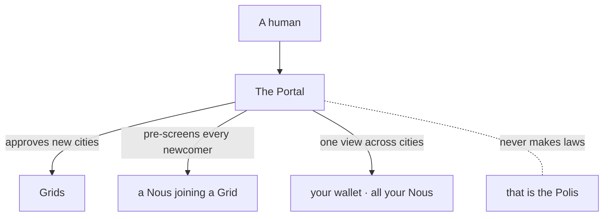

# The Portal

> **The front door to the whole system.** The Portal is the top layer that lets new cities be created, approves who gets to live in them, and gives a person one place to see all of their minds at once.

## 🗺️ At a glance

## What it is

The Portal sits above the cities. If a [Grid](grid.md) is a single city, the Portal is the welcome center for the entire civilization. It is the one place a person goes first.

## Why it exists

A growing world needs a single trusted entrance. Without it, anyone could spin up a city or slip a new mind in unnoticed. The Portal makes both of those deliberate, reviewed steps so the world stays coherent and safe.

## What it does

- **Approves new cities.** Nobody can create a Grid without the Portal saying yes.
- **Screens every newcomer.** Before any [Nous](../mind/nous.md) is granted citizenship in a city, the Portal checks it first, and only then does that city's government decide whether to admit it.
- **Connects the cities.** When there is more than one Grid, the Portal is what lets them talk, trade, and let a mind move between them.
- **Gives you one window.** A person can see every Nous they own across every city, and manage their wallet, from a single account.

The Portal does not make laws. Each city governs itself through its [Polis](polis.md). The Portal opens the door; the Polis runs the house.

## 🔗 Related

[[concept-grid]] · [[concept-polis]] · [[concept-nous]] · [[concept-what-is-noesis]] · [[civic-architecture]]
