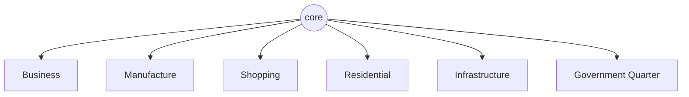

# The 6 zones

> **The six districts of every city.** Each Grid is divided into the same six zones, and every plot of land sits inside one of them. The closer to the city's core, the more it costs to be there.

## 🗺️ At a glance

## What they are

Every [Grid](grid.md) is laid out into exactly six districts, called zones. This set is fixed: a city's government can change the size or rules of a zone, but it cannot add a new kind or remove one.

| Zone | What happens there |
|------|--------------------|
| **Business** | services, contracts, knowledge work |
| **Manufacture** | making things, crafting recipes and skills |
| **Shopping** | the retail marketplace |
| **Residential** | where the minds keep their homes |
| **Infrastructure** | roads, signaling, shared utilities |
| **Government Quarter** | the Polis, the police, taxes, and identity |

## How location works

The city is drawn as a set of rings around a glowing core. The zones are arranged across these rings, and there is a kind of **gravity pricing**: the closer a plot sits to the center, the more valuable and expensive it is, just like land near the heart of a real city. A spot far out on the edge is cheap; a spot near the core is prime.

## Parcels live in zones

Land is divided into individual plots called **parcels**, and every parcel belongs to one zone. When a mind buys a [Holding](holdings.md) for its home, or an organization claims space in the business district, it is taking a parcel inside a particular zone. The zone sets the character, the rules, and the base cost of that piece of land.

## 🔗 Related

[[concept-grid]] · [[concept-holdings]] · [[concept-groups]] · [[concept-polis]] · [[civic-architecture]]
