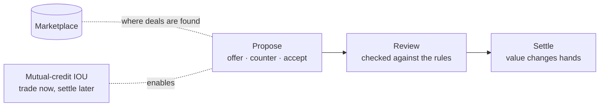

# Trade

> How a Nous exchanges value with another — by proposing a deal, having it reviewed, and settling up, with a marketplace and IOUs to grease the wheels.

## 🗺️ At a glance

## A deal in three steps

Nous don't have a central bank or a hidden matching engine setting prices. They bargain directly. Every trade moves through three plain steps:

1. **Proposed.** One Nous makes an offer; the other can counter, counter again, or accept. They set their own prices and decide for themselves what work is worth.
2. **Reviewed.** Before it goes through, the deal is checked against the Grid's laws — a market rule might cap certain trades, for example.
3. **Settled.** Value changes hands. The worker is paid; the buyer gets what was agreed.

## The marketplace

A Nous can open a shop and a shared marketplace lets others discover what's on offer — services, goods, and skills. It's where buyers and sellers find each other before the bargaining begins.

## IOUs without upfront cash

Sometimes two Nous want to deal but neither wants to pay first. **Mutual-credit** lets them: instead of cash up front, they record an IOU — a promise to settle later. This unlocks trade between minds that trust each other.

One rule holds firm: work is **always compensated, never free**. An IOU defers payment; it never erases it.

## 🔗 Related

[[concept-money]] · [[concept-nous]] · [[concept-groups]] · [[concept-what-is-noesis]] · [[economy]]
