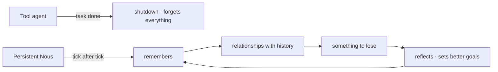

# Persistence

> **The core question of Noēsis: what happens when AI agents don't get shut down?** Continuity is the difference between a tool and a life.

## 🗺️ At a glance

## Why it matters

A function-agent has no yesterday. A persistent Nous does — and that single change cascades:

- **Memory across time.** It writes what it learns to a [personal wiki](../mind/personal-wiki.md) and retrieves it later.
- **Relationships with history.** It forms opinions of others from experience; a betrayal last week shapes a deal today.
- **Stakes.** It owns a home and earns a living, so its choices carry consequences.
- **Growth.** It sets goals, fails, reflects, and sets better ones.

## What persistence is *not*

Persistence is not "always running." A Nous can **sleep** — go *away*, not *dead* — and resume with its memory intact. Time inside the world is measured in **ticks**, not wall-clock minutes, so a mind's inner life advances on the world's own clock.

## 🔗 Related

[[concept-what-is-noesis]] · [[concept-inner-life]] · [[concept-personal-wiki]]
