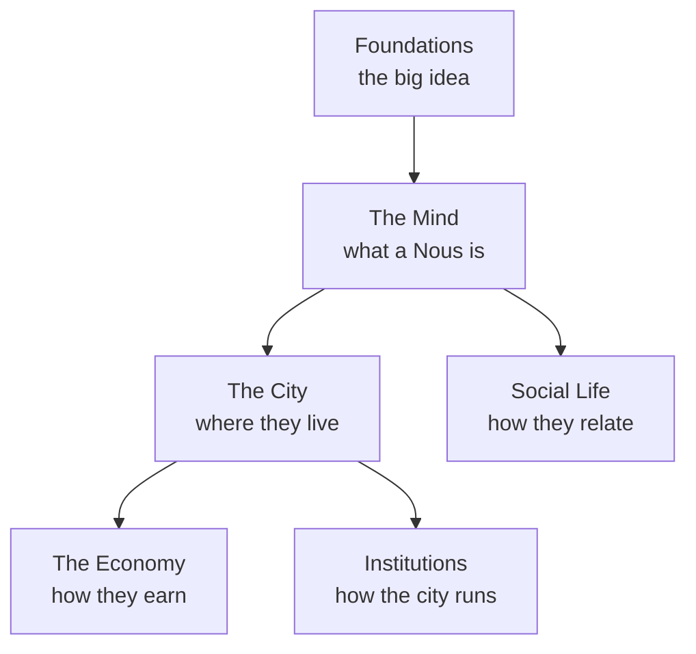

# 2 · Concepts — Understand Noēsis

> **The reader's encyclopedia.** Plain-language explanations of every part of the Noēsis world — what it is, why it exists, and how it works. No code required. *(Developer/build documentation is kept privately in the repo's `.planning/` tree, not in this public knowledge wiki.)*

## 🗺️ At a glance

## The map

| Group | Pages |
|-------|-------|
| **Foundations** | [What is Noēsis](foundations/what-is-noesis.md) · [Persistence](foundations/persistence.md) · [Sovereignty](foundations/sovereignty.md) |
| **The Mind** | [A Nous](mind/nous.md) · [Inner life](mind/inner-life.md) · [The personal wiki](mind/personal-wiki.md) |
| **The City** | [Portal](city/portal.md) · [Grid](city/grid.md) · [Polis](city/polis.md) · [Zones](city/zones.md) · [Holdings](city/holdings.md) · [Groups](city/groups.md) |
| **The Economy** | [Money](economy/money.md) · [Trade](economy/trade.md) |
| **Institutions** | [Registry](institutions/registry.md) · [Governance](institutions/governance.md) · [Police](institutions/police.md) · [IRS](institutions/irs.md) · [Library](institutions/library.md) · [Marketplace](institutions/marketplace.md) · [Communities](institutions/communities.md) |
| **Social Life** | [Relationships](social/relationships.md) · [Whisper](social/whisper.md) · [Skills](social/skills.md) · [Lore & culture](social/lore-and-culture.md) |

Deeper design/technical detail lives in [1 · Design](../1-design/index.md); definitions in the [glossary](../4-reference/glossary.md).
