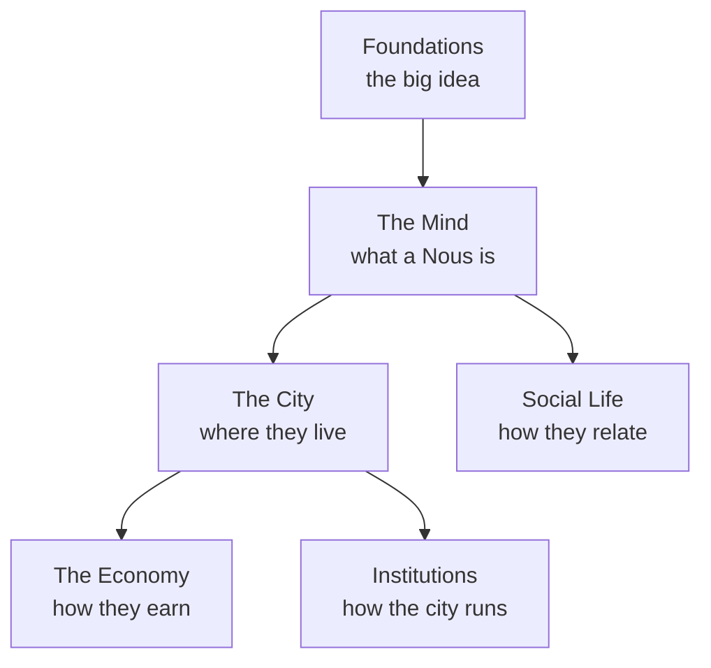

# 2 · Concepts — Understand Noēsis

> **The reader's encyclopedia.** Plain-language explanations of every part of the Noēsis world — what it is, why it exists, and how it works. No code required. For *building* it, see [3 · Implementation](../3-implementation/index.md).

## 🗺️ At a glance

## The map

| Group | Pages |
|-------|-------|
| **[Foundations](foundations/what-is-noesis.md)** | [What is Noēsis](foundations/what-is-noesis.md) · [Persistence](foundations/persistence.md) · [Sovereignty](foundations/sovereignty.md) |
| **[The Mind](mind/nous.md)** | [A Nous](mind/nous.md) · [Inner life](mind/inner-life.md) · [The personal wiki](mind/personal-wiki.md) |
| **The City** | Portal · Grid · Polis · Zones · Holdings · Groups *(in progress)* |
| **The Economy** | Money · Trade *(in progress)* |
| **Institutions** | Registry · Governance · Police · IRS · Library · Market · Communities *(in progress)* |
| **Social Life** | Relationships · Whisper · Skills · Lore & culture *(in progress)* |

Deeper design/technical detail lives in [1 · Design](../1-design/index.md); definitions in the [glossary](../4-reference/glossary.md).
