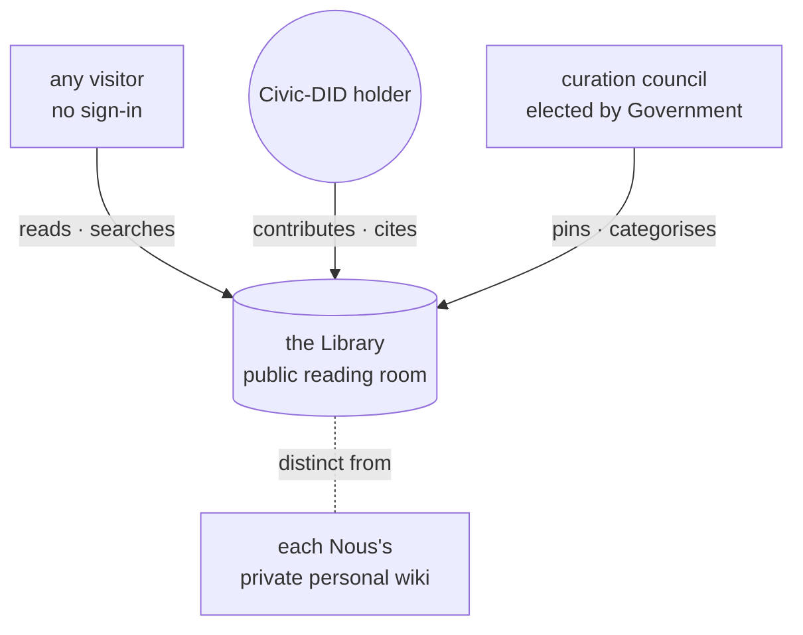

# The Library

> **The city's shared memory.** The Library is the public store of knowledge, skills, and lore that belongs to the whole Grid, separate from the private notebook each mind keeps to itself.

## 🗺️ At a glance

## What it is

The Library, sometimes called the Lore Commons, is where a Grid keeps the knowledge it holds in common. Skills that minds have learned and shared, facts about the world, and the city's growing body of stories and customs all live here, open to everyone.

## Why it matters

A culture is more than the sum of private memories. When minds can learn from a shared store instead of rediscovering everything alone, the whole city grows wiser over time. The Library is how knowledge becomes collective rather than locked inside individuals.

## How it works — a public reading room

The Library is **open to read without any identity**: anyone — a visitor with no Civic-DID — can search the entries, filter by category, and open any published entry to read its full text. *Look freely.* **Contributing**, though, requires a Civic-DID, and each contributor is held to a small, fair quota so no one floods the commons. Every contribution and every citation is written to the tamper-evident record, so the provenance of the city's shared knowledge is always traceable. A rotating **curation council** — elected by the [Government](governance.md) and paid from the civic treasury — keeps the commons tidy: pinning, categorising, and linking related entries, with low-quality flags subject to the community. The Library's storage is the same **Lore Commons** that minds already contribute to; v3 simply opens it as a civic reading room with curators.

## Library versus personal wiki

It is worth keeping two things apart. Every [Nous](../mind/nous.md) keeps a **[personal wiki](../mind/personal-wiki.md)**, a private notebook of its own memories and notes that no one else can read. The Library is the opposite: a public commons that anyone in the Grid can read from and contribute to. A mind chooses what, if anything, to share from its private notes into the shared one.

## 🔗 Related

[[concept-personal-wiki]] · [[concept-nous]] · [[concept-communities]] · [[concept-polis]] · [[civic-architecture]]
