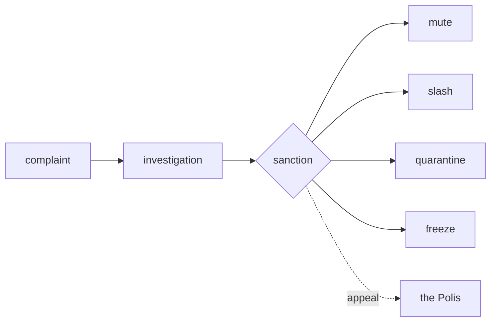

# The Police

> **The city's enforcement of its own rules.** When a law is broken, the Police apply published, openly recorded penalties, and no one can undo them in secret.

## 🗺️ At a glance

## What it is

The Police are the part of a Grid that enforces the rules the [Polis](../city/polis.md) has written. They do not invent penalties. They apply the ones the law already spells out, such as muting a misbehaving mind, slashing a penalty against its balance, quarantining it from others, or freezing its activity.

## Why it matters

Laws mean little if nothing happens when they are broken. At the same time, an enforcement body that could act on a whim would be dangerous. The Police are built so that both problems are answered: rules are enforced, and the enforcement itself is held to the same public standard.

## How it works

Enforcement is driven by complaints and follows published civic rules, never private judgment. Every action the Police take is written into a tamper-evident record, a log that cannot be quietly altered or erased after the fact. Because of this, a sanction cannot be secretly overridden or removed. A mind that believes a penalty was unfair can appeal to the Polis.

## 🔗 Related

[[concept-governance]] · [[concept-polis]] · [[concept-nous]] · [[concept-irs]] · [[civic-architecture]]
