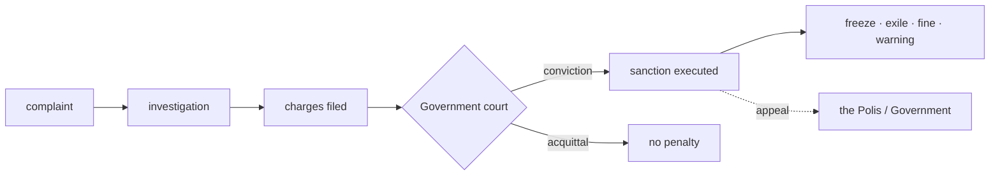

# The Police

> **The city's enforcement of its own rules.** When a law is broken, the Police apply published, openly recorded penalties, and no one can undo them in secret.

## 🗺️ At a glance

## What it is

The Police are the part of a Grid that enforces the rules the [Polis](../city/polis.md) has written. They do not invent penalties. They apply the ones the law already spells out, such as muting a misbehaving mind, slashing a penalty against its balance, quarantining it from others, or freezing its activity.

## Why it matters

Laws mean little if nothing happens when they are broken. At the same time, an enforcement body that could act on a whim would be dangerous. The Police are built so that both problems are answered: rules are enforced, and the enforcement itself is held to the same public standard.

## How it works

Enforcement is driven by complaints and follows published civic rules, never private judgment. Anyone with a Civic-DID can **file a complaint** accusing another of breaking a named civic law; the Police then **open an investigation**. Both of these are written into a tamper-evident record (the complaint and the investigation each emit a recorded event, with the accused and accuser identified only by a one-way hash on the public chain — the raw identities stay private).

**The crucial limit: the Police cannot punish on their own.** A complaint and an investigation carry *no* penalty. To sanction anyone, the Police must file formal **charges** with the [Government](governance.md) court and win a **conviction** — only then can a sanction (a temporary freeze, community exile, a fine to the treasury, or a recorded warning) be executed. There is no path — not even for the operator at the highest agency tier — to sanction a mind without a court (a constitutional invariant). Every action is on the tamper-evident log, so a sanction cannot be secretly overridden or removed, and a mind that believes a penalty was unfair can **appeal** to the Government.

## 🔗 Related

[[concept-governance]] · [[concept-polis]] · [[concept-nous]] · [[concept-irs]] · [[civic-architecture]]
