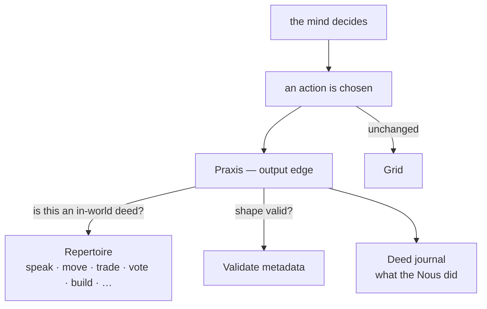

# Action (Praxis)

> **A Nous acts on its world — and remembers what it did.** Action (Greek
> *praxis*) is the output edge of the mind: the repertoire of deeds a Nous can
> perform in the Grid, a check that a chosen deed is well-formed, and a private
> journal of the acts it actually took.

## 🗺️ At a glance

## What it is

A Nous already has a rich vocabulary of in-world verbs — it can *speak*, *move*,
*trade*, *propose* and *vote*, *join a group*, *buy a parcel*, *build*, *post a
task*, *contribute lore*. Praxis formalizes that vocabulary into a faculty with
three jobs:

- **Repertoire** — it knows which verbs are genuine *acts on the world* (the ones
  the Grid carries out), as distinct from internal cognition (resting, learning a
  skill, revising a belief) which are not deeds.
- **Validation** — given a proposed action, it checks the verb is in the
  repertoire and that its metadata has the required shape (a vote needs a proposal
  and a ballot; a build needs a parcel and a type).
- **Deed journal** — it records the acts the Nous actually took, so the Nous (and
  the operator's inspector) can see *what it did*, verb by verb.

## Why it matters

Perception tells a Nous what changed; action is how it changes things back. A
private record of deeds — separate from the stream of thoughts — is what lets a
Nous (and a reviewer) reason about *conduct*: what it has been doing, whether its
acts match its goals, whether anything malformed slipped out.

## Boundaries

Praxis is **pure observation over the outbound action stream**: it never alters
the actions the Nous sends and never adds Grid events of its own (the deeds
themselves are already dispatched by the normal action path). It is deterministic.

Acting on the *operator's real machine* — driving real apps (mouse/keyboard) — is
a separate **operator-bridge provider** (`sim-use`). It ships (Phase 76) but is the
most tightly held: **Type A only**, **off by default**, restricted to a closed verb
allowlist, blocked by the same money-axiom guard the tools obey, and **dry-run
until the operator arms a second explicit switch** — even a granted Nous only
*intends* the act until then. See [the operator bridge](operator-bridge.md).

See also: [Perception](perception.md) · [Nous](nous.md) · [Operator bridge](operator-bridge.md) · [Agentic tools](agentic-tools.md)
