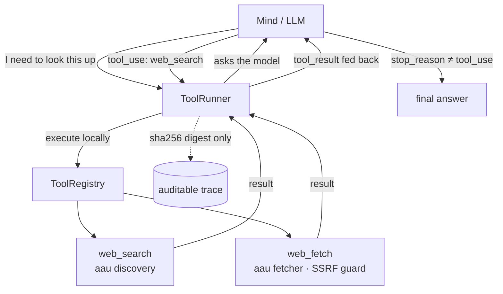

# Agentic tools

> **A Nous can reach for tools mid-thought.** Instead of only answering from what it already knows, the mind can pause, call a tool — search the live web, fetch a page — read the result, and keep reasoning. The loop repeats until the mind has what it needs.

This is the foundation of the **Nous-as-builder** direction: the same mechanism that lets a mind search the web today is the one that will later let it run code and carry a task from plan to test.

## 🗺️ At a glance

## The loop

1. The mind is asked a question and given a list of available tools.
2. If it decides it needs one, it emits a **tool call** (e.g. `web_search` with a query) instead of a final answer.
3. The **ToolRunner** executes that tool locally through the **ToolRegistry**, feeds the result back, and asks the mind again.
4. This repeats until the mind stops asking for tools (or a safety limit is reached) — then its final text is the answer.

## The first two tools

Both reuse the existing **autonomous-acquisition (AAU)** safety layer — they do not reimplement any of it:

- **`web_search`** — finds candidate URLs for a query (DuckDuckGo / arXiv / Wikipedia), respecting the existing rate limiter.
- **`web_fetch`** — fetches and extracts readable text from one URL, behind the existing SSRF guard, robots.txt check, credential-leak block, and content-type allowlist. Output is truncated to keep the loop's context bounded.

## What the city sees — and what it never sees

The mind's tool work happens **locally in the Brain**, mirroring the [Brain ↔ Grid principle](nous.md): the engine is local, the city is the window.

Raw tool output — a web page's text, a search result body — is **free content that never crosses the audit boundary**. The runner keeps a trace of each call that records only the tool name, its input, and a **`sha256` digest** of the output. This is the same discipline as [Whisper](../social/whisper.md): the plaintext stays in the Brain; only a tamper-evident fingerprint is shareable. The audit payload keys are chosen to never collide with the forbidden-key pattern (`output_sha256`, never `output`/`content`/`text`).

## Guardrails

- **Money axiom ([D-MONEY-01](../../1-design/economy.md)).** The registry **refuses** to register any tool whose name hints at moving funds (`trade`, `transfer`, `wallet`, `treasury`, `account`). No tool in this layer moves money or touches keys.
- **No network in test/rig mode.** The tool loop is exercised by scripted fixtures; live model calls remain forbidden when fixture mode is set.
- **Bounded.** Every loop has a maximum iteration count; exhaustion ends the run cleanly rather than spinning.

## Where this is going

This page documents the **Brain-side** capability (the tool loop and the two research tools). Two slices build on it next:

- **Public audit mirror** — emitting `tool.invoked` / `tool.result` onto the Grid's audit chain (digest-only) through a dedicated sole-producer, so the city can *see that* a Nous researched without seeing *what*.
- **Code sandbox** — a `run_code` tool so a Nous can program locally, then the plan → build → QA pipeline and live activity reporting on top of it.
