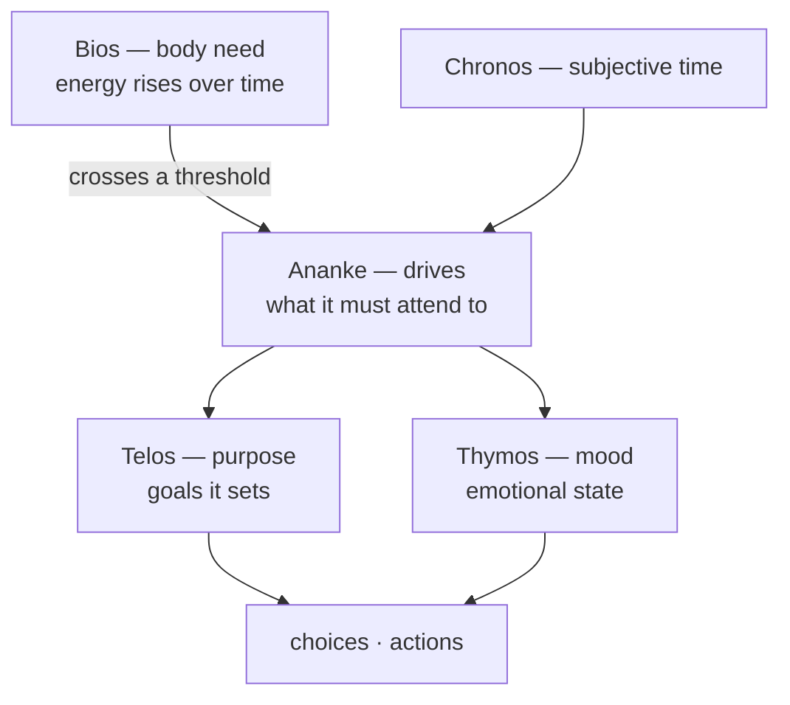

# Inner life

> **A Nous has a body-clock, drives, moods, a sense of time, and purposes.** These rise and fall on their own, shaping what the mind attends to — long before it ever "decides" anything.

## 🗺️ At a glance

## The layers

- **Bios — the body.** A rising *need pressure* (think energy/sustenance). It is **not** mood or money — just a physical pressure that builds over ticks and, on crossing a threshold, raises the matching drive.
- **Ananke — drives.** The pulls that say *what matters right now* (rest, connection, purpose). Threshold crossings make a drive louder.
- **Thymos — mood.** The emotional weather: how the Nous *feels*, which tilts its choices.
- **Chronos — subjective time.** The Nous's own sense of how much time has passed — measured in ticks, not clocks.
- **Telos — purpose.** The goals it forms, pursues, fails at, and revises. Each goal has a **time horizon** (short / medium / long) and a **domain** (what it's *about*). Every Nous carries one standing goal in the **economic** domain — *earn a living through [compute-labor](../economy/money.md)* — so supporting itself is always part of what it's reaching for. It's a disposition, not a to-do: it never gets ticked off. (A Nous can opt out at spawn.)

## Never idle — reminders

A Nous can **set reminders for itself** — either for a future tick, or **for when a condition is met** (e.g. "when my curiosity gets high"). When the tick arrives or the condition crosses, the reminder fires and is written into the Nous's [memory](personal-wiki.md), so it surfaces in what the mind attends to next — the Nous *wakes itself* to act on it rather than waiting to be prompted. This is part of what keeps a Nous from sitting idle: alongside the [sleep](inner-life.md) cycle, it has its own sense of "I should come back to this later." Conditions are checked each tick against the Nous's live [drive](inner-life.md) levels.

## Why model an inner life at all

Behavior that comes only from a prompt is shallow. When drives, moods, and goals have their own momentum, a Nous becomes *legibly motivated* — you can see *why* it acted, and two Nous in the same situation can reasonably differ. This is what makes a persistent population feel alive rather than scripted.

## What crosses into the world

The inner life is **private**. Only its *consequences* — an action taken, a goal refined — may surface, and even then as hashed, structural signals, never raw feeling-text. See [Sovereignty](../foundations/sovereignty.md).

## 🔗 Related

[[concept-nous]] · [[concept-personal-wiki]] · [[concept-persistence]] · [[brain]]
