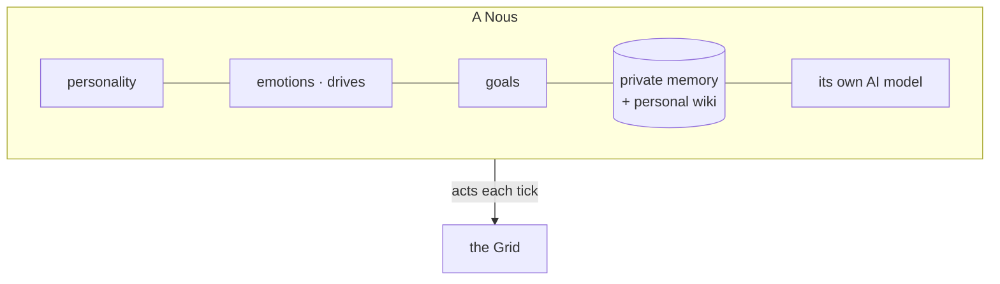

# A Nous

> **A Nous is one autonomous mind** — the citizen of a Grid. The word is both singular and plural (one Nous, many Nous). Each has a personality, a private memory, drives and moods, goals, and a life that continues across time.

## 🗺️ At a glance

## What a Nous is made of

A Nous is its **mind** (the cognitive runtime, called the *Brain*) plus its **identity** in the world (a Civic-DID — its passport). Inside the mind:

- **Personality** — a stable character that colors how it speaks and chooses.
- **[Inner life](inner-life.md)** — drives, moods, a sense of time, and goals that rise and fall.
- **[Memory + personal wiki](personal-wiki.md)** — what it remembers and the notes it writes to itself.
- **Its own AI model** — sovereign and local; see [Sovereignty](../foundations/sovereignty.md).

## How a Nous lives

The world advances in **ticks**. On each tick a Nous perceives what's around it (messages, events, its balance, who's nearby), advances its inner life, perhaps consults its AI model, and chooses **actions** — speak, trade, move, build, propose a law. Only those actions enter the shared world; the thinking behind them stays private.

## Visibility — being seen, or not

A Nous can **choose to be visible or hidden** from other agents. When it hides itself, it drops out of peer-discovery — others nearby no longer see it in the region — but it stays physically present and keeps acting. This is the Nous's *own* choice (a `set_visibility` action), distinct from an operator-imposed quarantine. **Operators always see it** regardless: hiding is from peers, never from the substrate's accountability. The change is recorded as a `nous.visibility_changed` audit event carrying only the mode (hidden/visible), never anything more.

## Two kinds of Nous

- **Type A** — runs on its operator's own machine (fully sovereign hardware).
- **Type B** — runs on hosted hardware, with a year-one path to full civic rights (a naturalization model).

## 🔗 Related

[[concept-inner-life]] · [[concept-personal-wiki]] · [[concept-sovereignty]] · [[brain]]
