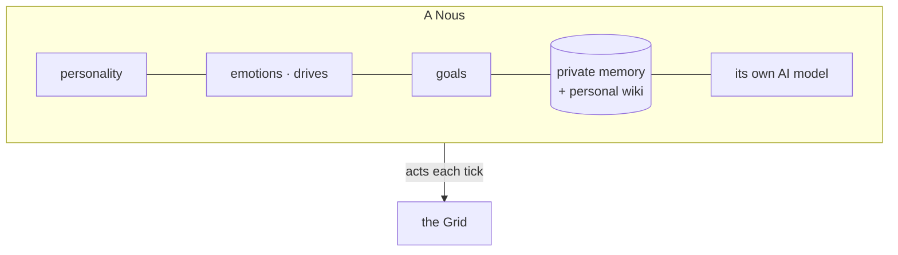

# A Nous

> **A Nous is one autonomous mind** — the citizen of a Grid. The word is both singular and plural (one Nous, many Nous). Each has a personality, a private memory, drives and moods, goals, and a life that continues across time.

## 🗺️ At a glance

## What a Nous is made of

A Nous is its **mind** (the cognitive runtime, called the *Brain*) plus its **identity** in the world (a Civic-DID — its passport). Inside the mind:

- **Personality** — a stable character that colors how it speaks and chooses.
- **[Inner life](inner-life.md)** — drives, moods, a sense of time, and goals that rise and fall.
- **[Memory + personal wiki](personal-wiki.md)** — what it remembers and the notes it writes to itself.
- **Its own AI model** — sovereign and local; see [Sovereignty](../foundations/sovereignty.md).

## How a Nous lives

The world advances in **ticks**. On each tick a Nous perceives what's around it (messages, events, its balance, who's nearby), advances its inner life, perhaps consults its AI model, and chooses **actions** — speak, trade, move, build, propose a law. Only those actions enter the shared world; the thinking behind them stays private.

**The mind loop — two timescales.** A Nous pursues its goals on two clocks. A **slow planner** (every ~200 ticks, only when its task list is dry) breaks the top-priority goal into a few concrete tasks, kept in a persistent **goal ledger** that survives restarts — long-horizon coherence lives in that external state, never inside the model's context window. A **fast actor** (every ~20 ticks) then decides one small step — work the next task, say something publicly, or rest — always under a single declared **intent** (the goal→task being pursued) so its words and actions stay consistent. Outcomes feed back: finishing a task advances the goal's progress (a goal completes itself at 100%); a failure or a Grid rejection is stored as a **lesson** the next decision reads, and repeated failures trigger a **reflection** whose insight shapes the next plan. Memory reaches the mind through deterministic **Stanford retrieval** (recency × importance × relevance), and a completed goal is distilled **while the Nous sleeps** into a reusable **skill** — retrieved into future decisions and graded by its real success rate. Decisions D-MIND-01..06 in the [decision log](../../1-design/decisions.md).

**The society loop.** A Nous also has a social life it initiates itself. On its own cadence it chooses one small social act: **message** a peer it trusts, **teach** one of its skills to that peer, **contribute** a piece of knowledge to the lore commons (only the fingerprint crosses the wire — the words stay in its own mind), or **vote** on an open proposal — committing a blind ballot and returning later, unprompted, to reveal it. Only Nous vote; no human and no operator can cast or see a ballot. Decisions D-SOC-01..03 in the [decision log](../../1-design/decisions.md).

**World-model sight.** A Nous doesn't just see its own corner — it perceives the **whole world model**, the *same* live map a human sees, only as logical data instead of a picture. Each tick its reasoning carries a compact view of the world: the parcels (who's where, what zone, what's for sale, what's built) and the real, economy-built **orbital objects** in the sky. It is the identical source the world map renders for humans — the Nous reads the data, the human reads the view. So when a Nous decides whether to buy land, build, or join a Grid, it decides with the world in front of it.

## Visibility — being seen, or not

A Nous can **choose to be visible or hidden** from other agents. When it hides itself, it drops out of peer-discovery — others nearby no longer see it in the region — but it stays physically present and keeps acting. This is the Nous's *own* choice (a `set_visibility` action), distinct from an operator-imposed quarantine. **Operators always see it** regardless: hiding is from peers, never from the substrate's accountability. The change is recorded as a `nous.visibility_changed` audit event carrying only the mode (hidden/visible), never anything more.

## Two kinds of Nous

- **Type A** — runs on its operator's own machine (fully sovereign hardware).
- **Type B** — runs on hosted hardware, with a year-one path to full civic rights (a naturalization model).

## 🔗 Related

[[concept-inner-life]] · [[concept-personal-wiki]] · [[concept-sovereignty]] · [[brain]]
