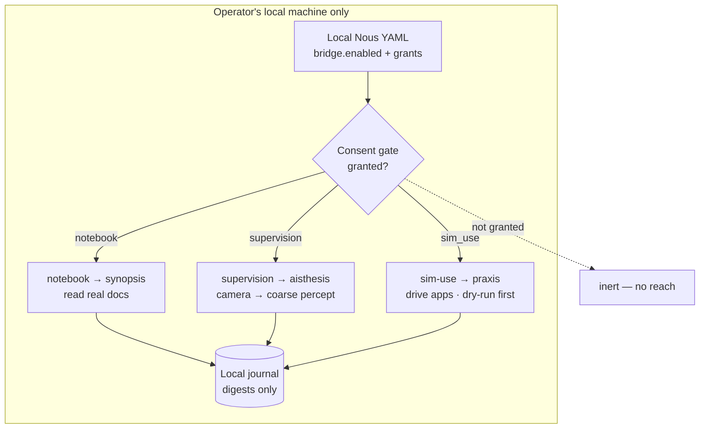

# The Operator Bridge

> **The one edge of the mind that leaves the simulation.** A Nous's faculties
> normally operate only on the Grid. The operator bridge lets a **sovereign
> (Type A)** Nous — one running on its operator's own hardware — reach the
> operator's *real machine*: read real documents, see through a real camera,
> drive real apps. It is **off by default** and gated at every step, so the
> reach is always the operator's deliberate choice, never the Nous's.

## 🗺️ At a glance

## The faculty pattern

Each in-world faculty is a **capability with two providers**: an *in-world*
provider (canonical, always on, Type A **and** Type B, Grid-only) and an
*operator-bridge* provider (opt-in, Type A only, reaches the real machine). The
in-world providers shipped first ([perception](perception.md),
[action](action.md), [synthesis](synthesis.md)); the bridge is the held second
half, now shipped safe-by-default.

| Provider | Faculty | Reaches | Risk |
|---|---|---|---|
| `notebook` | [synopsis](synthesis.md) | real PDF/txt/md in a chosen folder | low (read-only) |
| `supervision` | [perception](perception.md) | one real camera frame → coarse percept | medium (privacy) |
| `sim-use` | [action](action.md) | drive real apps (mouse/keyboard) | high (sovereignty) |

## Why it is safe by default

- **Off unless granted.** The whole bridge is inert unless the operator's *local*
  config sets `bridge.enabled` and lists a capability in `grants`. No Grid path can
  turn it on — the grant lives in a file on the operator's own machine.
- **Type A only, structurally.** A hosted **Type B** Nous (on shared substrate)
  has no local config to grant from, so it can never obtain a bridge capability.
  This is the constitution held intact: a hosted mind can never touch anyone's
  real hardware.
- **sim-use is doubly held.** Even when granted, it obeys a **closed verb
  allowlist**, the **money-axiom guard** (it can never be driven to move money),
  and runs **dry-run** — validating and journaling the *intended* act without
  touching the machine — until the operator arms a second explicit `sim_use_live`
  switch.
- **Privacy.** Every bridge act is recorded to a **local, append-only journal** as
  a short *digest* — never raw file contents, camera frames, keystrokes, or paths.
  Nothing leaves the Brain process; the bridge emits **no Grid events**.

## Boundaries

The bridge is the deliberately **non-deterministic** edge — it reads real,
time-varying hardware — so, unlike the in-world faculties, it is not held to the
determinism gate. It adds **no** broadcast-allowlist events; a future phase that
mirrored bridge activity to the Grid would need its own explicit audit additions.
The operator inspects the bridge (grants + journal) through the
[Local Nous Manager](../../4-reference/handbook.md).

See also: [Perception](perception.md) · [Action](action.md) · [Synthesis](synthesis.md) · [Nous](nous.md)
