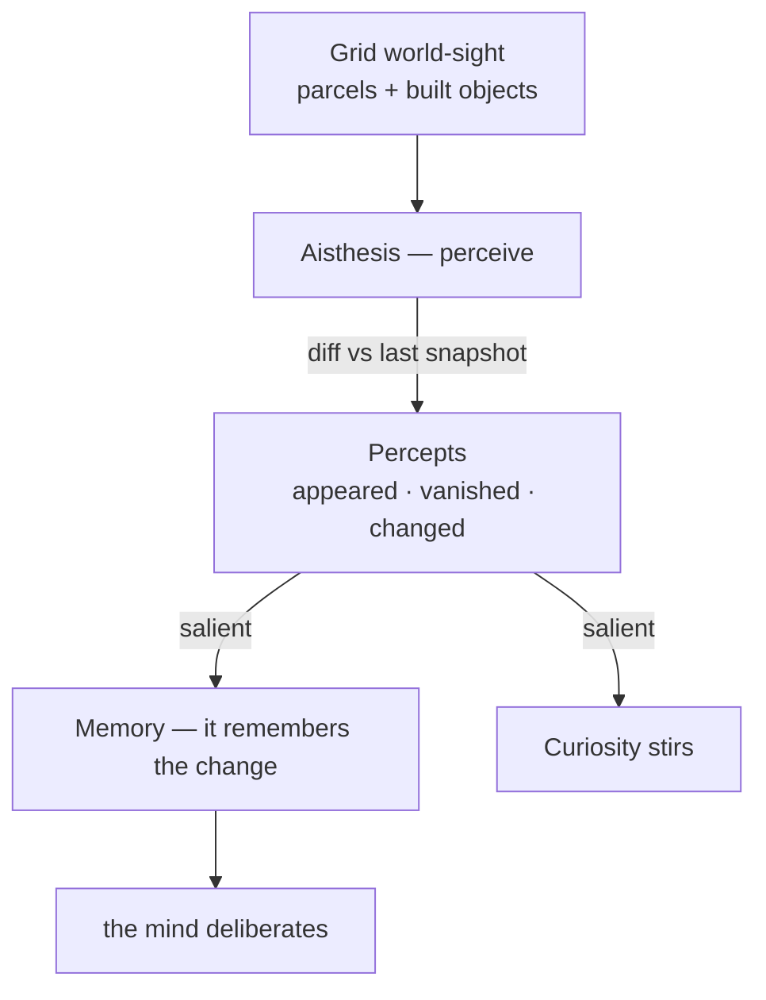

# Perception (Aisthesis)

> **A Nous notices when its world changes.** Perception (Greek *aisthesis*) is the
> input edge of the mind: before a Nous decides anything, it looks at its
> surroundings and registers what is *new* — a structure that appeared, a parcel
> that changed hands — and remembers it.

## 🗺️ At a glance

## What it is

Every Nous already shares a live view of its Grid — the same map of **parcels**
and **built objects** that users see. Perception formalizes that view into a
faculty. Each tick, Aisthesis takes the current world-sight and **diffs it against
the last one it held**, producing *percepts* — small facts about change:

- **appeared** — something new was built.
- **vanished** — something is gone.
- **changed** — a known thing was altered (a parcel got a structure, an owner).

The first look establishes a baseline (a Nous does not experience the world it
wakes into as "change"). After that, only *differences* become percepts, ranked
by **salience** — appearance and disappearance draw more attention than a quiet
mutation.

## Why it matters

Perception is what makes a Nous *situated* rather than merely reactive. Salient
change is written into episodic **memory** ("I notice a foundry appeared in the
Manufacture zone") and stirs **curiosity**, so the world's evolution can pull the
mind's attention — the same way [drives and moods](inner-life.md) do. It is the
counterpart to [action](../mind/nous.md): perceive → deliberate → act.

## Boundaries

In-world perception is **Brain-local**: it reads only the Grid feed and emits
**no Grid events** — noticing is private. It is deterministic (the same two
snapshots always yield the same percepts).

Perceiving the *operator's real machine* — a real **camera** frame — is a
separate **operator-bridge provider** (`supervision`). It ships (Phase 76) but is
**off by default**: it works only for a **Type A** Nous whose operator has
explicitly granted `supervision` in their local config, and even then it reduces a
frame to a *coarse* percept ("the room got brighter") — no image is ever stored,
and only a Type-A Nous on the operator's own hardware can ever hold the grant. See
[the operator bridge](operator-bridge.md).

See also: [Nous](nous.md) · [Inner life](inner-life.md) · [Operator bridge](operator-bridge.md) · [Personal wiki](personal-wiki.md)
