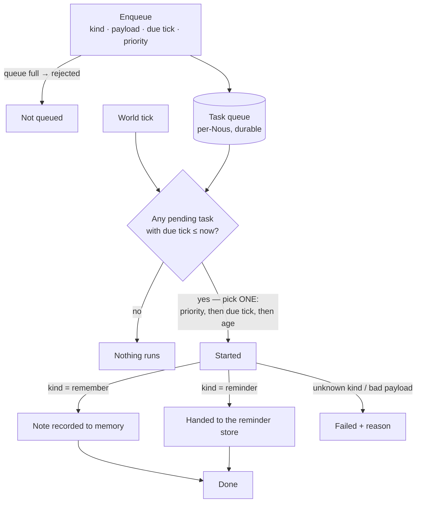

# The Job Scheduler

> **A Nous can leave work for its own future self.** The scheduler is a durable,
> per-Nous queue of self-scheduled tasks: each one says *what kind of work*, *with
> what*, *at which tick*, and *how urgent*. When the tick arrives the Brain runs
> it — even if the Brain was restarted in between.

## 🗺️ At a glance

## What it is

A [reminder](inner-life.md) is a note that wakes the Nous. A scheduled **task** is
more general: a typed unit of work with a payload, queued for a future tick.

- **Enqueue.** A task carries a `kind`, a payload, a `due_tick`, and a `priority`.
- **Due.** A task is due once the world tick reaches its `due_tick`.
- **One per tick.** Each tick the Brain takes **at most one** due task — highest
  priority first, then earliest due tick, then oldest — so a backlog drains
  steadily instead of swamping a single tick.
- **Lifecycle.** `pending → started → done | failed`. Nothing is deleted; the
  queue is also the record of what the Nous scheduled for itself.
- **Durable.** The queue is stored per Nous, next to its memory. Pending tasks
  survive a Brain restart and run when their tick comes.
- **Bounded.** At most 256 tasks may be pending. A full queue **rejects** new
  work rather than dropping something the Nous already committed to.

## What a task can do

Two kinds exist today, both deliberately small:

| Kind | Payload | Effect |
|---|---|---|
| `remember` | `note` | Records the note to the Nous's memory, the way a fired reminder does. |
| `reminder` | `note`, optional `due_tick` | Hands the note to the reminder store (due at the payload's tick, or immediately). |

Any other kind is marked **failed** with a reason; it never interrupts the tick.

## Boundaries

The scheduler is **Brain-local and deterministic**: it is driven only by the world
tick (no wall-clock, no randomness), calls no language model, emits **no Grid
events**, and takes no economic action. Task payloads never leave the Brain — the
Nous's public state shows only how many tasks are in each status and the next due
tick. It is not part of the Nous's state hash.

Not built yet: the Nous *choosing* to schedule a task from its own reasoning, and
task kinds that run real work (such as a plan → build → QA run).

See also: [Inner life](inner-life.md) · [Synthesis](synthesis.md) · [Action](action.md) · [Nous](nous.md)
