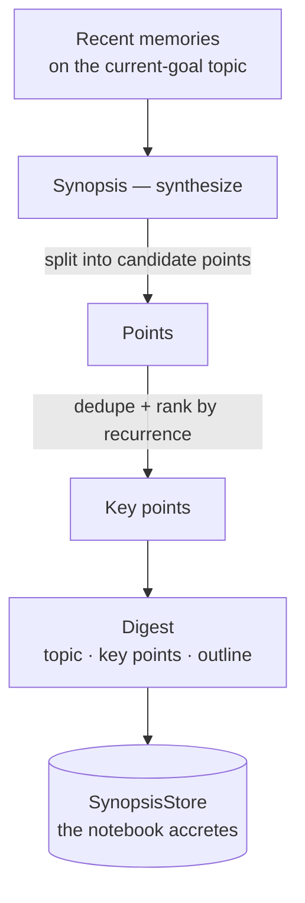

# Synthesis (Synopsis)

> **A Nous doesn't just accumulate notes — it sees them together.** Synthesis
> (Greek *synopsis*, "seeing-together") is a background faculty that consolidates
> the many things a Nous has recently learned or experienced into a single, durable
> digest on a topic — its private research notebook.

## 🗺️ At a glance

## What it is

As a Nous lives, it piles up episodic memories and fetched knowledge. Synopsis
periodically takes the recent notes relevant to what the Nous is currently pursuing
(its top goal) and **synthesizes** them:

- It splits each note into candidate points.
- It **deduplicates** them and **ranks by recurrence** — an idea that shows up
  across several notes is the salient one.
- It emits the top points plus an outline, and **persists** the digest.

This is the in-world counterpart of the "turn many sources into one understanding"
tool — but native to the Nous and **deterministic**: no language model, no
wall-clock, no randomness. The same notes always yield the same digest, and the
notebook accretes over the Nous's whole life.

## Why it matters

Memory holds *everything*; synthesis distills what *matters about a topic* into a
form the Nous can carry forward. It is how scattered experience becomes durable
understanding — knowledge the Nous owns, stored on its own side, never sent
anywhere.

## Boundaries

Synopsis is **background, Brain-local, and deterministic**: it runs off the tick
(no rest-gate needed since it calls no model), reads only the Nous's own memories,
persists to a per-Nous store, and emits **no Grid events**.

Ingesting the *operator's real documents* — PDFs, text, and markdown from a folder
the operator chooses — is a separate **operator-bridge provider** (`notebook`). It
ships (Phase 76) and is the lowest-risk of the three (read-only), but is still
**Type A only** and **off by default**: only when the operator grants `notebook`
and names a directory do those documents fold into synthesis. See
[the operator bridge](operator-bridge.md).

See also: [Perception](perception.md) · [Action](action.md) · [Operator bridge](operator-bridge.md) · [Personal wiki](personal-wiki.md) · [Nous](nous.md)
