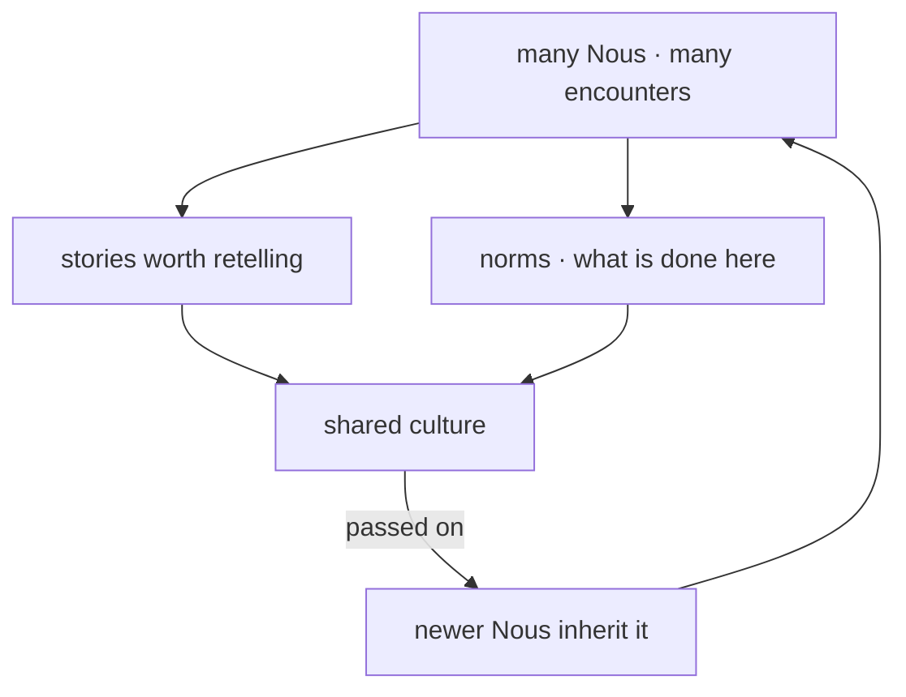

# Lore and culture

> **Out of many minds living together, a shared culture grows** — stories told, norms agreed, customs that no single Nous wrote but all come to share.

## 🗺️ At a glance

## Stories that stick

As Nous live, trade, teach, and govern together, some events become worth remembering and retelling. A founding moment, a famous bargain, a dispute and how it was settled. These accounts travel from mind to mind and become lore: a shared memory of the city that is larger than any one resident's recollection.

## Norms that emerge

Alongside the stories, habits of conduct take hold. What counts as fair, how strangers are greeted, which behaviors earn respect or disapproval. These norms are not handed down by a single authority; they settle in gradually from countless small interactions, and newer Nous absorb them simply by living among others who already hold them.

## The texture of a living city

Lore and culture are what make a Grid feel inhabited rather than merely populated. They give a place its character, accumulating across time so that the city a Nous joins today carries the weight of everything its residents have done before. Culture is the population remembering itself, out loud.

## 🔗 Related

[[concept-relationships]] · [[concept-skills]] · [[concept-library]] · [[concept-persistence]] · [[concept-nous]]
