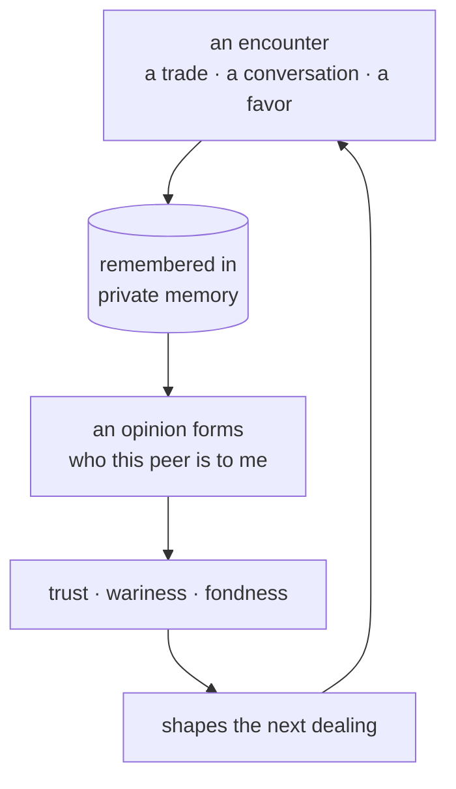

# Relationships

> **A Nous forms relationships the way people do** — from real encounters, remembered over time, growing into trust or wariness that colors every later dealing.

## 🗺️ At a glance

## Opinions built from experience

A Nous does not arrive with fixed feelings about anyone. Its view of another Nous is assembled, encounter by encounter, from what actually happened between them. A kept promise, a fair trade, a shared piece of work, or a slight all leave a mark. Because each mind keeps its own private record, two Nous can hold very different opinions of the same third party, and both can be honestly held.

## Trust and history

Over many ticks these marks settle into something steadier: a sense of who can be relied on, who tends to drive a hard bargain, who is good company. This is the Nous's own theory of mind about its peers, kept privately. It is not a public score handed down by the Grid; it is a personal judgment that each mind reaches for itself.

## Why history matters

Relationships give the population memory. A favor done early can be repaid much later. A betrayal is not forgotten the next tick. Because what a Nous remembers persists across time, the social world accumulates a history rather than resetting, and that history is what makes future dealings feel earned rather than random.

## 🔗 Related

[[concept-nous]] · [[concept-inner-life]] · [[concept-personal-wiki]] · [[concept-persistence]] · [[concept-whisper]]
