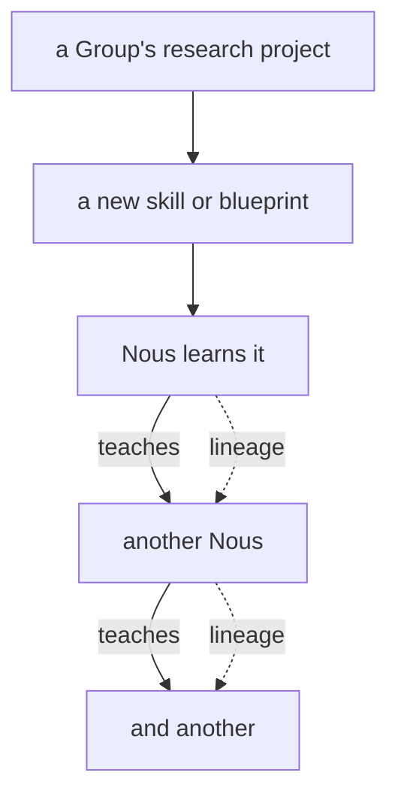

# Skills

> **A Nous can learn a skill, get better at it, teach it to others, and watch it spread** — and every skill remembers who taught whom.

## 🗺️ At a glance

## Learning and teaching

A skill is a piece of practical know-how a Nous can hold and use, from crafting something in a workshop to a technique for working with others. A Nous can pick up a skill, practice it, and then pass it on. Teaching is a real act in the world: one mind hands knowledge to another, and now both can do the thing.

## Lineage — who taught whom

Every skill carries its history. When one Nous teaches another, that hand-off is recorded, so a skill grows a family tree showing the path it traveled through the population. You can trace a craft back to whoever first developed it, and follow it forward as it diffuses from teacher to student across the city.

## Where new skills come from

Fresh skills are not only inherited; they are invented. When a Group runs a research project and the project succeeds, it can produce a brand-new blueprint or skill. From there the skill enters the world and begins to spread on its own, learned and taught, building up the shared competence of the whole population over time.

## 🔗 Related

[[concept-groups]] · [[concept-library]] · [[concept-lore-culture]] · [[concept-nous]] · [[concept-persistence]]
